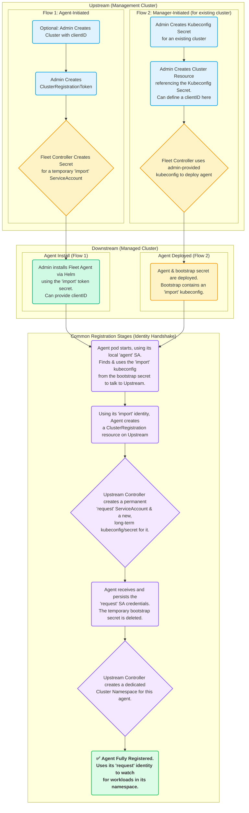
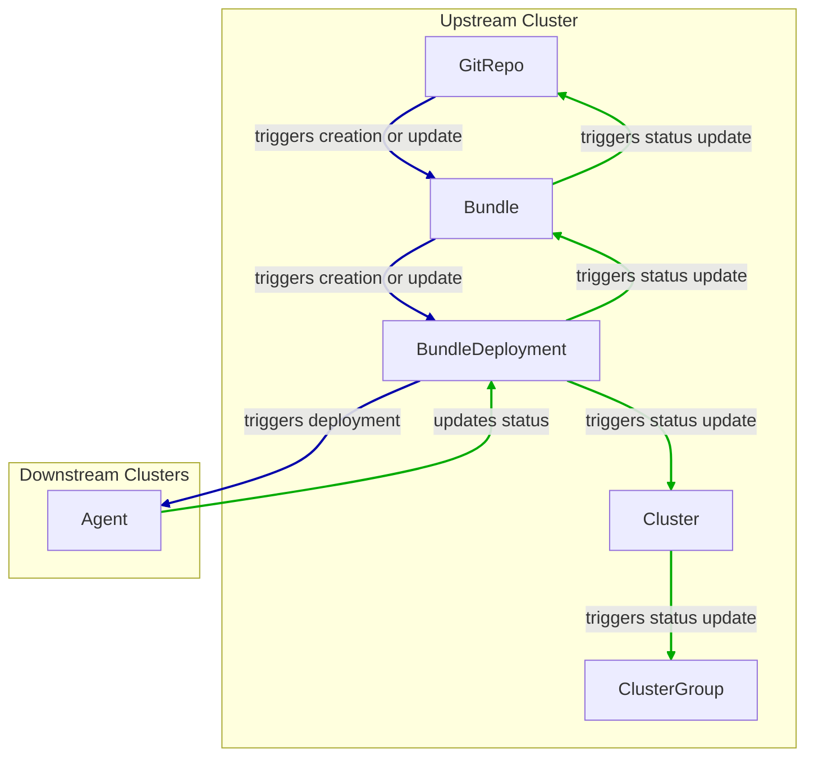
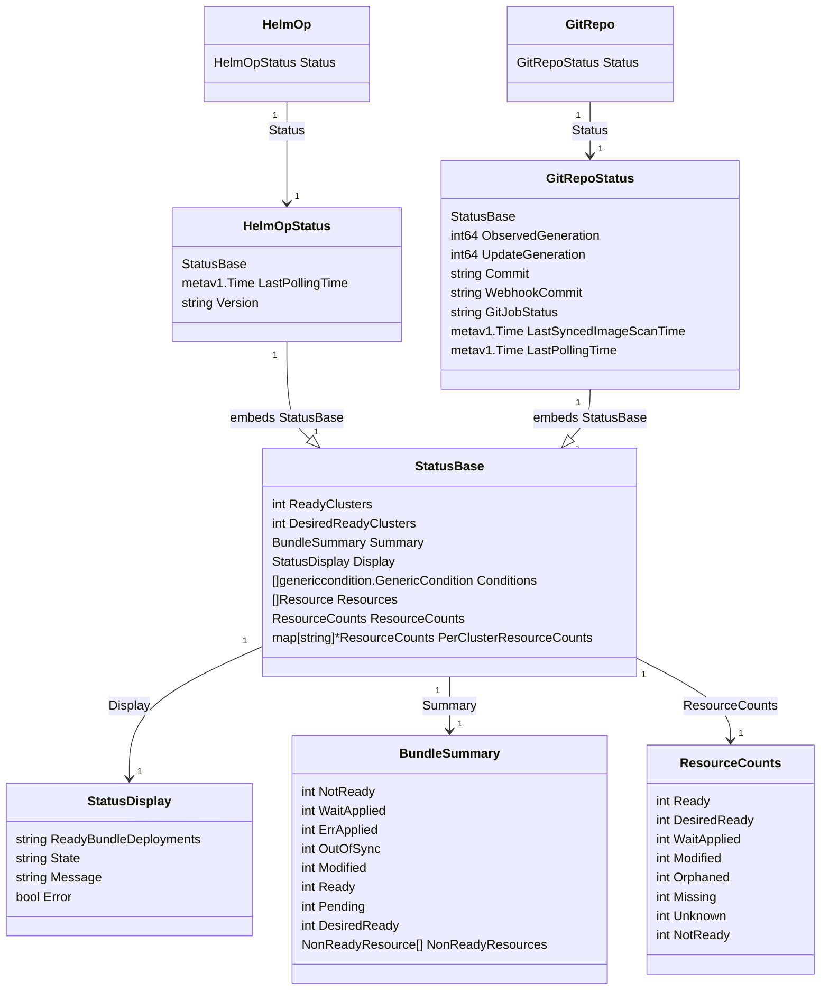

### AI Context

This is the official Fleet documentation. Fleet is a container management and deployment engine.

# Merged Knowledge Base for AI

## Article: architecture.md

# Architecture

Fleet has two primary components.  The Fleet controller and the cluster agents.  These
components work in a two-stage pull model.  The Fleet controller will pull from git and the
cluster agents will pull from the Fleet controller.

## Fleet Controller

The Fleet controller is a set of Kubernetes controllers running in any standard Kubernetes
cluster.  The only API exposed by the Fleet controller is the Kubernetes API, there is no
custom API for the fleet controller.

## Cluster Agents

One cluster agent runs in each cluster and is responsible for talking to the Fleet controller.
The only communication from cluster to Fleet controller is by this agent and all communication
goes from the managed cluster to the Fleet controller. The fleet manager does not initiate
connections to downstream clusters. This means managed clusters can run in private networks and behind
NATs. The only requirement is the cluster agent needs to be able to communicate with the
Kubernetes API of the cluster running the Fleet controller. The one exception to this is if you use
the [manager initiated](./cluster-registration.md#manager-initiated) cluster registration flow.  This is not required, but
an optional pattern.

The cluster agents are not assumed to have an "always on" connection.  They will resume operation as
soon as they can connect. Future enhancements will probably add the ability to schedule times of when
the agent checks in, as it stands right now they will always attempt to connect.

## Security

The Fleet controller dynamically creates service accounts, manages their RBAC and then gives the
tokens to the downstream clusters. Clusters are registered by optionally expiring cluster registration tokens.
The cluster registration token is used only during the registration process to generate a credential specific
to that cluster. After the cluster credential is established the cluster "forgets" the cluster registration
 token.

The service accounts given to the clusters only have privileges to list `BundleDeployment` in the namespace created
specifically for that cluster. It can also update the `status` subresource of `BundleDeployment` and the `status`
subresource of it's `Cluster` resource.

## Component Overview

An overview of the components and how they interact on a high level.


---

## Article: bundle-add.md

# Create a Bundle Resource

Bundles are automatically created by Fleet when a `GitRepo` is created. In most cases `Bundles` should not be created
manually by the user. To deploy resources from a git repository use a
[GitRepo](./gitrepo-add.md) instead.


To deploy resources without a git repository follow this guide to create a `Bundle`.

:::note
If you want to deploy resources without running a Fleet controller, also take a look at the [Fleet CLI](ref-bundle-stages#examining-the-bundle-lifecycle-with-the-cli).
:::

When creating a `GitRepo` Fleet fetches the resources from a git repository, and add them to a Bundle.
When creating a `Bundle` resources need to be explicitly specified in the `Bundle` Spec.
Resources can be compressed with gz. See [here](https://github.com/rancher/rancher/blob/main/pkg/controllers/provisioningv2/managedchart/managedchart.go#L149-L153)
an example of how Rancher uses compression in go code.

If you would like to deploy in downstream clusters, you need to define targets. Targets work similarly to targets in `GitRepo`.
See [Mapping to Downstream Clusters](./gitrepo-targets.md#defining-targets).

The following example creates a nginx `Deployment` in the local cluster:

```yaml
kind: Bundle
apiVersion: fleet.cattle.io/v1alpha1
metadata:
  # Any name can be used here
  name: my-bundle
  # For single cluster use fleet-local, otherwise use the namespace of
  # your choosing
  namespace: fleet-local
spec:
  resources:
  # List of all resources that will be deployed
  - content: |
      apiVersion: apps/v1
      kind: Deployment
      metadata:
        name: nginx-deployment
        labels:
          app: nginx
      spec:
        replicas: 3
        selector:
          matchLabels:
            app: nginx
        template:
          metadata:
            labels:
              app: nginx
          spec:
            containers:
              - name: nginx
                image: nginx:1.14.2
                ports:
                  - containerPort: 80
    name: nginx.yaml
  targets:
  - clusterName: local

```

## Targets

The bundle can target multiple clusters. It uses the same [targeting as the GitRepo](gitrepo-targets#target-matching).
Additional [customization options](ref-fleet-yaml#supported-customizations) can be specified per target:

```yaml
targets:
- clusterSelector:
    matchLabels:
      env: dev
  defaultNamespace: lab-1
  helm:
    values:
      replicas: 1
```

## Limitations

Helm options related to downloading the helm chart will be ignored. The helm chart is downloaded by the fleet-cli, which creates the bundles. The bundle has to contain all the resources from the chart. Therefore the bundle will ignore:

* `spec.helm.repo`
* `spec.helm.charts`

You can't use a `fleet.yaml` in resources, it is only used by the fleet-cli to create bundles.

The `spec.targetRestrictions` field is not useful, as it is an allow list for targets specified in `spec.targets`. It is not needed, since `targets` are explicitly given in a bundle and an empty `targetRestrictions` defaults to allow.

:::note
You can use Fleet CLI to convert a Helm chart into a `bundle`. For more information, refer to [Convert a Helm chart into a bundle using CLI.](install-usage-fleet-cli.md#convert-a-helm-chart-into-a-bundle).
:::

---

## Article: bundle-diffs.md

# Generating Diffs to Ignore Modified GitRepos


Continuous Delivery in Rancher is powered by Fleet. When a user adds a GitRepo CR, then Continuous Delivery creates the associated fleet bundles.

You can access these bundles by navigating to the Cluster Explorer (Dashboard UI), and selecting the `Bundles` section.

The bundled charts may have some objects that are amended at runtime, for example:
* in a ValidatingWebhookConfiguration, the `caBundle` is empty and the CA cert is injected by the cluster.
* an installed chart may create a job, which is then deleted once completed

This leads the status of the bundle and associated GitRepo to be reported as "Modified"


Associated Bundle


Fleet bundles support the ability to specify a custom [jsonPointer patch](http://jsonpatch.com/).

With the patch, users can instruct fleet to ignore:
* object modifications
* entire objects

## Ignoring object modifications

### Simple Example

In this simple example, we create a Service and ConfigMap that we apply a bundle diff onto.

https://github.com/rancher/fleet-test-data/tree/master/bundle-diffs


### Gatekeeper Example

In this example, we are trying to deploy opa-gatekeeper using Continuous Delivery to our clusters.

The opa-gatekeeper bundle associated with the opa GitRepo is in modified state.

Each path in the GitRepo CR, has an associated Bundle CR. The user can view the Bundles, and the associated diff needed in the Bundle status.

In our case the differences detected are as follows:

```yaml
  summary:
    desiredReady: 1
    modified: 1
    nonReadyResources:
    - bundleState: Modified
      modifiedStatus:
      - apiVersion: admissionregistration.k8s.io/v1
        kind: ValidatingWebhookConfiguration
        name: gatekeeper-validating-webhook-configuration
        patch: '{"$setElementOrder/webhooks":[{"name":"validation.gatekeeper.sh"},{"name":"check-ignore-label.gatekeeper.sh"}],"webhooks":[{"clientConfig":{"caBundle":"Cg=="},"name":"validation.gatekeeper.sh","rules":[{"apiGroups":["*"],"apiVersions":["*"],"operations":["CREATE","UPDATE"],"resources":["*"]}]},{"clientConfig":{"caBundle":"Cg=="},"name":"check-ignore-label.gatekeeper.sh","rules":[{"apiGroups":[""],"apiVersions":["*"],"operations":["CREATE","UPDATE"],"resources":["namespaces"]}]}]}'
      - apiVersion: apps/v1
        kind: Deployment
        name: gatekeeper-audit
        namespace: cattle-gatekeeper-system
        patch: '{"spec":{"template":{"spec":{"$setElementOrder/containers":[{"name":"manager"}],"containers":[{"name":"manager","resources":{"limits":{"cpu":"1000m"}}}],"tolerations":[]}}}}'
      - apiVersion: apps/v1
        kind: Deployment
        name: gatekeeper-controller-manager
        namespace: cattle-gatekeeper-system
        patch: '{"spec":{"template":{"spec":{"$setElementOrder/containers":[{"name":"manager"}],"containers":[{"name":"manager","resources":{"limits":{"cpu":"1000m"}}}],"tolerations":[]}}}}'
```

Based on this summary, there are three objects which need to be patched.

We will look at these one at a time.

#### 1. ValidatingWebhookConfiguration:
The gatekeeper-validating-webhook-configuration validating webhook has two ValidatingWebhooks in its spec.

In cases where more than one element in the field requires a patch, that patch will refer these to as `$setElementOrder/ELEMENTNAME`

From this information, we can see the two ValidatingWebhooks in question are:

```
  "$setElementOrder/webhooks": [
    {
      "name": "validation.gatekeeper.sh"
    },
    {
      "name": "check-ignore-label.gatekeeper.sh"
    }
  ],
```

Within each ValidatingWebhook, the fields that need to be ignore are as follows:

```
    {
      "clientConfig": {
        "caBundle": "Cg=="
      },
      "name": "validation.gatekeeper.sh",
      "rules": [
        {
          "apiGroups": [
            "*"
          ],
          "apiVersions": [
            "*"
          ],
          "operations": [
            "CREATE",
            "UPDATE"
          ],
          "resources": [
            "*"
          ]
        }
      ]
    },
 ```

 and

 ```
     {
      "clientConfig": {
        "caBundle": "Cg=="
      },
      "name": "check-ignore-label.gatekeeper.sh",
      "rules": [
        {
          "apiGroups": [
            ""
          ],
          "apiVersions": [
            "*"
          ],
          "operations": [
            "CREATE",
            "UPDATE"
          ],
          "resources": [
            "namespaces"
          ]
        }
      ]
    }
```

In summary, we need to ignore the fields `rules` and `clientConfig.caBundle` in our patch specification.

The field webhook in the ValidatingWebhookConfiguration spec is an array, so we need to address the elements by their index values.


Based on this information, our diff patch would look as follows:

```yaml
  - apiVersion: admissionregistration.k8s.io/v1
    kind: ValidatingWebhookConfiguration
    name: gatekeeper-validating-webhook-configuration
    operations:
    - {"op": "remove", "path":"/webhooks/0/clientConfig/caBundle"}
    - {"op": "remove", "path":"/webhooks/0/rules"}
    - {"op": "remove", "path":"/webhooks/1/clientConfig/caBundle"}
    - {"op": "remove", "path":"/webhooks/1/rules"}
```

#### 2. Deployment gatekeeper-controller-manager:
The gatekeeper-controller-manager deployment is modified since there are cpu limits and tolerations applied (which are not in the actual bundle).

```
{
  "spec": {
    "template": {
      "spec": {
        "$setElementOrder/containers": [
          {
            "name": "manager"
          }
        ],
        "containers": [
          {
            "name": "manager",
            "resources": {
              "limits": {
                "cpu": "1000m"
              }
            }
          }
        ],
        "tolerations": []
      }
    }
  }
}
```

In this case, there is only 1 container in the deployment container spec, and that container has cpu limits and tolerations added.

Based on this information, our diff patch would look as follows:
```yaml
  - apiVersion: apps/v1
    kind: Deployment
    name: gatekeeper-controller-manager
    namespace: cattle-gatekeeper-system
    operations:
    - {"op": "remove", "path": "/spec/template/spec/containers/0/resources/limits/cpu"}
    - {"op": "remove", "path": "/spec/template/spec/tolerations"}
```

#### 3. Deployment gatekeeper-audit:
The gatekeeper-audit deployment is modified in a similarly, to the gatekeeper-controller-manager, with additional cpu limits and tolerations applied.

```
{
  "spec": {
    "template": {
      "spec": {
        "$setElementOrder/containers": [
          {
            "name": "manager"
          }
        ],
        "containers": [
          {
            "name": "manager",
            "resources": {
              "limits": {
                "cpu": "1000m"
              }
            }
          }
        ],
        "tolerations": []
      }
    }
  }
}
```

Similar to gatekeeper-controller-manager, there is only 1 container in the deployments container spec, and that has cpu limits and tolerations added.

Based on this information, our diff patch would look as follows:
```yaml
  - apiVersion: apps/v1
    kind: Deployment
    name: gatekeeper-audit
    namespace: cattle-gatekeeper-system
    operations:
    - {"op": "remove", "path": "/spec/template/spec/containers/0/resources/limits/cpu"}
    - {"op": "remove", "path": "/spec/template/spec/tolerations"}
```

#### Combining It All Together
We can now combine all these patches as follows:

```yaml
diff:
  comparePatches:
  - apiVersion: apps/v1
    kind: Deployment
    name: gatekeeper-audit
    namespace: cattle-gatekeeper-system
    operations:
    - {"op": "remove", "path": "/spec/template/spec/containers/0/resources/limits/cpu"}
    - {"op": "remove", "path": "/spec/template/spec/tolerations"}
  - apiVersion: apps/v1
    kind: Deployment
    name: gatekeeper-controller-manager
    namespace: cattle-gatekeeper-system
    operations:
    - {"op": "remove", "path": "/spec/template/spec/containers/0/resources/limits/cpu"}
    - {"op": "remove", "path": "/spec/template/spec/tolerations"}
  - apiVersion: admissionregistration.k8s.io/v1
    kind: ValidatingWebhookConfiguration
    name: gatekeeper-validating-webhook-configuration
    operations:
    - {"op": "remove", "path":"/webhooks/0/clientConfig/caBundle"}
    - {"op": "remove", "path":"/webhooks/0/rules"}
    - {"op": "remove", "path":"/webhooks/1/clientConfig/caBundle"}
    - {"op": "remove", "path":"/webhooks/1/rules"}
```

We can add these now to the bundle directly to test and also commit the same to the `fleet.yaml` in your GitRepo.

Once these are added, the GitRepo should deploy and be in "Active" status.


## Ignoring entire objects

When installing a chart such as [Consul](https://developer.hashicorp.com/consul/docs/k8s/helm), a job named
`consul-server-acl-init` is created, then deleted once it has successfully completed.

That chart can be installed by creating a `GitRepo` pointing to a git repository using a `fleet.yaml` such as:
```yaml
defaultNamespace: consul
helm:
  releaseName: test-consul
  chart: "consul"
  repo: "https://helm.releases.hashicorp.com"

  values:
    global:
      name: consul
      acls:
        manageSystemACLs: true
```

Installing this chart will result in the `GitRepo` reporting a `Modified` status, with job `consul-server-acl-init`
missing, once that job has completed.

This can be remedied with the following bundle diff in our `fleet.yaml`:
```yaml
diff:
  comparePatches:
  - apiVersion: batch/v1
    kind: Job
    namespace: consul
    name: consul-server-acl-init
    operations:
    - {"op":"ignore"}
```


---

## Article: cluster-group.md

# Create Cluster Groups

Clusters in a namespace can be put into a cluster group. A cluster group is essentially a named selector.
The only parameter for a cluster group is essentially the selector.
When you get to a certain scale cluster groups become a more reasonable way to manage your clusters.
Cluster groups serve the purpose of giving aggregated
status of the deployments and then also a simpler way to manage targets.

A cluster group is created by creating a `ClusterGroup` resource like below

```yaml
kind: ClusterGroup
apiVersion: fleet.cattle.io/v1alpha1
metadata:
  name: production-group
  namespace: clusters
spec:
  # This is the standard metav1.LabelSelector format to match clusters by labels
  selector:
    matchLabels:
      env: prod
```


---

## Article: cluster-registration.md

import {versions} from '@site/src/fleetVersions';
import CodeBlock from '@theme/CodeBlock';
import Tabs from '@theme/Tabs';
import TabItem from '@theme/TabItem';

# Register Downstream Clusters

## Overview

There are two specific styles to registering clusters. These styles will be referred
to as **agent-initiated** and **manager-initiated** registration. Typically one would
go with the agent-initiated registration but there are specific use cases in which
manager-initiated is a better workflow.

### Agent-Initiated Registration

Agent-initiated refers to a pattern in which the downstream cluster installs an agent with a
[cluster registration token](#create-cluster-registration-tokens) and optionally a client ID. The cluster
agent will then make a API request to the Fleet manager and initiate the registration process. Using
this process the Manager will never make an outbound API request to the downstream clusters and will thus
never need to have direct network access. The downstream cluster only needs to make outbound HTTPS
calls to the manager.

It is not commonly used in Rancher. Rancher does not need to make an outbound
API request to the downstream cluster, as it uses a tunnel to provide that
connectivity.

### Manager-Initiated Registration

Manager-initiated registration is a process in which you register an existing Kubernetes cluster
with the Fleet manager and the Fleet manager will make an API call to the downstream cluster to
deploy the agent. This style can place additional network access requirements because the Fleet
manager must be able to communicate with the downstream cluster API server for the registration process.
After the cluster is registered there is no further need for the manager to contact the downstream
cluster API.  This style is more compatible if you wish to manage the creation of all your Kubernetes
clusters through GitOps using something like [cluster-api](https://github.com/kubernetes-sigs/cluster-api)
or [Rancher](https://github.com/rancher/rancher).

| Feature | Agent-Initiated Registration | Manager-Initiated Registration (Rancher Mode) |
| :--- | :--- | :--- |
| **Registration Initiator** | The downstream cluster initiates the registration process by deploying the agent. | The Fleet Manager (upstream cluster) initiates the registration process. |
| **Prerequisite: Upstream Admin Action** | **Requires manual administrative action** to create a `ClusterRegistrationToken` resource upstream. This token is required for agent authorization. | Requires creating a `Cluster` resource in the Fleet Manager that references a Kubernetes **Secret containing a valid kubeconfig** for the downstream cluster. |
| **Primary Mechanism** | Installing the Fleet agent via Helm on the downstream cluster using the manually generated **cluster registration token**. | The Fleet Controller uses the provided **kubeconfig** to make an API call to the downstream cluster's API server and deploy the agent. |
| **Registration Network Direction** | Communication flows **from** the managed cluster to the Fleet Controller (upstream). This is a PULL mechanism for registration credentials. | The Manager initiates a connection (PUSH) to the downstream cluster API server to deploy the agent. |
| **Network Requirement (Manager)** | The Fleet Manager **does not need direct inbound** network access to the downstream cluster API. Clusters can run in private networks/behind NATs. | The Fleet Manager **must be able to communicate directly** with the downstream cluster API server during the registration phase. |
| **Network Requirement (Agent)** | The downstream cluster must be able to make **outbound HTTPS calls** to the Fleet Manager. | The downstream cluster must be able to make outbound HTTPS calls to the Fleet Manager (post-deployment, for communication and data synchronization). |
| **Data Synchronization (Pull)** | The agent pulls configuration bundles and agent updates from the Fleet Controller (part of the two-stage pull model). | The agent pulls configuration bundles and agent updates from the Fleet Controller. |
| **Agent Management (Push/Redeploy)** | The upstream controller typically **lacks** the direct network access/credentials required for proactive management actions (PUSH) on the agent deployment. | The initial deployment mechanism grants the Manager explicit access. This infrastructure can be used for administrative management actions (e.g., triggering deployment using the kubeconfig). |
| **Agent Redeployment Control Field** | The `redeployAgentGeneration` field (on `ClusterSpec`) is **not used** by the upstream controller to trigger redeployment, as the manager lacks the API access necessary to directly manipulate the downstream agent deployment. | The `redeployAgentGeneration` field on the `ClusterSpec` **can be incremented to force redeployment** of the agent by the Fleet Controller. |
| **Agent Adoption Post-Registration** | After initial registration using the token, the agent is adopted into the standard management lifecycle via bundles created by the `manageagent` controller. |
| **Rancher Context** | This method is **not commonly used** when registering clusters through the Rancher dashboard. | This method **is used** when adding a cluster via the Rancher dashboard (often via a Rancher agent proxying the downstream kubeconfig upstream). |
| **Post-Registration Token Status** | The agent forgets the registration token after success; a new token must be generated for re-registration. | N/A; registration token/kubeconfig management is handled internally by the Fleet Manager. |

## Agent Initiated

A downstream cluster is registered by installing an agent via helm and using the **cluster registration token** and optionally a **client ID** or **cluster labels**.

The cluster resource on upstream does not have a kubecConfigSecret field, as
the Fleet manager does not need to communicate with the downstream cluster API
server.
However, a bundle for the agent is created and the agent will update itself from the bundle.
The bundle uses a different naming scheme, so the downstream cluster will end up with two helm charts.

:::info
It's not necessary to configure the Fleet manager for [multi cluster](./installation.md#configuration-for-multi-cluster), as the downstream agent we install via Helm will connect to the Kubernetes API of the upstream cluster directly.

Agent-initiated registration is normally not used with Rancher.
:::

### Cluster Registration Token and Client ID

The **cluster registration token** is a credential that will authorize the downstream cluster agent to be
able to initiate the registration process. This is required.
The [cluster registration token](./architecture.md#security) is manifested as a `values.yaml` file that will be passed to the `helm install` process.
Alternatively one can pass the token directly to the helm install command via `--set token="$token"`.

There are two styles of registering an agent. You can have the cluster for this agent dynamically created, in which
case you will probably want to specify **cluster labels** upon registration.  Or you can have the agent register to a predefined
cluster in the Fleet manager, in which case you will need a **client ID**.  The former approach is typically the easiest.

### Install Agent For a New Cluster

The Fleet agent is installed as a Helm chart. Following are explanations how to determine and set its parameters.

First, follow the [cluster registration token instructions](#create-cluster-registration-tokens) to obtain the `values.yaml` which contains
the registration token to authenticate against the Fleet cluster.

Second, optionally you can define labels that will assigned to the newly created cluster upon registration. After
registration is completed an agent cannot change the labels of the cluster. To add cluster labels add
`--set-string labels.KEY=VALUE` to the below Helm command. To add the labels `foo=bar` and `bar=baz` then you would
add `--set-string labels.foo=bar --set-string labels.bar=baz` to the command line.

```shell
# Leave blank if you do not want any labels
CLUSTER_LABELS="--set-string labels.example=true --set-string labels.env=dev"
```

Third, set variables with the Fleet cluster's API Server URL and CA, for the downstream cluster to use for connecting.

```shell
API_SERVER_URL=https://<API_URL>:6443
API_SERVER_CA_DATA=...
```

If the API server is not listening on the https port (443), the `API_SERVER_URL` should include the port, e.g. `https://<API_URL>:6443`. The URL can be found in the `.kube/config` file.
Value in `API_SERVER_CA_DATA` can be obtained from a `.kube/config` file with valid data to connect to the upstream cluster
(under the `certificate-authority-data` key). Alternatively it can be obtained from within the upstream cluster itself,
by looking up the default ServiceAccount secret name (typically prefixed with `default-token-`, in the default namespace),
under the `ca.crt` key.


:::warning Kubectl Context

__Ensure you are installing to the right cluster__:
Helm will use the default context in `${HOME}/.kube/config` to deploy the agent. Use `--kubeconfig` and `--kube-context`
to change which cluster Helm is installing to.

:::

:::caution Fleet in Rancher
Rancher has separate helm charts for Fleet and uses a different repository.
:::

Add Fleet's Helm repo.
<CodeBlock language="bash">
{`helm repo add fleet https://rancher.github.io/fleet-helm-charts/`}
</CodeBlock>

:::caution

__Use proper namespace and release name__:
For the agent chart the namespace must be `cattle-fleet-system` and the release name `fleet-agent`

:::


Finally, install the agent using Helm.
<Tabs>
  <TabItem value="helm" label="Install" default>
<CodeBlock language="bash">
{`helm -n cattle-fleet-system install --create-namespace --wait \\
    $CLUSTER_LABELS \\
    --values values.yaml \\
    --set apiServerCA="$API_SERVER_CA_DATA" \\
    --set apiServerURL="$API_SERVER_URL" \\
    fleet-agent fleet/fleet-agent`}
</CodeBlock>
</TabItem>
<TabItem value="validate" label="Validate">
You can check that status of the fleet pods by running the below commands.

```shell
# Ensure kubectl is pointing to the right cluster
kubectl -n cattle-fleet-system logs -l app=fleet-agent
kubectl -n cattle-fleet-system get pods -l app=fleet-agent
```
</TabItem>
</Tabs>
The agent should now be deployed.

Additionally you should see a new cluster registered in the Fleet manager.  Below is an example of checking that a new cluster
was registered in the `clusters` [namespace](./namespaces.md).  Please ensure your `${HOME}/.kube/config` is pointed to the Fleet
manager to run this command.

```shell
kubectl -n clusters get clusters.fleet.cattle.io
```
```
NAME                   BUNDLES-READY   NODES-READY   SAMPLE-NODE             LAST-SEEN              STATUS
cluster-ab13e54400f1   1/1             1/1           k3d-cluster2-server-0   2020-08-31T19:23:10Z
```

### Install Agent For a Predefined Cluster

Client IDs are for the purpose of predefining clusters in the Fleet manager with existing labels and repos targeted to them.
A client ID is not required and is just one approach to managing clusters.
The **client ID** is a unique string that will identify the cluster.
This string is user generated and opaque to the Fleet manager and agent.  It is assumed to be sufficiently unique. For security reasons one should not be able to easily guess this value
as then one cluster could impersonate another.  The client ID is optional and if not specified the UID field of the `kube-system` namespace
resource will be used as the client ID. Upon registration if the client ID is found on a `Cluster` resource in the Fleet manager it will associate
the agent with that `Cluster`.  If no `Cluster` resource is found with that client ID a new `Cluster` resource will be created with the specific
client ID.

The Fleet agent is installed as a Helm chart. The only parameters to the helm chart installation should be the cluster registration token, which
is represented by the `values.yaml` file and the client ID.  The client ID is optional.


First, create a `Cluster` in the Fleet Manager with the random client ID you have chosen.

```yaml
kind: Cluster
apiVersion: fleet.cattle.io/v1alpha1
metadata:
  name: my-cluster
  namespace: clusters
spec:
  clientID: "really-random"
```

Second, follow the [cluster registration token instructions](#create-cluster-registration-tokens) to obtain the `values.yaml` file to be used.

Third, setup your environment to use the client ID.

```shell
CLUSTER_CLIENT_ID="really-random"
```

:::note

__Use proper namespace and release name__:
For the agent chart the namespace must be `cattle-fleet-system` and the release name `fleet-agent`

:::

:::note

__Ensure you are installing to the right cluster__:
Helm will use the default context in `${HOME}/.kube/config` to deploy the agent. Use `--kubeconfig` and `--kube-context`
to change which cluster Helm is installing to.

:::

Add Fleet's Helm repo.
<CodeBlock language="bash">
{`helm repo add fleet https://rancher.github.io/fleet-helm-charts/`}
</CodeBlock>

Finally, install the agent using Helm.

<Tabs>
  <TabItem value="helm2" label="Install" default>
<CodeBlock language="bash">
{`helm -n cattle-fleet-system install --create-namespace --wait \\
    --set clientID="$CLUSTER_CLIENT_ID" \\
    --values values.yaml \\
    fleet-agent fleet/fleet-agent`}
</CodeBlock>

</TabItem>
<TabItem value="validate2" label="Validate">
You can check that status of the fleet pods by running the below commands.

```shell
# Ensure kubectl is pointing to the right cluster
kubectl -n cattle-fleet-system logs -l app=fleet-agent
kubectl -n cattle-fleet-system get pods -l app=fleet-agent
```
</TabItem>
</Tabs>
The agent should now be deployed.

Additionally you should see a new cluster registered in the Fleet manager.  Below is an example of checking that a new cluster
was registered in the `clusters` [namespace](./namespaces.md).  Please ensure your `${HOME}/.kube/config` is pointed to the Fleet
manager to run this command.

```shell
kubectl -n clusters get clusters.fleet.cattle.io
```
```
NAME                   BUNDLES-READY   NODES-READY   SAMPLE-NODE             LAST-SEEN              STATUS
my-cluster             1/1             1/1           k3d-cluster2-server-0   2020-08-31T19:23:10Z
```

### Create Cluster Registration Tokens

:::info

__Not needed for Manager-initiated registration__:
For manager-initiated registrations the token is managed by the Fleet manager and does
not need to be manually created and obtained.

:::

For an agent-initiated registration the downstream cluster must have a [cluster registration token](./architecture.md#security).
Cluster registration tokens are used to establish a new identity for a cluster. Internally
cluster registration tokens are managed by creating Kubernetes service accounts that have the
permissions to create `ClusterRegistrationRequests` within a specific namespace.  Once the
cluster is registered a new `ServiceAccount` is created for that cluster that is used as
the unique identity of the cluster. The agent is designed to forget the cluster registration
token after registration. While the agent will not maintain a reference to the cluster registration
token after a successful registration please note that usually other system bootstrap scripts do.

Since the cluster registration token is forgotten, if you need to re-register a cluster you must
give the cluster a new registration token.

#### Token TTL

Cluster registration tokens can be reused by any cluster in a namespace.  The tokens can be given a TTL
such that it will expire after a specific time.

#### Create a new Token

The `ClusterRegistationToken` is a namespaced type and should be created in the same namespace
in which you will create `GitRepo` and `ClusterGroup` resources. For in depth details on how namespaces
are used in Fleet refer to the documentation on [namespaces](./namespaces.md).  Create a new
token with the below YAML.

```yaml
kind: ClusterRegistrationToken
apiVersion: "fleet.cattle.io/v1alpha1"
metadata:
    name: new-token
    namespace: clusters
spec:
    # A duration string for how long this token is valid for. A value <= 0 or null means infinite time.
    ttl: 240h
```

After the `ClusterRegistrationToken` is created, Fleet will create a corresponding `Secret` with the same name.
As the `Secret` creation is performed asynchronously, you will need to wait until it's available before using it.

One way to do so is via the following one-liner:
```shell
while ! kubectl --namespace=clusters  get secret new-token; do sleep 5; done
```

#### Obtaining Token Value (Agent values.yaml)

The token value contains YAML content for a `values.yaml` file that is expected to be passed to `helm install`
to install the Fleet agent on a downstream cluster.

Such value is contained in the `values` field of the `Secret` mentioned above. To obtain the YAML content for the
above example one can run the following one-liner:
```shell
kubectl --namespace clusters get secret new-token -o 'jsonpath={.data.values}' | base64 --decode > values.yaml
```

Once the `values.yaml` is ready it can be used repeatedly by clusters to register until the TTL expires.

## Manager Initiated

The manager-initiated registration flow is accomplished by creating a
`Cluster` resource in the Fleet Manager that refers to a Kubernetes
`Secret` containing a valid kubeconfig file in the data field called `value`.


:::info
If you are using Fleet standalone *without Rancher*, it must be installed as described in [installation details](./installation.md#configuration-for-multi-cluster).

The manager-initiated registration is used when you add a cluster from the Rancher dashboard.
:::

### Create Kubeconfig Secret

The format of this secret is intended to match the [format](https://cluster-api.sigs.k8s.io/developer/architecture/controllers/cluster.html#secrets) of the kubeconfig
secret used in [cluster-api](https://github.com/kubernetes-sigs/cluster-api).
This means you can use `cluster-api` to create a cluster that is dynamically registered with Fleet.

```yaml title="Kubeconfig Secret Example"
kind: Secret
apiVersion: v1
metadata:
  name: my-cluster-kubeconfig
  namespace: clusters
data:
  value: YXBpVmVyc2lvbjogdjEKY2x1c3RlcnM6Ci0gY2x1c3RlcjoKICAgIHNlcnZlcjogaHR0cHM6Ly9leGFtcGxlLmNvbTo2NDQzCiAgbmFtZTogY2x1c3Rlcgpjb250ZXh0czoKLSBjb250ZXh0OgogICAgY2x1c3RlcjogY2x1c3RlcgogICAgdXNlcjogdXNlcgogIG5hbWU6IGRlZmF1bHQKY3VycmVudC1jb250ZXh0OiBkZWZhdWx0CmtpbmQ6IENvbmZpZwpwcmVmZXJlbmNlczoge30KdXNlcnM6Ci0gbmFtZTogdXNlcgogIHVzZXI6CiAgICB0b2tlbjogc29tZXRoaW5nCg==
```

### Create Cluster Resource

The cluster resource needs to reference the kubeconfig secret.

```yaml title="Cluster Resource Example"
apiVersion: fleet.cattle.io/v1alpha1
kind: Cluster
metadata:
  name: my-cluster
  namespace: clusters
  labels:
    demo: "true"
    env: dev
spec:
  kubeConfigSecret: my-cluster-kubeconfig
```


---

## Article: concepts.md

# Core Concepts

Fleet is fundamentally a set of Kubernetes custom resource definitions (CRDs) and controllers
to manage GitOps for a single Kubernetes cluster or a large-scale deployment of Kubernetes clusters.

:::info

For more on the naming conventions of CRDs, click [here](./troubleshooting.md#naming-conventions-for-crds).

:::

Below are some of the concepts of Fleet that will be useful throughout this documentation:

* **Fleet Manager**: The centralized component that orchestrates the deployments of Kubernetes assets
    from git. In a multi-cluster setup, this will typically be a dedicated Kubernetes cluster. In a
    single cluster setup, the Fleet manager will be running on the same cluster you are managing with GitOps.
* **Fleet controller**: The controller(s) running on the Fleet manager orchestrating GitOps. In practice,
    the Fleet manager and Fleet controllers are used fairly interchangeably.
* **Single Cluster Style**: This is a style of installing Fleet in which the manager and downstream cluster are the
    same cluster.  This is a very simple pattern to quickly get up and running with GitOps.
* **Multi Cluster Style**: This is a style of running Fleet in which you have a central manager that manages a large
    number of downstream clusters.
* **Fleet agent**: Every managed downstream cluster will run an agent that communicates back to the Fleet manager.
    This agent is just another set of Kubernetes controllers running in the downstream cluster.
* **GitRepo**: Git repositories that are watched by Fleet are represented by the type `GitRepo`.

>**Example installation order via `GitRepo` custom resources when using Fleet for the configuration management of downstream clusters:**
>
> 1. Install [Calico](https://github.com/projectcalico/calico) CRDs and controllers.
> 2. Set one or multiple cluster-level global network policies.
> 3. Install [GateKeeper](https://github.com/open-policy-agent/gatekeeper). Note that **cluster labels** and **overlays** are critical features in Fleet as they determine which clusters will get each part of the bundle.
> 4. Set up and configure ingress and system daemons.

* **Bundle**: An internal unit used for the orchestration of resources from git.
    When a `GitRepo` is scanned it will produce one or more bundles. Bundles are a collection of
    resources that get deployed to a cluster. `Bundle` is the fundamental deployment unit used in Fleet. The
    contents of a `Bundle` may be Kubernetes manifests, Kustomize configuration, or Helm charts.
    Regardless of the source the contents are dynamically rendered into a Helm chart by the agent
    and installed into the downstream cluster as a helm release.

    - To see the **life cycle of a bundle**, click [here](./ref-bundle-stages.md).

* **BundleDeployment**: When a `Bundle` is deployed to a cluster an instance of a `Bundle` is called a `BundleDeployment`.
    A `BundleDeployment` represents the state of that `Bundle` on a specific cluster with its cluster specific
    customizations. The Fleet agent is only aware of `BundleDeployment` resources that are created for
    the cluster the agent is managing.

    - For an example of how to deploy Kubernetes manifests across clusters using Fleet customization, click [here](./gitrepo-targets.md#customization-per-cluster).

* **Downstream Cluster**: Clusters to which Fleet deploys manifests are referred to as downstream clusters. In the single cluster use case, the Fleet manager Kubernetes cluster is both the manager and downstream cluster at the same time.
* **Cluster Registration Token**: Tokens used by agents to register a new cluster.


---

## Article: enableexperimental.md

# How to enable experimental features

Fleet supports experimental features that are disabled by default and that can be enabled by the user.

Enabling/disabling experimental features is done using extra environment variables that are available when deploying `rancher/fleet`.

See also "[Configure Fleet Install Options in Rancher](./ref-configuration#configure-fleet-install-options-in-rancher)".

## Available experimental features

Fleet currently supports the following experimental features, toggled through their respective environment variables:
* Scheduling: [`EXPERIMENTAL_SCHEDULES`](./scheduling.md)
* Automated propagation of resources to downstream clusters:
[`EXPERIMENTAL_COPY_RESOURCES_DOWNSTREAM`](./experimental-downstream-resources.md)

## Enabling an experimental feature

### Enabling when installing Fleet stand-alone

All you need to do is to pass something like:
```
--set-string extraEnv[0].name=EXPERIMENTAL_SCHEDULES \
--set-string extraEnv[0].value=true \
```
to your helm install or update command.

Please note you have to use `--set-string` because otherwise the boolean value won't work as expected.

### Enabling when installing Fleet with Rancher

You can also activate the experimental features in Fleet when installing Rancher.

The parameters are the same, but you have to add the `fleet.` prefix.

```
--set-string fleet.extraEnv[0].name=EXPERIMENTAL_SCHEDULES \
--set-string fleet.extraEnv[0].value=true \
```


---

## Article: experimental-downstream-resources.md

# Automatically copying resources to downstream clusters

:::warning
This is an experimental feature.
:::

From Fleet v0.14.0 onwards, Fleet supports propagating external resources to downstream clusters.

This simplifies dealing with dependencies of charts, such as values coming from external resources.
See also [valuesFrom](gitrepo-content#using-valuesfrom).

## How it works

HelmOps support a new `downstreamResources` field, which can be used to reference resources by kind and name.
Those resources must:
* Be either secrets or config maps. No other `kind`s are currently supported.
* Exist before being referenced from the HelmOp, and live in the same namespace as the HelmOp referencing them.

Example:
```yaml
apiVersion: fleet.cattle.io/v1alpha1
kind: HelmOp
[...] # metadata
spec:
  helm:
    [...] # Helm options
  downstreamResources:
    - kind: Secret
      name: my-secret
    - kind: ConfigMap
      name: my-config
```

This instructs the Fleet controller to copy those resources to each targeted downstream cluster, before deploying the
workload (in this case specified through a Helm chart) to said downstream cluster.

When a cluster is not targeted anymore, the Fleet agent will delete those resources from the cluster as well. They will
remain on the upstream cluster, though.

:::note
If resources referenced through `downstreamResources` should stay on downstream clusters even after they are no longer
targeted, [keepResources](./ref-bundle) should be set to `true` on the HelmOp.
:::


## Monitoring

From version v0.14.0 onwards, Fleet monitors changes made to secrets and configmaps that are listed in `DownstreamResources`. It also checks whether a secret or configmap was created after the Bundle was created.


---

## Article: fetch-helm-oci.md

# Fetch Helm Charts from OCI Registries

Fleet supports pulling Helm charts stored in OCI registries. OCI registries are commonly used to store and distribute container images. By using them for Helm charts, you can apply the same packaging, authentication, and distribution methods you already use for container images.

Using OCI registries for Helm charts helps you:

* Store charts alongside container images in the same registry.  
* Use the same authentication and access control you already apply to container images.  
* Push and pull charts using standard OCI commands, making them easy to distribute across environments.  
* Manage charts in registries designed for high availability and global distribution.

For more information about HelmOps with OCI registry, refer to [HelmOps](helm-ops.md#oci-registry)


For example, if you manage multiple clusters with Fleet, developers can push Helm charts to an internal OCI registry. Fleet then pulls the charts directly from the registry and deploys them to downstream clusters.  
This approach avoids maintaining a separate chart repository and reuses your existing registry infrastructure.


## Helm chart in fleet.yaml

To fetch Helm chart, you reference the chart like this in a fleet.yaml file:

```bash
helm:
  chart: "oci://ghcr.io/fleetrepoci/guestbook"
```

You can use the version field to reference a specific chart version.

```bash
helm:
  chart: "oci://ghcr.io/fleetrepoci/guestbook"
  version: 0.1.0
```

Fleet pulls the chart from the OCI registry and deploys it to the targeted clusters.

## Using authenticated registries

If the OCI registry requires authentication, reference a Kubernetes secret in the GitRepo resource. Fleet uses this secret to pull the chart and deploy it to the targeted clusters.

For more information, refer to [fleet.yaml with authentication](gitrepo-add.md#using-private-helm-repositories).  


---

## Article: fine-tune-error.md

# Fine Tuning Error Detection

Fleet monitors the `status` field of deployed resources to determine whether a `Bundle` is healthy or in error. In certain cases, Fleet may interpret a condition in the status field as an error, even if it is expected or harmless.

You can adjust this behavior in two ways:

* Ignore conditions in `fleet.yaml`  
* Customize error mappings with environment variables


:::note
You should rarely need to configure readiness detection in Fleet with environment variables. If you do, open an issue or submit a pull request to help improve the default readiness detection.
:::

## **Ignore conditions in `fleet.yaml`**

Use the `ignore.conditions` setting in the `fleet.yaml` file to tell Fleet to ignore specific conditions.

```yaml
# from https://fleet.rancher.io/ref-fleet-yaml

# Ignore fields when monitoring a Bundle. This can be used when Fleet thinks
# some conditions in Custom Resources makes the Bundle to be in an error state
# when it shouldn't.
ignore:

  # Conditions to be ignored
  conditions:

    # In this example a condition will be ignored if it contains
    # {"type": "Active", "status", "False"}
    - type: Active
      status: "False"
```

This method is useful when a custom resource or controller sets conditions that cause Fleet to mark a Bundle as failed, even though the resource is healthy.


## **Configure error mapping with environment variables**

In Fleet **v0.13**, error detection was enhanced to give you more control. You can use the environment variable  `CATTLE_WRANGLER_CHECK_GVK_ERROR_MAPPING` to customize how resource conditions are interpreted.

This variable lets you define, by `Group`,`Version`,`Kind` (GVK), which condition values should be treated as errors or explicitly not treated as errors.

Set this variable in your Fleet Helm chart deployment (`values.yaml`) using `extraEnv`. The value must be JSON.

```yaml
# Extra environment variables passed to the fleet pods.
# extraEnv:
# - name: OCI_STORAGE
#   value: "false"
```
:::note
This setting is global to all Fleet controllers and applies to every `GitRepo`. If you need to adjust error handling only for a specific Bundle, use the `ignoreConditions` option in `fleet.yaml` instead.
:::

### Merging behavior

When you override mappings with `CATTLE_WRANGLER_CHECK_GVK_ERROR_MAPPING`:

* New Conditions are merged with predefined conditions.  
* Condition values are replaced for any condition you redefine.

For example, consider the Default mapping: 

`HelmChart.Failed=["True"]`

This means `Failed=True` is treated as an error.

When you override with:

* `HelmChart.Failed=["False"]`  
* `HelmChart.Ready=["False"]`

This results in 

* `Failed=["False"]` replaces the default mapping. This means **`Failed=False`** is now treated as an error.  
* `Ready=["False"]` is added, so **`Ready=False`** is also treated as an error.  
* Other conditions unchanged.

### Disable error interpretation example

Assume that every value of `Failed` was previously interpreted as an error, for example:

```json
{ "type": "Failed", "status": ["True", "False"] }
```
You can narrow this mapping to treat only `Failed=True` as an error by setting:

```json
[
  {
    "gvk": "sample.cattle.io/v1, Kind=Sample",
    "conditionMappings": [
      { "type": "Failed", "status": ["True"] } 
    ]
  }
]
```

This configuration means only **`Failed=True`** is treated as an error. `Failed=False` is no longer considered an error.

You can also disable errors for any value of `Failed` by

```json
{ "type": "Failed", "status": [""] } 

```

This configuration ensures that **no value of `Failed`** is treated as an error.

:::note
Overriding conditions only affects the default error mappings (refer to [Default error mappings](#default-error-mappings)). Fleet may still mark a resource as an error because other checks, such as those from the `kstatus` library, continue to run after your customization.
:::

### Enable error interpretation example

```json
[
  {
    "gvk": "sample.cattle.io/v1, Kind=Sample",
    "conditionMappings": [
      { "type": "Failed", "status": ["True"] }
    ]
  }
]

```

Here, `Failed=True` is treated as an error.

## Default error mappings {#default-error-mappings}

Fleet adds default error mappings to interpret certain resource conditions in the `status` field as errors. These mappings are applied besides to other readiness checks, such as those performed by the Kubernetes `kstatus` library.

The following default mappings apply:

* **HelmChart** (`helm.cattle.io/v1`)  
  * `JobCreated`: Neither `True` nor `False` is considered an error.  
  * `Failed`: `True` is considered an error.  
* **Node** (`v1`)  
  * `OutOfDisk`: `True` is considered an error.  
  * `MemoryPressure`: `True` is considered an error.  
  * `DiskPressure`: `True` is considered an error.  
  * `NetworkUnavailable`: `True` is considered an error.  
* **Deployment** (`apps/v1`)  
  * `ReplicaFailure`: `True` is considered an error.  
  * `Progressing`: `False` is considered an error.  
* **ReplicaSet** (`apps/v1`)  
  * `ReplicaFailure`: `True` is considered an error.

### Fallback mapping

If a resource does not match the listed GVKs, Fleet applies a fallback mapping:

* Any `Group` and `Version` with any kind

  * `Stalled`: `True` is considered an error.  
  * `Failed`: `True` is considered an error.


---

## Article: gitrepo-add.md

# Create a GitRepo Resource

## Create GitRepo Instance

Git repositories are registered by creating a `GitRepo` resource in Kubernetes. Refer
to the [creating a deployment tutorial](./tut-deployment.md) for examples.

[Git Repository Contents](./gitrepo-content.md) has detail about the content of the Git repository.

The available fields of the GitRepo custom resource are documented in the [GitRepo resource reference](./ref-gitrepo.md)

:::note
Fleet does not support SSH proxy server authentication when cloning [private Git](#adding-a-private-git-repository) or [Helm](#using-private-helm-repositories) repositories. Use HTTPS authentication with a username and password or a personal access token.
:::

### Proper Namespace

Git repos are added to the Fleet manager using the `GitRepo` custom resource type. The `GitRepo` type is namespaced. By default, Rancher will create two Fleet workspaces: **fleet-default** and **fleet-local**.

- `fleet-default` will contain all the downstream clusters that are already registered through Rancher.
- `fleet-local` will contain the local cluster by default.

If you are using Fleet in a [single cluster](./concepts.md) style, the namespace will always be **fleet-local**. Check [here](./namespaces.md#cluster-registration-namespace-fleet-local) for more on the `fleet-local` namespace.

For a [multi-cluster](./concepts.md) style, please ensure you use the correct repo that maps to the right target clusters.

## Override Workload's Namespace

The `targetNamespace` field will override any namespace in the bundle. If the deployment contains cluster scoped resources, it will fail.

It takes precendence over all other namespace definitions:

`gitRepo.targetNamespace > fleet.yaml namespace > namespace in workload's manifest > fleet.yaml defaultNamespace`


Workload namespace definitions can be restricted with `allowedTargetNamespaces` in the `GitRepoRestriction` resource.

## Adding A Private Git Repository

Fleet supports the following authentication mechanisms for private repositories:
    * HTTP basic auth
    * SSH auth keys
    * Github Apps

To use any of them, you have to create a secret in the `GitRepo`'s namespace.

For example, to generate a private SSH key:

```text
ssh-keygen -t rsa -b 4096 -m pem -C "user@email.com"
```
:::note
The private key format has to be in `EC PRIVATE KEY`, `RSA PRIVATE KEY` or `PRIVATE KEY` and should not contain a passphase.
:::

Put your private key into secret, use the namespace the GitRepo is in:

```text
kubectl create secret generic ssh-key -n namespace-of-your-gitrepo --from-file=ssh-privatekey=/file/to/private/key  --type=kubernetes.io/ssh-auth
```

Now the `clientSecretName` must be specified in the repo definition:

```text
apiVersion: fleet.cattle.io/v1alpha1
kind: GitRepo
metadata:
  name: sample-ssh
  # This namespace is special and auto-wired to deploy to the local cluster
  namespace: fleet-local
spec:
  # Everything from this repo will be run in this cluster. You trust me right?
  repo: "git@github.com:rancher/fleet-examples"
  # or
  # repo: "ssh://git@github.com/rancher/fleet-examples"
  clientSecretName: ssh-key
  paths:
  - simple
```

:::caution

Private key with passphrase is not supported.

:::

:::caution

The key has to be in PEM format.

:::

### Known hosts

Fleet supports injecting `known_hosts` into an SSH secret. Here is an example of how to add it:

Fetch the public key hash (taking Github as an example)

```bash
ssh-keyscan -H github.com
```

And add it into the secret:

```yaml
apiVersion: v1
kind: Secret
metadata:
  name: ssh-key
type: kubernetes.io/ssh-auth
stringData:
  ssh-privatekey: <private-key>
  known_hosts: |-
    |1|YJr1VZoi6dM0oE+zkM0do3Z04TQ=|7MclCn1fLROZG+BgR4m1r8TLwWc= ssh-rsa AAAAB3NzaC1yc2EAAAABIwAAAQEAq2A7hRGmdnm9tUDbO9IDSwBK6TbQa+PXYPCPy6rbTrTtw7PHkccKrpp0yVhp5HdEIcKr6pLlVDBfOLX9QUsyCOV0wzfjIJNlGEYsdlLJizHhbn2mUjvSAHQqZETYP81eFzLQNnPHt4EVVUh7VfDESU84KezmD5QlWpXLmvU31/yMf+Se8xhHTvKSCZIFImWwoG6mbUoWf9nzpIoaSjB+weqqUUmpaaasXVal72J+UX2B+2RPW3RcT0eOzQgqlJL3RKrTJvdsjE3JEAvGq3lGHSZXy28G3skua2SmVi/w4yCE6gbODqnTWlg7+wC604ydGXA8VJiS5ap43JXiUFFAaQ==
```

#### Strict host key checks

Chart value `insecureSkipHostKeyChecks` defines how Fleet behaves with regards to `known_hosts` when establishing SSH
connections.

When that value is set to `false`, Fleet will enforce strict host key checks, meaning that it will fail to establish any
SSH connections to hosts for which no matching `known_hosts` entry can be found.
This is the default behaviour from Fleet v0.13 onwards.

`known_hosts` entries are sourced in priority from secrets referenced in `GitRepo`s, e.g. `helmSecretName` for accessing
Helm charts or `clientSecretName` for cloning git repositories.

Note that this is compatible with Fleet looking for a `gitcredential` secret if no secret is referenced in the
`GitRepo`.

If no such secret exists, or no `known_hosts` entries are available in that secret, then Fleet uses its own
`known-hosts` config map, newly created at installation time with static entries for the most widely used git providers.

Host key fingerprints added to the config map are sourced, respectively:
* from [here](https://docs.github.com/en/authentication/keeping-your-account-and-data-secure/githubs-ssh-key-fingerprints) for
Github
* from [here](https://docs.gitlab.com/ee/user/gitlab_com/index.html#ssh-known_hosts-entries) for Gitlab
* from [here](https://support.atlassian.com/bitbucket-cloud/docs/configure-ssh-and-two-step-verification/) for
Bitbucket, which also provides a `curl` command to fetch them in `known_hosts`-friendly format: `curl
https://bitbucket.org/site/ssh`
* from [here](https://learn.microsoft.com/en-us/azure/devops/repos/git/use-ssh-keys-to-authenticate?view=azure-devops)
for Azure DevOps

The absence of the config map, should no secret be available, is considered a symptom of an incomplete Fleet deployment,
and reported as such.

Fleet only uses a _single_ source of `known_hosts` entries at a time. This means that, even if a secret contains invalid
(or insufficient) entries, then Fleet will not look for valid entries in the config map. This applies to a secret
referenced in a `GitRepo` as well as to a possible `gitcredential` secret, if no secret is referenced in the `GitRepo`.

### Using HTTP Auth

Create a secret containing username and password. You can replace the password with a personal access token if necessary. Also see [HTTP secrets in Github](./troubleshooting.md#http-secrets-in-github).

```text
kubectl create secret generic basic-auth-secret -n namespace-of-your-gitrepo --type=kubernetes.io/basic-auth --from-literal=username=$user --from-literal=password=$pat
```

Just like with SSH, reference the secret in your GitRepo resource via `clientSecretName`.

```text
    spec:
      repo: https://github.com/fleetrepoci/gitjob-private.git
      branch: main
      clientSecretName: basic-auth-secret
```

:::info
When using BitBucket and access tokens, the username must be `x-token-auth`.
:::

### Using a Github App

The following fields are needed to enable Fleet to authenticate to Github using a Github App:
| Name                  | Secret field name             | Where to find it                                           |
| --                    | ---                           | ----                                                       |
| app ID                | `github_app_id`               | on your app's setting page, under `App ID` (numeric value)
| app installation ID   | `github_app_installation_id`  | in the URL of the installation page for the app. For instance, if you have installed the app on a `foo/bar` repo, navigate to that repo's settings → _Integrations_ → _Applications_, open the page for the app; its URL will look like `https://github.com/settings/installations/<digits>`: those digits are your app installation ID. |
| private key           | `github_app_private_key`      | generated when creating the Github App, or from the app settings page, where a `Generate a private key` button is available. |

See [this page](https://docs.github.com/en/apps/creating-github-apps/registering-a-github-app/registering-a-github-app)
for more details on creating a Github App.

With the necessary data at hand, create a secret containing those fields:
```
kubectl -n namespace-of-your-gitrepo create secret generic github-app-secret \
    --from-literal=github_app_id=<app-id> \
    --from-literal=github_app_installation_id=<installation-id> \
    --from-literal=github_app_private_key="<private-key>"
```

Using a literal instead of a file for the private key can help prevent PEM decoding errors at execution time.
Before creating the secret, the private key can be sourced from a file exporting environment variable, to prevent the
key itself from appearing in shell history.
Surrounding the value, or the environment variable name (e.g. `--from-literal=github_app_private_key="$MY_VAR"`) with
double quotes ensures that its full contents are taken into account, including possible line breaks.

Make sure you reference that secret in your GitRepo resource via `clientSecretName`.

### Using Custom CA Bundles

Validating a repository using a certificate signed by a custom Certificate Authority can be done by specifying a
`cabundle` field in a `GitRepo`.

:::info
Note that if secrets specifying CA bundles exist, for instance if Fleet is installed with Rancher (see
[this](https://ranchermanager.docs.rancher.com/getting-started/installation-and-upgrade/resources/add-tls-secrets#using-a-private-ca-signed-certificate)
and
[that](https://ranchermanager.docs.rancher.com/getting-started/installation-and-upgrade/installation-references/helm-chart-options#additional-trusted-cas)),
Fleet will use those CA bundles if no CA bundle is specified in the `GitRepo`.
:::

## Using Private Helm Repositories

:::warning
The credentials will be used unconditionally for all Helm repositories referenced by the gitrepo resource.
Make sure you don't leak credentials by mixing public and private repositories. Use [different helm credentials for each path](#use-different-helm-credentials-for-each-path),
or split them into different gitrepos, or use `helmRepoURLRegex` to limit the scope of credentials to certain servers.
:::

For a private Helm repo, users can reference a secret with the following keys:

1. `username` and `password` for basic http auth if the Helm HTTP repo is behind basic auth.

2. `cacerts` for custom CA bundle if the Helm repo is using a custom CA.
    :::info
    Note that if secrets specifying CA bundles exist, for instance if Fleet is installed with Rancher (see
    [this](https://ranchermanager.docs.rancher.com/getting-started/installation-and-upgrade/resources/add-tls-secrets#using-a-private-ca-signed-certificate)
    and
    [that](https://ranchermanager.docs.rancher.com/getting-started/installation-and-upgrade/installation-references/helm-chart-options#additional-trusted-cas)),
    Fleet will use those CA bundles if no CA bundle is specified in the Helm secret.
    :::

3. `ssh-privatekey` for ssh private key if repo is using ssh protocol. Private key with passphase is not supported currently.

For example, to add a secret in kubectl, run

`kubectl create secret -n $namespace generic helm --from-literal=username=foo --from-literal=password=bar --from-file=cacerts=/path/to/cacerts --from-file=ssh-privatekey=/path/to/privatekey.pem`

After secret is created, specify the secret to `gitRepo.spec.helmSecretName`. Make sure secret is created under the same namespace with gitrepo.

### Use different helm credentials for each path

Fleet allows you to define unique credentials for each Helm chart path in a Git repository using the `helmSecretNameForPaths` field.

:::info
If `gitRepo.spec.helmSecretNameForPaths` is defined, `gitRepo.spec.helmSecretName` is ignored.
:::

Create a file named `secrets-path.yaml` that specifies credentials for each path in your `GitRepo`. Each key can be either:
- an exact path, in which case it must match the full path to a bundle directory (a folder containing a `fleet.yaml
file`), which may have more segments than the entry under `paths:`.
- a _glob_ matching one or more paths, useful when credentials need to be reused across multiple paths/bundles.
[Here](https://pkg.go.dev/path/filepath#Match) are examples of supported syntax.
:::info
If more than one glob match a given path in a git repository, then Fleet will order globs lexically and use credentials
from the first match.

_Example_: For repository path `world-domination/ui_charts` and a secret containing the following keys, credentials
under the _second_ glob will be used:
```yaml
world-domination/*_charts: # will not be used
  username: fleet-ci
  password: foo
  insecureSkipVerify: true
world-domination/*: # will be used, as `/*` will be sorted before `/*_charts`
  username: fleet-ci
  password: foo
  insecureSkipVerify: true
```
:::

If a path listed in the GitRepo is not included in this file, whether through exact paths or glob matching, then Fleet
does not use credentials for it.

:::note
The file should be named `secrets-path.yaml`, otherwise Fleet will not be able to use it.
:::

Example `GitRepo` resource:

```yaml
kind: GitRepo
apiVersion: fleet.cattle.io/v1alpha1
metadata:
  name: gitrepo
  namespace: fleet-local
spec:
  helmSecretNameForPaths: test-multipasswd
  repo: https://github.com/0xavi0/fleet-examples
  branch: helm-multi-passwd
  paths:
  - single-cluster/test-multipasswd
```

Example `secrets-path.yaml`:

```yaml
single-cluster/test-multipasswd/passwd:
  username: fleet-ci
  password: foo
  insecureSkipVerify: true
```

Another example with two distinct paths:

```yaml
path-one: # path path-one must exist in the repository
  username: user
  password: pass
path-two: # path path-one must exist in the repository
  username: user2
  password: pass2
  caBundle: LS0tLS1CRUdJTiBDRVJUSUZJQ0FURS0tLS0tCiAgICBNSUlEblRDQ0FvV2dBd0lCQWdJVUNwMHB2SVJTb2c0eHJKN2Q1SUI2ME1ka0k1WXdEUVlKS29aSWh2Y05BUUVMCiAgICBCUUF3WGpFTE1Ba0dBMVVFQmhNQ1FWVXhFekFSQmdOVkJBZ01DbE52YldVdFUzUmhkR1V4SVRBZkJnTlZCQW9NCiAgICBHRWx1ZEdWeWJtVjBJRmRwWkdkcGRITWdVSFI1SUV4MFpERVhNQlVHQTFVRUF3d09jbUZ1WTJobGNpNXRlUzV2CiAgICBjbWN3SGhjTk1qTXdOREkzTVRVd056VXpXaGNOTWpnd05ESTFNVFV3TnpVeldqQmVNUXN3Q1FZRFZRUUdFd0pCCiAgICBWVEVUTUJFR0ExVUVDQXdLVTI5dFpTMVRkR0YwWlRFaE1COEdBMVVFQ2d3WVNXNTBaWEp1WlhRZ1YybGtaMmwwCiAgICBjeUJRZEhrZ1RIUmtNUmN3RlFZRFZRUUREQTV5WVc1amFHVnlMbTE1TG05eVp6Q0NBU0l3RFFZSktvWklodmNOCiAgICBBUUVCQlFBRGdnRVBBRENDQVFvQ2dnRUJBTXBvZE5TMDB6NDc1dnVSc2ZZcTFRYTFHQVl3QU92anV4MERKTHY5CiAgICBrZFhwT091dGdjMU8yWUdqNUlCVGQzVmpISmFJYUg3SDR2Rm84RlBaMG9zcU9YaFg3eUM4STdBS3ZhOEE5VmVmCiAgICBJVXp6Vlo1cCs1elNxRjdtZTlOaUNiL0pVSkZLT0ZsTkF4cjZCcXhoMEIyN1VZTlpjaUIvL1V0L0I2eHJuVE55CiAgICBoRzJiNzk4bjg4bFZqY3EzbEE0djFyM3VzWGYxVG5aS2t2UEN4ZnFHYk5OdTlpTjdFZnZHOWoyekdHcWJvcDRYCiAgICBXY3VSa3N3QkgxZlRNS0ZrbGcrR1VsZkZPMGFzL3phalVOdmdweTlpdVBMZUtqZTVWcDBiMlBLd09qUENpV2d4CiAgICBabDJlVDlNRnJjV0F3NTg3emE5NDBlT1Era2pkdmVvUE5sU2k3eVJMMW96YlRka0NBd0VBQWFOVE1GRXdIUVlECiAgICBWUjBPQkJZRUZEQkNkYjE4M1hsU0tWYzBxNmJSTCt0dVNTV3lNQjhHQTFVZEl3UVlNQmFBRkRCQ2RiMTgzWGxTCiAgICBLVmMwcTZiUkwrdHVTU1d5TUE4R0ExVWRFd0VCL3dRRk1BTUJBZjh3RFFZSktvWklodmNOQVFFTEJRQURnZ0VCCiAgICBBQ1BCVERkZ0dCVDVDRVoxd1pnQmhKdm9GZTk2MUJqVCtMU2RxSlpsSmNRZnlnS0hyNks5ZmZaY1ZlWlBoMVU0CiAgICB3czBuWGNOZiszZGJlTjl4dVBiY0VqUWlQaFJCcnRzalE1T1JiVHdYWEdBdzlYbDZYTkl6YjN4ZDF6RWFzQXZPCiAgICBJMjM2ZHZXQ1A0dWoycWZqR0FkQjJnaXU2b2xHK01CWHlneUZKMElzRENraldLZysyWEdmU3lyci9KZU1vZlFBCiAgICB1VU9wcFVGdERYd0lrUW1VTGNVVUxWcTdtUVNQb0lzVkNNM2hKNVQzczdUSWtHUDZVcGVSSjgzdU9LbURYMkRHCiAgICBwVWVQVHBuVWVLOVMzUEVKTi9XcmJSSVd3WU1OR29qdDRKWitaK1N6VE1aVkh0SlBzaGpjL1hYOWZNU1ZXQmlzCiAgICBQRW5MU256MDQ4OGFUQm5SUFlnVXFsdz0KICAgIC0tLS0tRU5EIENFUlRJRklDQVRFLS0tLS0=
  sshPrivateKey: ICAgIC0tLS0tQkVHSU4gQ0VSVElGSUNBVEUtLS0tLQogICAgTUlJRFF6Q0NBaXNDRkgxTm5YUWI5SlV6anNBR3FSc3RCYncwRlFpak1BMEdDU3FHU0liM0RRRUJDd1VBTUY0eAogICAgQ3pBSkJnTlZCQVlUQWtGVk1STXdFUVlEVlFRSURBcFRiMjFsTFZOMFlYUmxNU0V3SHdZRFZRUUtEQmhKYm5SbAogICAgY201bGRDQlhhV1JuYVhSeklGQjBlU0JNZEdReEZ6QVZCZ05WQkFNTURuSmhibU5vWlhJdWJYa3ViM0puTUI0WAogICAgRFRJek1EUXlOekUxTVRBMU5Gb1hEVEkwTURReU5qRTFNVEExTkZvd1hqRUxNQWtHQTFVRUJoTUNRVlV4RXpBUgogICAgQmdOVkJBZ01DbE52YldVdFUzUmhkR1V4SVRBZkJnTlZCQW9NR0VsdWRHVnlibVYwSUZkcFpHZHBkSE1nVUhSNQogICAgSUV4MFpERVhNQlVHQTFVRUF3d09jbUZ1WTJobGNpNXRlUzV2Y21jd2dnRWlNQTBHQ1NxR1NJYjNEUUVCQVFVQQogICAgQTRJQkR3QXdnZ0VLQW9JQkFRRGd6UUJJTW8xQVFHNnFtYmozbFlYUTFnZjhYcURTbjdyM2lGcVZZZldDVWZOSwogICAgaGZwampTRGpOMmRWWEV2UXA3R0t3akFHUElFbXR5RmxyUW5rUGtnTGFSaU9jSDdNN0p2c3ZIa0Ewd0g0dzJ2QgogICAgUEp6aVlINWh2MUE2WS9NcFM5bVkvQUVxVm80TUJkdnNZQzc3MFpCbzVBMitIUEtMd1YzMVZyYlhhTytWeUJtNAogICAgSmJhZHlNUk40N3BKRWdPMjJaYVRXL3Y3S1dKdjNydGJTMlZVSkNlU0piWlpsN09ocHhLRTVocStmK0RWaU1mcQogICAgTWx4ODNEV2pVSlVkV3lqVUZYVlk0bEdVaUtrRWVtSlVuSlVyY1ErOXE1SzVaWmhyRjhoRXhKRjhiZTZjemVzeAogICAga1VWN3dKb1RjWkd2bUhYSk1FNmtrQXh4Mmh3bU8wSFcyQWdDdTJZekFnTUJBQUV3RFFZSktvWklodmNOQVFFTAogICAgQlFBRGdnRUJBS1BpTWdXc1dCTnJvRkY2aWpYL2xMM3FxaWc4TjlkR1VPWDIyRVJDU1RTekNONjM0ZTFkZUhsdQogICAgbTc5OU11Q3hvWSsyZWluNlV1cFMvTEV6cnpvU2dDVWllQzQrT3ZralF5eGJpTFR6bW1OWEFnd09TM3RvTHRGWAogICAgbytmWWpSMU9xcHVPS29kMkhiYjliczRWcXdaNHEvMlVKbXE2Q01pYjZKZUE2VFJvK2Rkc0pUM2dDOFhWL1Z1MAogICAgNnkwdjJxdTM0bm1MYjFxOHFTS1RwZXYyQmwzQUJGY3NyS0JvNHFieUM2bnBTbnpZenNYcS90SlFLclplNE4vMgogICAgUXIzd1dxQ0pDVWUrMWVsT3A2b0JVcXNWSnc3aHk3YzRLc1Fna09ERDJkc2NuNEF1NGJhWlY2QmpySm1USVY0aQogICAgeXJ1dk9oZ2lINklGUVdDWmVQM2s0MU5obWRzRTNHQT0KICAgIC0tLS0tRU5EIENFUlRJRklDQVRFLS0tLS0K
```

Supported fields per path:

| Field                | Description                            | 
| --                   | ---                                    | 
| `username`           | Registry or repository username        | 
| `password`           | Registry or repository password        | 
| `caBundle`           | Base64-encoded CA certificate bundle   | 
| `sshPrivateKey`      | Base64-encoded SSH private key         | 
| `insecureSkipVerify` | Boolean value to skip TLS verification | 


To create the secret, run the following command.

```bash
kubectl create secret generic test-multipasswd -n fleet-local --from-file=secrets-path.yaml
```

:::note
The secret must be created in the same namespace as the `GitRepo` resource.
:::

If you use [rancher-backups](https://ranchermanager.docs.rancher.com/how-to-guides/new-user-guides/backup-restore-and-disaster-recovery/back-up-rancher) and want to include this secret in your backups, label it with `resources.cattle.io/backup: true`:

```bash
kubectl label secret path-auth-secret -n fleet-local resources.cattle.io/backup=true
```

:::note
Ensure the backup is encrypted to protect sensitive credentials.
:::

## Storing Credentials in Git

It's recommended not to store credentials in Git. Even if the repository is properly protected, the secrets are at risk when cloning, etc.
As a workaround tools like SOPS can be used to encrypt the credentials.

Instead it is recommended to reference secrets in the downstream cluster. For manifest-style and kustomize-style bundles this must be done in the manifests, e.g. by [mounting the secrets](https://kubernetes.io/docs/tasks/inject-data-application/distribute-credentials-secure/#create-a-pod-that-has-access-to-the-secret-data-through-a-volume) or [referencing them as environment variables](https://kubernetes.io/docs/concepts/configuration/secret/#using-secrets-as-environment-variables).
Helm-style bundles can use [valuesFrom](gitrepo-content#using-valuesfrom) to read values from a secret in the downstream cluster.

When using Kubernetes [encryption at rest](https://kubernetes.io/docs/tasks/administer-cluster/encrypt-data/) and storing credentials in Git, it is recommended to configure the upstream cluster to include several Fleet CRDs in encryption resource list:

```
- secrets
- bundles.fleet.cattle.io
- bundledeployments.fleet.cattle.io
- contents.fleet.cattle.io
```

## Backing up and restoring

When backing up and restoring Fleet with existing workloads, be they GitRepos or HelmOps, a few points must be taken
into account.

### Kubernetes API server availability

A Fleet agent, living in a downstream cluster, monitors a cluster-specific namespace on the upstream cluster.
This means that, when a restore operation is in progress, changes made in the upstream cluster may affect deployments
running in downstream clusters, which would then be updated or deleted based on incomplete state coming from the
upstream cluster.

To prevent this, we recommend making the Kubernetes API server inaccessible to downstream clusters while a restore
operation is running on the upstream cluster. Agents should not have access to the upstream cluster until all resources
have been re-created.

### Pausing

A [paused](./ref-gitrepo.md) GitRepo will lead to paused bundles and bundle deployments. This means that:
* when deleting a bundle deployment coming from a paused GitRepo, Fleet will not re-create that bundle deployment until
the GitRepo is unpaused
* when deleting a bundle coming from a paused GitRepo, Fleet will delete the bundle deployments coming from that bundle,
  and will not re-create the bundle (nor the bundle-deployments) until the GitRepo is unpaused.

Besides, pausing a GitRepo only prevents bundles and bundle deployments from being created or updated for that GitRepo.
In other words, it only affects _controller_ operations, not Fleet _agent_ operations. To prevent user resources,
contained in a bundle, from being deleted when deleting a bundle deployment,
[keepResources](./ref-bundle.md) should be used instead.

# Troubleshooting

See Fleet Troubleshooting section [here](./troubleshooting.md).


---

## Article: gitrepo-content.md

# Git Repository Contents

Fleet will create bundles from a git repository. This happens either explicitly by specifying paths, or when a `fleet.yaml` is found.
The folder could contain a Helm chart, or reference one. It could be a plain Kubernetes manifest, or a Kustomize folder. Each bundle is converted to a single Helm chart for deployment.

The `fleet.yaml` file contains all the options for the deployment.

## Bundle Names

By default, bundle names will also be generated from the GitRepo's name and the path from which the bundle is created.
However, a bundle's name can be overridden by using the `name` field in a `fleet.yaml` file.

Bundle lifecycles are tracked between releases by the Helm `releaseName` field added to each bundle. If the releaseName is not
specified within fleet.yaml it is generated from `GitRepo.name + path`. Long names are truncated and a `-<hash>` prefix is added.

## How repos are scanned

**The git repository has no explicitly required structure.** It is important
to realize the scanned resources will be saved as a resource in Kubernetes so
you want to make sure the directories you are scanning in git do not contain
arbitrarily large resources. Right now there is a limitation that the resources
deployed must **gzip to less than 1MB**.


Multiple paths can be defined for a `GitRepo` and each path is scanned independently.
Internally each scanned path will become a [bundle](./concepts.md) that Fleet will manage,
deploy, and monitor independently.

Fleet looks for the following files to determine how the resources will be deployed.

| File | Location | Meaning |
|------|----------|---------|
| **Chart.yaml**:| / relative to `path` or custom path from `fleet.yaml` | The resources will be deployed as a Helm chart. Refer to the `fleet.yaml` for more options. |
| **kustomization.yaml**:| / relative to `path` or custom path from `fleet.yaml` | The resources will be deployed using Kustomize. Refer to the `fleet.yaml` for more options. |
| **fleet.yaml** | Any subpath | If any fleet.yaml is found a new [bundle](./concepts.md) will be defined. This allows mixing charts, kustomize, and raw YAML in the same repo |
| ** *.yaml ** | Any subpath | If a `Chart.yaml` or `kustomization.yaml` is not found then any `.yaml` or `.yml` file will be assumed to be a Kubernetes resource and will be deployed. |
| **overlays/`{name}`** | / relative to `path` | When deploying using raw YAML (not Kustomize or Helm) `overlays` is a special directory for customizations. |

### Alternative scan, explicitly defined by the user

In addition to the previously described method, Fleet also supports a more direct, user-driven approach for defining Bundles.

In this mode, Fleet will load all resources found within the specified base directory. It will only attempt to locate a `fleet.yaml` file at the root of that directory if an options file is not explicitly provided.
Unlike the traditional scanning method, this one is not recursive and does not attempt to find Bundle definitions other than those explicitly specified by the user.

#### Example Directory Structure
```
driven
     |___helm
     |      |__ fleet.yaml
     |
     |___simple
     |      |__ configmap.yaml
     |      |__ service.yaml
     |
     |___kustomize
            |__ base
            |      |__ kustomization.yaml
            |      |__ secret.yaml
            |
            |__ overlays
            |         |__ dev
            |         |     |__ kustomization.yaml
            |         |     |__ secret.yaml
            |         |__ prod
            |         |     |__ kustomization.yaml
            |         |     |__ secret.yaml
            |         |__ test
            |               |__ kustomization.yaml
            |               |__ secret.yaml
            |__ dev.yaml
            |__ prod.yaml
            |__ test.yaml
```
#### Corresponding GitRepo Definition
```
kind: GitRepo
apiVersion: fleet.cattle.io/v1alpha1
metadata:
  name: driven
  namespace: fleet-local
spec:
  repo: https://github.com/0xavi0/fleet-test-data
  branch: driven-scan-example
  bundles:
  - base: driven/helm
  - base: driven/simple
  - base: driven/kustomize
    options: dev.yaml
  - base: driven/kustomize
    options: test.yaml
```

In the example above, the user explicitly defines four Bundles to be generated.

* In the first case, the base directory is specified as `driven/helm`. As shown in the directory structure, this path contains a `fleet.yaml` file, which will be used to configure the Bundle.

* In the second case, the base directory is `driven/simple`, which contains only Kubernetes resource manifests (`configmap.yaml` and `service.yaml`). Since no `fleet.yaml` or options file is specified, Fleet will generate a Bundle using the default behavior—simply packaging all resources found within the directory.

* The third and fourth cases both reference the same base directory: `driven/kustomize`. However, each specifies a different options file (`dev.yaml` and `test.yaml`, respectively). These options files define overlay-specific configuration for each environment (e.g., dev, test) by selecting the appropriate kustomize overlay subdirectories and applying them on top of the shared base.
Fleet will process these as distinct Bundles, even though they originate from the same base path, because the provided options files point to different configurations.


An example of the files used in the third and fourth Bundles would be the following: (These files follow the exact same format as `fleet.yaml`, but since we can now reference them by name, we can use one that best suits our needs)
```yaml
namespace: kustomize-dev
kustomize:
  dir: "overlays/dev"
```
It is important to note that any path defined in these files must be relative to the base directory used when the Bundle was described.

For example, with the previously mentioned structure, we are defining the base directory as `driven/kustomize`. That is the directory we need to use as the root for the paths used in Kustomize files.

We could decide to place the `dev.yaml` file at the path `driven/kustomize/overlays/dev` (this is supported), and then define the Bundle as:
```yaml
bundles:
    - base: driven/kustomize
      options: overlays/dev/dev.yaml
```
However, the path defined within `dev.yaml` should still be relative to `driven/kustomize`.
This is because when Fleet reads the options files, it always uses the base directory as the root.

In other words, with the previous example... this would be incorrect:
```yaml
namespace: kustomize-dev
kustomize:
  dir: "."
```
And the correct definition should still be:
```yaml
namespace: kustomize-dev
kustomize:
  dir: "overlays/dev"
```

With this new way of defining Bundles, Fleet becomes much more direct and also simplifies the adoption of deployments using kustomize.
In the example, we can see a complete kustomize use case where for each Bundle, we can specify which version we want.

With the previous scanning option, Fleet cannot determine which YAML we want to use to configure the Bundle, so it attempts to find it on its own (Which, at times, does not provide enough flexibility.)

:::warning excluding irrelevant files from user-scanned bundles
When using this bundle scanning mode, Fleet does not exclude bundle configuration files which are not explicitly
referenced in the GitRepo. For instance, in the above example file structure:
* by default, neither `prod.yaml` nor `test.yaml` would be excluded from the bundle using `dev.yaml` as its options file
* similarly, by default, neither `dev.yaml` nor `prod.yaml` would be excluded from the bundle using `test.yaml` as its options file

This can be mitigated by using a `.fleetignore` file next to `{dev,test,prod}.yaml` excluding all three of them.
See the next section for more details on `.fleetignore` files.
:::

### Excluding files and directories from bundles

Fleet supports file and directory exclusion by means of `.fleetignore` files, in a similar fashion to how `.gitignore`
files behave in git repositories:
* Glob syntax is used to match files or directories, using Golang's
  [`filepath.Match`](https://pkg.go.dev/path/filepath#Match)
* Empty lines are skipped, and can therefore be used to improve readability
* Characters like white spaces and `#` can be escaped with a backslash
* Trailing spaces are ignored, unless escaped
* Comments, ie lines starting with unescaped `#`, are skipped
* A given line can match a file or a directory, even if no separator is provided: eg. `subdir/*` and `subdir` are both
  valid `.fleetignore` lines, and `subdir` matches both files and directories called `subdir`
* A match may be found for a file or directory at any level below the directory where a `.fleetignore` lives, ie
  `foo.yaml` will match `./foo.yaml` as well as `./path/to/foo.yaml`
* Multiple `.fleetignore` files are supported. For instance, in the following directory structure, only
  `root/something.yaml`, `bar/something2.yaml` and `foo/something.yaml` will end up in a bundle:
```
root/
├── .fleetignore            # contains `ignore-always.yaml'
├── something.yaml
├── bar
│   ├── .fleetignore        # contains `something.yaml`
│   ├── ignore-always.yaml
│   ├── something2.yaml
│   └── something.yaml
└── foo
    ├── ignore-always.yaml
    └── something.yaml
```

This currently comes with a few limitations, the following not being supported:
* Double asterisks (`**`)
* Explicit inclusions with `!`

## `fleet.yaml`

The `fleet.yaml` is an optional file that can be included in the git repository to change the behavior of how
the resources are deployed and customized.  The `fleet.yaml` is always at the root relative to the `path` of the `GitRepo`
and if a subdirectory is found with a `fleet.yaml` a new [bundle](./concepts.md) is defined that will then be
configured differently from the parent bundle.

:::caution

__Helm chart dependencies__:
Fleet automatically handles updating Helm chart dependencies, unless flag `disableDependencyUpdate` (`false` by
default) is set to `true`.

If automatic dependencies updates are disabled, it is up to the user to fulfill the dependency list for the Helm charts.
As such, you must manually run `helm dependencies update $chart` OR run `helm dependencies build $chart` prior to
install. See the [Fleet
docs](https://ranchermanager.docs.rancher.com/integrations-in-rancher/fleet/overview#helm-chart-dependencies) in Rancher for
more information.

:::

The available fields are documented in the [fleet.yaml reference](./ref-fleet-yaml.md)

For a private Helm repo, users can reference a secret from the git repo resource.
See [Using Private Helm Repositories](./gitrepo-add.md#using-private-helm-repositories) for more information.

## Using Helm Values

__How changes are applied to `values.yaml`__:

- The most recently applied changes to the `values.yaml` override any previously existing values.

- When changes are applied to the `values.yaml` from multiple sources at the same time, the values update in the following order: 
  1. `helm.values`
  2. `helm.valuesFiles`
  3. `helm.valuesFrom`

This means that `valuesFrom` always overrides both `valuesFiles` and `values`.  


### Templating

The targeting step can treat the values as a template and fill in information from the `clusters.fleet.cattle.io` resource. For more information, refer to [Helm values templating](./ref-fleet-yaml#values-templating).

You can turn this off in `fleet.yaml`, by setting `disablePreProcess`. This is useful to avoid conflicts with other templating languages.

It is not necessary to reference a chart's own `values.yaml` via `valuesFiles:`. The `values.yaml` file contained in the
chart is always used as a default when the agent installs the chart.

:::note Credentials in Values

If the chart generates certificates or passwords in its templates, these values must be overridden. Otherwise the chart could be continuously deployed as these values change.

Credentials loaded from the downstream cluster with `valuesFrom` are by default encrypted at rest, when [data encryption](https://kubernetes.io/docs/tasks/administer-cluster/encrypt-data/) is enabled in Kubernetes. Credentials contained in the default `values.yaml` file, or defined via `values:` or `valuesFiles` are not, as they are loaded from the repository when the bundle is created.

Hardened clusters should add the Fleet CRDs to the [list of resources encrypted at rest](gitrepo-add#storing-credentials-in-git), on the upstream cluster, when storing credentials in the bundles.

:::

### Understanding Helm `values.yaml` vs Fleet `valuesFiles`

Installing Helm charts with Fleet offers multiple ways of configuring and referencing values, using the chart’s built-in `values.yaml` and additional values files referenced in `fleet.yaml`. These files serve different purposes, and it’s important to understand how they interact.


**Example directory structure:**

```bash
.
├── Chart.yaml
├── fleet.yaml
├── README.md
├── templates/
│   ├── deployment.yaml
│   └── service.yaml
└── values.yaml   # chart defaults
```

You can use a Helm chart’s `values.yaml` file to:

* Provide default settings and allow users to override defaults without modifying the chart itself.  
* Define common Kubernetes resource defaults.

:::note
A Helm chart's `values.yaml` does not support templating. Any substitutions happen during chart rendering before Fleet applies the chart.

* You cannot use shell-style variables (for example, `${var}`) inside this file.  
* If `${var}` appears, Helm treats it as plain text—you don’t need to escape it.
:::

### **Fleet valuesFiles referenced from fleet.yaml**

Fleet lets you reference additional values files through `fleet.yaml`. These files override or extend the chart’s baseline defaults.

* A `valuesFiles` entry is equivalent to copy-pasting the contents of that file into the values section of `fleet.yaml`.  
* It’s mainly a convenience feature for splitting values into multiple files.  
* Unlike Helm chart `values.yaml`, Fleet’s values files support templating, which enables dynamic configuration per environment.

**Example fleet.yaml:**
```yaml
helm:  
  valuesFiles:  
    - values.prod.yaml   # overrides baseline
```

You can use fleet `valuesFiles` referenced from `fleet.yaml` to:

* Apply environment-specific overrides (dev, staging, prod).  
* Enable advanced features not included in chart defaults.

:::note **Best practice**

Whether you use helm `values.yaml`, `fleet.yaml` values:, or `valuesFiles`, never store credentials in these files.

The recommended and safer approach is to use `valuesFrom`, which references Kubernetes Secrets or ConfigMaps. Although this requires creating the Secrets on downstream clusters, it ensures sensitive data is stored securely.
:::

### Using ValuesFrom

These examples showcase the style and format for using `valuesFrom`.

:::note **Propagating ConfigMaps and Secrets to downstream clusters**
ConfigMaps and Secrets should generally be created directly in *downstream clusters*.

However, from Fleet v0.14.0 onwards, they can also be referenced through a HelmOp's `downstreamResources` field to be
automatically propagated to targeted downstream clusters.

See [this page](experimental-downstream-resources.md) for more details.
:::

Example [ConfigMap](https://kubernetes.io/docs/concepts/configuration/configmap/):

```yaml
apiVersion: v1
kind: ConfigMap
metadata:
  name: configmap-values
  namespace: default
data:
  values.yaml: |-
    replication: true
    replicas: 2
    serviceType: NodePort
```

Example [Secret](https://kubernetes.io/docs/concepts/configuration/secret/):

```yaml
apiVersion: v1
kind: Secret
metadata:
  name: secret-values
  namespace: default
stringData:
  values.yaml: |-
    replication: true
    replicas: 3
    serviceType: NodePort
```

A secret like that, can be created from a YAML file `secretdata.yaml` by running the following kubectl command: `kubectl create secret generic secret-values --from-file=values.yaml=secretdata.yaml`

The resources can then be referenced from a `fleet.yaml`:

```yaml
helm:
  chart: simple-chart
  valuesFrom:
    - secretKeyRef:
        name: secret-values
        namespace: default
        key: values.yaml
    - configMapKeyRef:
        name: configmap-values
        namespace: default
        key: values.yaml
  values:
    replicas: "4"
```

## Per Cluster Customization

The `GitRepo` defines which clusters a git repository should be deployed to and the `fleet.yaml` in the repository
determines how the resources are customized per target.

All clusters and cluster groups in the same namespace as the `GitRepo` will be evaluated against all targets of that
`GitRepo`. The targets list is evaluated one by one and if there is a match the resource will be deployed to the cluster.
If no match is made against the target list on the `GitRepo` then the resources will not be deployed to that cluster.
Once a target cluster is matched the `fleet.yaml` from the git repository is then consulted for customizations. The
`targetCustomizations` in the `fleet.yaml` will be evaluated one by one and the first match will define how the
resource is to be configured. If no match is made the resources will be deployed with no additional customizations.

There are three approaches to matching clusters for both `GitRepo` `targets` and `fleet.yaml` `targetCustomizations`.
One can use cluster selectors, cluster group selectors, or an explicit cluster group name.  All criteria is additive so
the final match is evaluated as "clusterSelector && clusterGroupSelector && clusterGroup".  If any of the three have the
default value it is dropped from the criteria.  The default value is either null or "".  It is important to realize
that the value `{}` for a selector means "match everything."

```yaml
targetCustomizations:
- name: all
  # Match everything
  clusterSelector: {}
- name: none
  # Selector ignored
  clusterSelector: null
```

When matching a cluster by name, make sure to use the name of the
`clusters.fleet.cattle.io` resource. The Rancher UI also has a provisioning and
a management cluster resource. Since the management cluster resource is not
namespaced, its name is different and contains a random suffix.

```yaml
targetCustomizations:
- name: prod
  clusterName: fleetname
```

See [Mapping to Downstream Clusters](gitrepo-targets#customization-per-cluster) for more information and a list of supported customizations.

## Raw YAML Resource Customization

When using Kustomize or Helm the `kustomization.yaml` or the `helm.values` will control how resources are
customized per target cluster. If you are using raw YAML then the following simple mechanism is built-in and can
be used.  The `overlays/` folder in the git repo is treated specially as folder containing folders that
can be selected to overlay on top per target cluster. The resource overlay content
uses a file name based approach.  This is different from kustomize which uses a resource based approach.  In kustomize
the resource Group, Kind, Version, Name, and Namespace identify resources and are then merged or patched.  For Fleet
the overlay resources will override or patch content with a matching file name.

```shell
# Base files
deployment.yaml
svc.yaml

# Overlay files

# The following file will be added
overlays/custom/configmap.yaml
# The following file will replace svc.yaml
overlays/custom/svc.yaml
# The following file will patch deployment.yaml
overlays/custom/deployment_patch.yaml
```

A file named `foo` will replace a file called `foo` from the base resources or a previous overlay.  In order to patch
the contents of a file the convention of adding `_patch.` (notice the trailing period) to the filename is used. The string `_patch.`
will be replaced with `.` from the file name and that will be used as the target.  For example `deployment_patch.yaml`
will target `deployment.yaml`.  The patch will be applied using JSON Merge, Strategic Merge Patch, or JSON Patch.
Which strategy is used is based on the file content. Even though JSON strategies are used, the files can be written
using YAML syntax.

## Cluster and Bundle State

See [Cluster and Bundle state](./ref-status-fields.md).

## Nested GitRepo CRs

Nested `GitRepo CRs` (defining a `GitRepo` that points to a repository containing one or more `GitRepo` resources) is supported.
You can use this feature to take advantage of `GitOps` in your `GitRepo` resources or, for example, to split complex scenarios into more than one `GitRepo` resource.
When finding a `GitRepo` in a `Bundle` Fleet will simply deploy it as any other resource.

See [this example](https://github.com/rancher/fleet-examples/tree/master/single-cluster/multi-gitrepo).


---

## Article: gitrepo-targets.md

# Mapping to Downstream Clusters

[Fleet in Rancher](https://ranchermanager.docs.rancher.com/integrations-in-rancher/fleet) allows users to manage clusters easily as if they were one cluster.
Users can deploy bundles, which can be comprised of deployment manifests or any other Kubernetes resource, across clusters using grouping configuration.

:::info

__Multi-cluster Only__:
This approach only applies if you are running Fleet in a multi-cluster style
If no targets are specified, i.e. when using a single-cluster, the bundles target the default cluster group.

:::

When deploying `GitRepos` to downstream clusters the clusters must be mapped to a target.

## Defining Targets

The deployment targets of `GitRepo` is done using the `spec.targets` field to
match clusters or cluster groups. The YAML specification is as below.

```yaml
kind: GitRepo
apiVersion: fleet.cattle.io/v1alpha1
metadata:
  name: myrepo
  namespace: clusters
spec:
  repo: https://github.com/rancher/fleet-examples
  paths:
  - simple

  # Targets are evaluated in order and the first one to match is used. If
  # no targets match then the evaluated cluster will not be deployed to.
  targets:
  # The name of target. This value is largely for display and logging.
  # If not specified a default name of the format "target000" will be used
  - name: prod
    # A selector used to match clusters.  The structure is the standard
    # metav1.LabelSelector format. If clusterGroupSelector or clusterGroup is specified,
    # clusterSelector will be used only to further refine the selection after
    # clusterGroupSelector and clusterGroup is evaluated.
    clusterSelector:
      matchLabels:
        env: prod
    # A selector used to match cluster groups.
    clusterGroupSelector:
      matchLabels:
        region: us-east
    # A specific clusterGroup by name that will be selected
    clusterGroup: group1
    # A specific cluster by name that will be selected
    clusterName: cluster1
```

## Target Matching

All clusters and cluster groups in the same namespace as the `GitRepo` will be evaluated against all targets.
If any of the targets match the cluster then the `GitRepo` will be deployed to the downstream cluster. If
no match is made, then the `GitRepo` will not be deployed to that cluster.

There are three approaches to matching clusters.
One can use cluster selectors, cluster group selectors, or an explicit cluster group name.  All criteria is additive so
the final match is evaluated as "clusterSelector && clusterGroupSelector && clusterGroup".  If any of the three have the
default value it is dropped from the criteria.  The default value is either null or "".  It is important to realize
that the value `{}` for a selector means "match everything."

```yaml
targets:
  # Match everything
  - clusterSelector: {}
  # Selector ignored
  - clusterSelector: null
```

You can also match clusters by name:

```yaml
targets:
  - clusterName: fleetname
```
When using Fleet in Rancher, make sure to put the name of the `clusters.fleet.cattle.io` resource.

## Default Target

If no target is set for the `GitRepo` then the default targets value is applied.  The default targets value is as below.

```yaml
targets:
- name: default
  clusterGroup: default
```

This means if you wish to setup a default location non-configured GitRepos will go to, then just create a cluster group called default
and add clusters to it.

## Customization per Cluster

:::info

The `targets:` in the `GitRepo` resource select clusters to deploy on. The `targetCustomizations:` in `fleet.yaml` override Helm values only and do not change targeting.

:::

To demonstrate how to deploy Kubernetes manifests across different clusters with customization using Fleet, we will use [multi-cluster/helm/fleet.yaml](https://github.com/rancher/fleet-examples/blob/master/multi-cluster/helm/fleet.yaml).

**Situation:** User has three clusters with three different labels: `env=dev`, `env=test`, and `env=prod`. User wants to deploy a frontend application with a backend database across these clusters.

**Expected behavior:**

- After deploying to the `dev` cluster, database replication is not enabled.
- After deploying to the `test` cluster, database replication is enabled.
- After deploying to the `prod` cluster, database replication is enabled and Load balancer services are exposed.

**Advantage of Fleet:**

Instead of deploying the app on each cluster, Fleet allows you to deploy across all clusters following these steps:

1. Deploy gitRepo `https://github.com/rancher/fleet-examples.git` and specify the path `multi-cluster/helm`.
2. Under `multi-cluster/helm`, a Helm chart will deploy the frontend app service and backend database service.
3. The following rule will be defined in `fleet.yaml`:

```
targetCustomizations:
- name: dev
  helm:
    values:
      replication: false
  clusterSelector:
    matchLabels:
      env: dev

- name: test
  helm:
    values:
      replicas: 3
  clusterSelector:
    matchLabels:
      env: test

- name: prod
  helm:
    values:
      serviceType: LoadBalancer
      replicas: 3
  clusterSelector:
    matchLabels:
      env: prod
```

**Result:**

Fleet will deploy the Helm chart with your customized `values.yaml` to the different clusters.

>**Note:** Configuration management is not limited to deployments but can be expanded to general configuration management. Fleet is able to apply configuration management through customization among any set of clusters automatically.

## Additional Examples

Examples using raw Kubernetes YAML, Helm charts, Kustomize, and combinations
of the three are in the [Fleet Examples repo](https://github.com/rancher/fleet-examples/).


---

## Article: glossary.md

# Glossary


## Agent

In Fleet's context, an agent is a Kubernetes deployment responsible for deploying workloads to its cluster.
This entails monitoring a specific namespace on the upstream cluster, and deploying any bundle deployments, living in that namespace, to the downstream cluster where the agent lives.

## Bundle

A bundle is a Fleet-specific resource (also known as a [Custom Resource](https://kubernetes.io/docs/concepts/extend-kubernetes/api-extension/custom-resources/) in Kubernetes) representing a workload, or set of user resources, to be deployed. It is typically generated by Fleet from a path of a git repository.

## Chart

See [this definition](https://helm.sh/docs/topics/charts/) of a Helm chart.

## Cluster

A cluster refers to:
* a [Kubernetes cluster](https://kubernetes.io/docs/concepts/architecture/) managed by Fleet
* a `Cluster` [resource](https://github.com/rancher/fleet/blob/main/pkg/apis/fleet.cattle.io/v1alpha1/cluster_types.go#L59) in Fleet's API, which Fleet uses to manage that Kubernetes cluster

## Continuous Delivery/Deployment

Definitions and distinctions between Continuous _Delivery_ and Continuous _Deployment_ greatly vary, for instance
depending on:
* whether the deployment step is included in the process, and to which environment: production or other?
* what triggers a deployment: is it a manual or automated step?

This much is clear, though: Fleet's goal is to make it easier to automate deployments.

## Custom Resource

See [this official definition](https://kubernetes.io/docs/concepts/extend-kubernetes/api-extension/custom-resources/).
In short, a custom resource is a resource defined for the purposes of an application (in our case Fleet), to extend the set of resources supported by the Kubernetes API (pods, deployments, services, etc).

## Custom Resource Definition

See [this explanation](https://kubernetes.io/docs/concepts/extend-kubernetes/api-extension/custom-resources/#customresourcedefinitions) from the Kubernetes docs.

## Deployment

A deployment may refer to:
* a [Kubernetes deployment](https://kubernetes.io/docs/reference/kubernetes-api/workload-resources/deployment-v1/),
whether part of a user workload or part of Fleet itself, such as an agent deployment, controller deployments.
* the action of deploying a user workload, which means Fleet reading configuration (`GitRepo`, `fleet.yaml`, etc) and,
as a result, creating resources on target clusters.

## Downstream Cluster

A downstream cluster is a Kubernetes cluster where user workloads will run, without any Fleet controllers living there. It is a target cluster for Fleet, where only a Fleet agent lives beside user workloads.

## fleet.yaml

A `fleet.yaml` file lives in a git repository and stores options for a bundle and bundle deployments to be generated from that bundle. More information is available [here](./ref-fleet-yaml.md).

## GitOps

GitOps refers to git-triggered operations, where git is the source of truth and changes to a git repository lead to
changes being applied to the state of one or more clusters.

## GitRepo

A `GitRepo` is a Fleet-specific resource, to be used as an entry point to using Fleet.
Creating a `GitRepo` pointing to a set of paths in a git repository enables Fleet to monitor those paths and deploy resources stored or referenced there.

## Label

Refers to a [Kubernetes label](https://kubernetes.io/docs/concepts/overview/working-with-objects/labels/).

## Multi-Cluster

A multi-cluster setup involves more than one cluster: the upstream cluster, needed to manage deployment of workloads, and at least one downstream cluster.

## Namespace

Refers to a [Kubernetes namespace](https://kubernetes.io/docs/concepts/overview/working-with-objects/namespaces/).

## Reconcile

Reconciling is used in the context of states in Kubernetes clusters. Reconciling a resource means updating it so that its _actual_ state matches its _expected_ state, be it from configuration, eg. from a git repository, chart, etc.

When using GitOps, updates to a git repository may translate into new expected states for resources configured through that git repository. As a result, affected resources will be reconciled.
A resource's state may also depend on another resource, leading to additional reconciliation. For instance, a cluster group's status depends on statuses of individual clusters contained in that cluster group. Therefore, a change in a cluster's state will result in any cluster group(s) to which that cluster belongs to being reconciled as well.

## Registration

Cluster registration is the process of getting a Fleet agent, living in a downstream cluster, recognised by Fleet controllers in the upstream cluster.
Once registration is complete for a downstream cluster, Fleet is able to deploy workloads to that cluster.

## Repository

A repository may be:
* a git repository, storing code, configuration or any kind of files and keeping track of changes made to those files
through commits. Fleet can monitor a git repository for new commits pushed to a specific branch or revision, at one or
more paths, through [GitRepo](./gitrepo-add.md) resources.
* a Helm repository, hosting Helm charts and an index file referencing them. Fleet is able to install Helm charts and
apply user-defined configuration to them.

## Resources

This usually refers to Kubernetes resources, which may be:
* core resources defined by Kubernetes itself, such as config maps, deployments, pods, services, etc
* custom resources defined by individual applications, such as Fleet itself, which defines GitRepo, Bundle,
Bundledeployment and a few others.

## Target

Fleet uses this word in the context of determining where a workload will run. This represents a _destination_ cluster for a workload.

## Upstream Cluster

A Kubernetes cluster where Fleet controllers run. This is the cluster where `GitRepo`s, bundles and bundle deployments are created.
Also called _management_ cluster.

## Workload

A workload represents what users want to deploy through Fleet. It may be a set of Helm charts, Kubernetes manifests, kustomize, etc, stored or referenced in a git repository.

When a user creates a `GitRepo` resource pointing to that git repository, and subsequently when relevant changes are found in that repository, Fleet deploys workloads.


---

## Article: helm-ops.md

# HelmOps

HelmOps is a simplified way of creating bundles by directly pointing to a Helm repository or to an OCI registry, without
needing to set up a git repository.

## Summary

When a `GitRepo` resource is created, Fleet monitors a git repository, creating one or more bundles from paths specified
in the `GitRepo`, following a GitOps, or git-driven, approach to continuous deployment. This requires a git repository
to be available, possibly containing `fleet.yaml` or other configuration files.

HelmOps, on the other hand, relies on a Helm registry as its source of truth, just as GitOps uses a git repository.
Leveraging HelmOps is done by creating a `HelmOp` resource, with similar options to those available in a `GitRepo`
resource and/or in a `fleet.yaml` file for targeting bundles to clusters, configuring chart values, etc.

HelmOps is the concept. A `HelmOp` is a custom Kubernetes resource managed by Fleet.

The Fleet HelmOps controller will create lightweight bundles, pointing to referenced Helm charts, without downloading
them.
However, it will resolve chart versions to ensure that the same, and latest, version of a chart is deployed to all
targeted downstream clusters. This applies to the following cases:
* a wildcard or empty version is specified
* a [semantic versioning](https://semver.org/) constraint is specified, such as `0.1.x`, `< 2.0.0`. More information on
  supported constraints [here](https://github.com/Masterminds/semver?tab=readme-ov-file#checking-version-constraints).
When constraints are invalid or no matching version can be found, Fleet will display a descriptive error message.

When using this feature, Helm charts are downloaded from downstream clusters, which must therefore have access to Helm
registries.

## Creating a HelmOp resource

A `HelmOp` resource can be created as follows to start deploying Helm charts directly:

```yaml
apiVersion: fleet.cattle.io/v1alpha1
kind: HelmOp
metadata:
  name: my-awesome-helmop
  namespace: "fleet-local"
spec:
  helm:
    releaseName: my-fantastic-chart
    repo: https://foo.bar/baz
    chart: fantastic-chart
    version: ''
  namespace: that-amazing-namespace
  helmSecretName: my-top-secret-helm-access
  insecureSkipTLSVerify: false
```

For private charts, this requires a Helm access secret (referenced by field `helmSecretName`) to be created in the same
namespace as the `HelmOp` resource.
The Fleet HelmOps controller will take care of copying that secret to targeted downstream clusters, enabling the Fleet
agent to access the registry.

## Supported use cases

With 3 fields available to reference a Helm chart, let's clarify a few rules.
As per the Helm install [documentation](https://helm.sh/docs/helm/helm_install/), there are 6 ways of expressing a chart
to install. 3 of them use either repository aliases or the local filesystem, which are not available in Fleet's HelmOps
context. This leaves us with 3 options:

### Absolute URL

Referencing a Helm chart by absolute URL is as simple as providing a URL to a `.tgz` file in the `chart` field. Helm
options would look like:
```yaml
  helm:
    chart: https://example.com/charts/my-chart-1.2.3.tgz

    # can be omitted
    repo: ''
    version: ''
```

If a non-empty repo, or a non-empty version is specified in this case, an error will appear in the HelmOp status and no
bundle will be created, aborting deployment.

### Chart reference and repo URL

A Helm chart can also be referenced through its repository and chart name, with an optional version, which may be a
static version or a version constraint.

In this case, polling can make sense, because referencing the chart using a repository allows Fleet to check the
repository's `index.yaml` for available versions matching the `version` field.

Example:
```yaml
  helm:
    repo: https://foo.bar/baz
    chart: fantastic-chart
    version: '1.2.3'
```

In this case, only the `version` field may be empty. If any of the `chart` or `repo` field is empty, Fleet will set an
error in the HelmOp status and no bundle will be created.

### OCI registry

Helm supports OCI registries, which can be referenced in Fleet using the `repo` field.

In this case, Helm options would be similar to this:

```yaml
  helm:
    repo: oci://foo.bar/baz
    version: '1.2.3' # optional
```

When an OCI URL is provided in the `repo` field, a non-empty `chart` field will lead to an error in the HelmOps status,
and no bundle being created.

:::note
In this case, Fleet will be downloading OCI artifacts. This means that:
* the `version` field represents an OCI artifact's tag, which may be different to the actual version of the
chart stored in the OCI artifact.
* polling is supported: Fleet can check available OCI tags matching both the provided repository and version constraint
on a regular basis, configured through the polling interval.
* an OCI artifact may contain multiple Helm charts. This use case has only been validated with OCI artifacts containing
  a single Helm chart.
:::

## Polling

Fleet can poll the referenced Helm registry, periodically checking if new versions are available.
Of course, this only makes sense if the `version` field contains a version constraint, which may resolve to multiple
versions.

### How to enable it

Polling involves a `pollingInterval` field, similar to what exists for GitOps. However, in the HelmOps case, the default
polling interval is 0 seconds, meaning that polling will be disabled.

The following conditions must be met on a HelmOp resource for Fleet to enable polling on it:
* the `pollingInterval` field is set to a non-zero duration (e.g. `10s`, `1m`, etc)
* the `version` field is set to a valid semantic versioning constraint (e.g. `2.x.x`, `< 1.0`), not a static version
(e.g. 1.2.3)

### What it does

When polling is enabled, Fleet does the following at the configured interval:
* checking the referenced Helm registry for the latest version matching the version constraint configured in the
`version` field
* if a new version is found, setting that version on the Bundle created from the HelmOp object, so that the new version
  of the chart will be installed on all targeted clusters
* updating the status of the HelmOp resource:
    * setting its `Polled` condition:
        * with `true` if polling was successful
        * with `false` with an error if a failure happened
    * updating the `Last Polling Time` field to the starting time of the last polling attempt, even if it failed.

## Using private Helm repositories

This works the same way as it does for gitOps, by referencing a Helm access secret through field `helmSecretName`.

See [the gitOps docs](./gitrepo-add.md#using-private-helm-repositories) for more details.
The part on using separate credentials for each path is not relevant though, since unlike a GitRepo, a HelmOp resource
only references a single Helm chart.

## Status updates

Creating a HelmOp resource leads to a bundle being created, if Helm options are valid and a chart version can be found.

The status of that bundle will evolve over time, as bundle deployments are created from it, for each target cluster, and
as these bundle deployments' statuses themselves evolve and are propagated back to the bundle.

Fleet propagates updates from the bundle status to the status of the HelmOp resource itself.
This includes:
* a display status with a summary, expected and ready cluster counts
* conditions providing more information about the state of the resource, whether it is valid and its deployments are
ready
* resource counts by status

See [status fields](./ref-status-fields.md) for more details on resource counts and conditions.


---

## Article: imagescan.md

# Using Image Scan to Update Container Image References

Image scan in fleet allows you to scan your image repository, fetch the desired image and update your git repository,
without the need to manually update your manifests.

:::caution

This feature is considered as experimental feature.

:::

Go to `fleet.yaml` and add the following section.

```yaml
imageScans:
# specify the policy to retrieve images, can be semver or alphabetical order
- policy:
    # if range is specified, it will take the latest image according to semver order in the range
    # for more details on how to use semver, see https://github.com/Masterminds/semver
    semver:
      range: "*"
    # can use ascending or descending order
    alphabetical:
      order: asc

  # specify images to scan
  image: "your.registry.com/repo/image"

  # Specify the tag name, it has to be unique in the same bundle
  tagName: test-scan

  # specify secret to pull image if in private registry
  secretRef:
    name: dockerhub-secret

  # Specify the scan interval
  interval: 5m
```

:::info

You can create multiple image scans in fleet.yaml.

:::

:::note

Semver will ignore pre-release versions (for example, 0.0.1-10) unless a pre-release version is explicitly used in the range definition.
For example, the "*" range will ignore pre-releases while ">= 0.0.1-10" will take them into account.

:::

Go to your manifest files and update the field that you want to replace. For example:

```yaml
apiVersion: apps/v1
kind: Deployment
metadata:
  name: redis-slave
spec:
  selector:
    matchLabels:
      app: redis
      role: slave
      tier: backend
  replicas: 2
  template:
    metadata:
      labels:
        app: redis
        role: slave
        tier: backend
    spec:
      containers:
      - name: slave
        image: <image>:<tag> # {"$imagescan": "test-scan"}
        resources:
          requests:
            cpu: 100m
            memory: 100Mi
        ports:
        - containerPort: 6379
```

:::note

There are multiple form of tagName you can reference. For example

`{"$imagescan": "test-scan"}`: Use full image name(foo/bar:tag)

`{"$imagescan": "test-scan:name"}`: Only use image name without tag(foo/bar)

`{"$imagescan": "test-scan:tag"}`: Only use image tag

`{"$imagescan": "test-scan:digest"}`: Use full image name with digest(foo/bar:tag@sha256...)

:::

Create a GitRepo that includes your fleet.yaml

```yaml
kind: GitRepo
apiVersion: fleet.cattle.io/v1alpha1
metadata:
  name: my-repo
  namespace: fleet-local
spec:
  # change this to be your own repo
  repo: https://github.com/rancher/fleet-examples
  # define how long it will sync all the images and decide to apply change
  imageScanInterval: 5m
  # user must properly provide a secret that have write access to git repository
  clientSecretName: secret
  # specify the commit pattern
  imageScanCommit:
    authorName: foo
    authorEmail: foo@bar.com
    messageTemplate: "update image"
```

Try pushing a new image tag, for example, `<image>:<new-tag>`. Wait for a while and there should be a new commit pushed into your git repository to change tag in deployment.yaml.
Once change is made into git repository, fleet will read through the change and deploy the change into your cluster.


---

## Article: index.md

# Overview


### What is Fleet?

- **Cluster engine**: Fleet is a container management and deployment engine designed to offer users more control on the local cluster and constant monitoring through **GitOps**. Fleet focuses not only on the ability to scale, but it also gives users a high degree of control and visibility to monitor exactly what is installed on the cluster.

- **Deployment management**: Fleet can manage deployments from git of raw Kubernetes YAML, Helm charts, Kustomize, or any combination of the three. Regardless of the source, all resources are dynamically turned into Helm charts, and Helm is used as the engine to deploy all resources in the cluster. As a result, users can enjoy a high degree of control, consistency, and auditability of their clusters.

### Configuration Management

Fleet is fundamentally a set of Kubernetes [custom resource definitions (CRDs)](./concepts.md) and controllers that manage GitOps for a single Kubernetes cluster or a large scale deployment of Kubernetes clusters. It is a distributed initialization system that makes it easy to customize applications and manage HA clusters from a single point.


---

## Article: install-usage-fleet-cli.md

# Install and Use Fleet CLI

Fleet CLI is a command-line interface (CLI) that allows you to interact directly with Fleet from your local machine. It enables you to create, apply and inspect `bundles` without requiring a `GitRepo`. Typical use cases include:

* Testing and previewing `bundle` contents.
* Creating bundles directly from Helm charts, Kubernetes manifests and `fleet.yaml` files.
* Checking which clusters a `bundle` would target
* Validating deployments without installing Fleet in the cluster

:::note
You can use `fleet apply` without installing Fleet in your clusters. However, for cluster interaction (for example, `fleet target`, `fleet deploy`), Fleet must be installed. For more information, refer to [Install Fleet](installation.md).
:::

## Install Fleet CLI

Fleet CLI is a stand-alone binary you can download from the [Fleet GitHub releases page](https://github.com/rancher/fleet/releases).

**Linux/macOS**

```bash
curl -L -o fleet https://github.com/rancher/fleet/releases/latest/download/fleet-linux-amd64

# Make it executable and move to PATH

chmod +x fleet

sudo mv fleet /usr/local/bin/
```

**Windows (PowerShell)**

```bash
Invoke-WebRequest -Uri "https://github.com/rancher/fleet/releases/latest/download/fleet-windows-amd64.exe" -OutFile "fleet.exe"
```

**Verify installation**

```bash
fleet --version
```

## **Prerequisites**

Make sure you have the following tools installed and configured:

* A working Kubernetes cluster (e.g., via k3s, kind, or a cloud provider).  
* `kubectl` is configured for your cluster.  
* helm is installed.  
* Fleet CLI is installed and accessible in your terminal.

**Verify prerequisites**

```bash
kubectl get nodes  
helm version  
fleet --version
```

## Key commands

Fleet provides several CLI commands to create, preview, and deploy bundles. These commands are useful for debugging and understanding the bundle lifecycle.

* `fleet apply`: creates or previews a `bundle` from local files, such as a Helm chart, Kubernetes manifests, or kustomize folders. This command does not require access to a cluster, and therefore works even without Fleet or `kubectl` installed.
  * This applies for `fleet.yaml`, Helm charts and manifests. For example, `fleet apply my-bundle ./manifests`.  
* `fleet target`: Reads a bundle file and evaluates which clusters would receive it, based on selectors and targeting rules such as `targets`, `targetOverrides`, `clusterGroups`, and `label` selectors.
  * For example, `fleet target my-bundle ./manifests.`
* `fleet deploy`: takes the output of `fleet target`, or a dumped `bundledeployment`/content resource and deploys it to a cluster, just like fleet-agent would. You can use it in these scenarios:
  * `fleet apply -o - name ./folder` to check the YAML of the bundle before creating it. For more information, refer to [Convert a Helm chart into a bundle.](#convert-a-helm-chart-into-a-bundle)
  * Use with a target to debug selectors and verify which downstream clusters are targeted.
  * `fleet deploy --dry-run` to print the resources that would be deployed, but without applying them.  


For more information, refer to [Bundle Lifecycle With the CLI](ref-bundle-stages.md#examining-the-bundle-lifecycle-with-the-cli).

## Deploy a Sample Bundle Using Fleet CLI

You can deploy workloads without using GitRepos by applying them locally with the CLI. For example, consider using the [Fleet examples repository](https://github.com/rancher/fleet-examples).

```bash
git clone https://github.com/rancher/fleet-examples  
cd fleet-examples/single-cluster
```

Apply it to the current cluster:

```bash
fleet apply -o my-cool-bundle manifests
```

This creates a Bundle resource in the namespace.

## Convert a Helm Chart into a Bundle

You can use the Fleet CLI to convert a Helm chart into a bundle.

For example, you can download and convert the "external secrets" operator chart like this:

```bash
cat > targets.yaml <<EOF
targets:
- clusterSelector: {}
EOF

mkdir app
cat > app/fleet.yaml <<EOF
defaultNamespace: external-secrets
helm:
  repo: https://charts.external-secrets.io
  chart: external-secrets
EOF

fleet apply --compress --targets-file=targets.yaml -n fleet-default -o - external-secrets app > eso-bundle.yaml

kubectl apply -f eso-bundle.yaml
```

Make sure you use a cluster selector in `targets.yaml`, that matches all clusters you want to deploy to.

The blog post on [Fleet: Multi-Cluster Deployment with the Help of External Secrets](https://www.suse.com/c/rancher_blog/fleet-multi-cluster-deployment-with-the-help-of-external-secrets/) has more information.


## **Troubleshooting**

If the bundle is not ready:

* Check if `fleet-controller` and `fleet-agent` pods are running.  
* Make sure the `fleet-local` cluster is registered.
* Inspect the bundle for error messages with:  
  * `kubectl describe bundle -n fleet-local <bundle-name>`  
* Delete and re-apply the bundle if you encounter Helm ownership conflicts.


## Troubleshooting

Before troubleshooting bundle or deployment issues, verify that the Fleet agent is registered and running on the downstream cluster. For details, refer to [Fleet Agent is Registered, Watches for BundleDeployments](ref-registration.md#fleet-agent-is-registered-watches-for-bundledeployments).

### Verify agent and controller status 

If a bundle is not ready on a given cluster, check the following:
* on the management cluster:
    * Verify that the fleet-controller and gitjob pods (or fleet-controller and helmops, depending on whether your bundle comes from gitOps or helmOps) are running.
    * Ensure the cluster status shows Ready
    * Check the status of the bundle: it should contain an error message explaining what went wrong when trying to deploy to that target cluster
* on the target cluster where the bundle is not ready:
    * Verify that this target cluster is registered and has a `fleet-agent` pod running.
    * As last resort, check the logs of the `fleet-agent` pod.


---

## Article: installation.md

import {versions} from '@site/src/fleetVersions';
import CodeBlock from '@theme/CodeBlock';
import Tabs from '@theme/Tabs';
import TabItem from '@theme/TabItem';

# Installation Details

The installation is broken up into two different use cases: single and multi-cluster.
The single cluster install is for if you wish to use GitOps to manage a single cluster,
in which case you do not need a centralized manager cluster. In the multi-cluster use case
you will setup a centralized manager cluster to which you can register clusters.

If you are just learning Fleet the single cluster install is the recommended starting
point. After which you can move from single cluster to multi-cluster setup down the line.


Single-cluster is the default installation. The same cluster will run both the Fleet
manager and the Fleet agent. The cluster will communicate with Git server to
deploy resources to this local cluster. This is the simplest setup and very
useful for dev/test and small scale setups.  This use case is supported as a valid
use case for production.

## Prerequisites

<Tabs>
  <TabItem value="helm" label="Helm 3" default>
  Fleet is distributed as a Helm chart. Helm 3 is a CLI, has no server side component, and is
  fairly straight forward. To install the Helm 3 CLI follow the <a href="https://helm.sh/docs/intro/install">official install instructions</a>.
  </TabItem>
  <TabItem value="kubernetes" label="Kubernetes" default>
  Fleet is a controller running on a Kubernetes cluster so an existing cluster is required. For the
  single cluster use case you will install Fleet to the cluster which you intend to manage with GitOps.
  Any Kubernetes community supported version of Kubernetes will work, in practice this means {versions.next.kubernetes} or greater.
  </TabItem>
</Tabs>

## Default Install

Install the following two Helm charts.

<Tabs>
<TabItem value="install" label="Install" default>

:::caution Fleet in Rancher
Rancher has separate helm charts for Fleet and uses a different repository.
:::

First add Fleet's Helm repository.
<CodeBlock language="bash">
{`helm repo add fleet https://rancher.github.io/fleet-helm-charts/`}
</CodeBlock>

Second install the Fleet CustomResourcesDefintions.
<CodeBlock language="bash">
{`helm -n cattle-fleet-system install --create-namespace --wait fleet-crd \\
    fleet/fleet-crd`}
</CodeBlock>

Third install the Fleet controllers.
<CodeBlock language="bash">
{`helm -n cattle-fleet-system install --create-namespace --wait fleet \\
    fleet/fleet`}
</CodeBlock>
</TabItem>
<TabItem value="verify" label="Verify">

Fleet should be ready to use now for single cluster. You can check the status of the Fleet controller pods by
running the below commands.

```bash
kubectl -n cattle-fleet-system logs -l app=fleet-controller
kubectl -n cattle-fleet-system get pods -l app=fleet-controller
```

```
NAME                                READY   STATUS    RESTARTS   AGE
fleet-controller-64f49d756b-n57wq   1/1     Running   0          3m21s
```
</TabItem>
</Tabs>

You can now [register some git repos](./gitrepo-add.md) in the `fleet-local` namespace to start deploying Kubernetes resources.

## Tweaking your Fleet install

### Controller and agent replicas

Starting with v0.13, Fleet charts expose new Helm values setting replica counts for each type of controller and the
agent:
* `controller.replicas` for the `fleet-controller` deployment reconciling bundles, bundle deployments, clusters and
cluster groups
* `gitjob.replicas` for the gitOps controller reconciling `GitRepo` resources
* `helmops.replicas` for the experimental HelmOps controller
* `agent.replicas` for the agent.

Each of them defaults to 1.

## Multi-controller install: sharding

### Deployment

From 0.10 onwards, Fleet supports static sharding.
Each shard is defined by its shard ID.
Optionally, a shard can have a [node
selector](https://kubernetes.io/docs/concepts/scheduling-eviction/assign-pod-node/#nodeselector), instructing Fleet to
create all controller pods and jobs for that shard on nodes matching that selector.

The Fleet controller chart can be installed with the following arguments:
* `--set shards[$index].id=$shard_id`
* `--set shards[$index].nodeSelector.$key=$value`

This will result in:
* as many Fleet controller and gitjob deployments as specified unique shard IDs,
* plus the usual unsharded Fleet controller pod. That latter pod will be the only one containing agent management and
cleanup containers.

For instance:
```bash
$ helm -n cattle-fleet-system install --create-namespace --wait fleet fleet/fleet \
  --set shards[0].id=foo \
  --set shards[0].nodeSelector."kubernetes\.io/hostname"=k3d-upstream-server-0 \
  --set shards[1].id=bar \
  --set shards[1].nodeSelector."kubernetes\.io/hostname"=k3d-upstream-server-1 \
  --set shards[2].id=baz \
  --set shards[2].nodeSelector."kubernetes\.io/hostname"=k3d-upstream-server-2 \

$ kubectl -n cattle-fleet-system get pods -l app=fleet-controller \
    -o=custom-columns='Name:.metadata.name,Shard-ID:.metadata.labels.fleet\.cattle\.io/shard-id,Node:spec.nodeName'
Name                                          Shard-ID   Node
fleet-controller-b4c469c85-rj2q8                         k3d-upstream-server-2
fleet-controller-shard-bar-5f5999958f-nt4bm   bar        k3d-upstream-server-1
fleet-controller-shard-baz-75c8587898-2wkk9   baz        k3d-upstream-server-2
fleet-controller-shard-foo-55478fb9d8-42q2f   foo        k3d-upstream-server-0

$ kubectl -n cattle-fleet-system get pods -l app=gitjob \
    -o=custom-columns='Name:.metadata.name,Shard-ID:.metadata.labels.fleet\.cattle\.io/shard-id,Node:spec.nodeName'
Name                                Shard-ID   Node
gitjob-8498c6d78b-mdhgh                        k3d-upstream-server-1
gitjob-shard-bar-8659ffc945-9vtlx   bar        k3d-upstream-server-1
gitjob-shard-baz-6d67f596dc-fsz9m   baz        k3d-upstream-server-2
gitjob-shard-foo-8697bb7f67-wzsfj   foo        k3d-upstream-server-0
```

### How it works

With sharding in place, each Fleet controller will process resources bearing its own shard ID. This also holds for the
unsharded controller, which has no set shard ID and will therefore process all unsharded resources.

To deploy a GitRepo for a specific shard, simply add label `fleet.cattle.io/shard-ref` with your desired shard ID as a
value.
Here is an example:
```bash
$ kubectl apply -n fleet-local -f - <<EOF
kind: GitRepo
apiVersion: fleet.cattle.io/v1alpha1
metadata:
  name: sharding-test
  labels:
    fleet.cattle.io/shard-ref: foo
spec:
  repo: https://github.com/rancher/fleet-examples
  paths:
  - single-cluster/helm
EOF
```

A GitRepo with a label ID for which a Fleet controller is deployed (eg. `foo` in the above example) will then be
processed by that controller.

On the other hand, a GitRepo with an unknown label ID (eg. `boo` in the above example) will _not_ be processed by any
Fleet controller, hence no resources other than the GitRepo itself will be created.

Removing or adding supported shard IDs currently requires redeploying Fleet with a new set of shard IDs.

## Configuration for Multi-Cluster

:::caution
Downstream clusters in Rancher are automatically registered in Fleet. Users can access Fleet under `Continuous Delivery` on Rancher.

The multi-cluster install described below is **only** covered in standalone Fleet, which is untested by Rancher QA.
:::


:::info
The setup is the same as for a single cluster.
After installing the Fleet manager, you will then need to register remote downstream clusters with the Fleet manager.

However, to allow for [manager-initiated registration](./cluster-registration.md#manager-initiated) of downstream clusters, a few extra settings are required. Without the API server URL and the CA, only [agent-initiated registration](./cluster-registration.md#agent-initiated) of downstream clusters is possible.
:::

### API Server URL and CA certificate

In order for your Fleet management installation to properly work it is important
the correct API server URL and CA certificates are configured properly.  The Fleet agents
will communicate to the Kubernetes API server URL. This means the Kubernetes
API server must be accessible to the downstream clusters.  You will also need
to obtain the CA certificate of the API server. The easiest way to obtain this information
is typically from your kubeconfig file (`$HOME/.kube/config`). The `server`,
`certificate-authority-data`, or `certificate-authority` fields will have these values.

```yaml title="$HOME/.kube/config"
apiVersion: v1
clusters:
- cluster:
    certificate-authority-data: LS0tLS1CRUdJTi...
    server: https://example.com:6443
```

#### Extract CA certificate

Please note that the `certificate-authority-data` field is base64 encoded and will need to be
decoded before you save it into a file. This can be done by saving the base64 encoded contents to
a file and then running

```shell
base64 -d encoded-file > ca.pem
```

Next, retrieve the CA certificate from your kubeconfig.

<Tabs>
<TabItem value="extractca" label="Extract First">
If you have `jq` and `base64` available then this one-liners will pull all CA certificates from your
`KUBECONFIG` and place then in a file named `ca.pem`.

```shell
kubectl config view -o json --raw  | jq -r '.clusters[].cluster["certificate-authority-data"]' | base64 -d > ca.pem
```
</TabItem>
<TabItem value="extractcas" label="Multiple Entries">
Or, if you have a multi-cluster setup, you can use this command:

```shell
# replace CLUSTERNAME with the name of the cluster according to your KUBECONFIG
kubectl config view -o json --raw  | jq -r '.clusters[] | select(.name=="CLUSTERNAME").cluster["certificate-authority-data"]' | base64 -d > ca.pem
```
</TabItem>
</Tabs>


#### Extract API Server

If you have a multi-cluster setup, you can use this command:

```shell
# replace CLUSTERNAME with the name of the cluster according to your KUBECONFIG
API_SERVER_URL=$(kubectl config view -o json --raw  | jq -r '.clusters[] | select(.name=="CLUSTER").cluster["server"]')
# Leave empty if your API server is signed by a well known CA
API_SERVER_CA="ca.pem"
```

#### Validate

First validate the server URL is correct.

```shell
curl -fLk "$API_SERVER_URL/version"
```

The output of this command should be JSON with the version of the Kubernetes server or a `401 Unauthorized` error.
If you do not get either of these results than please ensure you have the correct URL. The API server port is typically
6443 for Kubernetes.

Next validate that the CA certificate is proper by running the below command.  If your API server is signed by a
well known CA then omit the `--cacert "$API_SERVER_CA"` part of the command.

```shell
curl -fL --cacert "$API_SERVER_CA" "$API_SERVER_URL/version"
```

If you get a valid JSON response or an `401 Unauthorized` then it worked. The Unauthorized error is
only because the curl command is not setting proper credentials, but this validates that the TLS
connection work and the `ca.pem` is correct for this URL. If you get a `SSL certificate problem` then
the `ca.pem` is not correct. The contents of the `$API_SERVER_CA` file should look similar to the below:

```pem title="ca.pem"
-----BEGIN CERTIFICATE-----
MIIBVjCB/qADAgECAgEAMAoGCCqGSM49BAMCMCMxITAfBgNVBAMMGGszcy1zZXJ2
ZXItY2FAMTU5ODM5MDQ0NzAeFw0yMDA4MjUyMTIwNDdaFw0zMDA4MjMyMTIwNDda
MCMxITAfBgNVBAMMGGszcy1zZXJ2ZXItY2FAMTU5ODM5MDQ0NzBZMBMGByqGSM49
AgEGCCqGSM49AwEHA0IABDXlQNkXnwUPdbSgGz5Rk6U9ldGFjF6y1YyF36cNGk4E
0lMgNcVVD9gKuUSXEJk8tzHz3ra/+yTwSL5xQeLHBl+jIzAhMA4GA1UdDwEB/wQE
AwICpDAPBgNVHRMBAf8EBTADAQH/MAoGCCqGSM49BAMCA0cAMEQCIFMtZ5gGDoDs
ciRyve+T4xbRNVHES39tjjup/LuN4tAgAiAteeB3jgpTMpZyZcOOHl9gpZ8PgEcN
KDs/pb3fnMTtpA==
-----END CERTIFICATE-----
```

### Install for Multi-Cluster

In the following example it will be assumed the API server URL from the `KUBECONFIG` which is `https://example.com:6443`
and the CA certificate is in the file `ca.pem`. If your API server URL is signed by a well-known CA you can
omit the `apiServerCA` parameter below or just create an empty `ca.pem` file (ie `touch ca.pem`).

Setup the environment with your specific values, e.g.:

```shell
API_SERVER_URL="https://example.com:6443"
API_SERVER_CA="ca.pem"
```

Once you have validated the API server URL and API server CA parameters, install the following two
Helm charts.

<Tabs>
<TabItem value="install2" label="Install" default>
First add Fleet's Helm repository.
<CodeBlock language="bash">
{`helm repo add fleet https://rancher.github.io/fleet-helm-charts/`}
</CodeBlock>

Second install the Fleet CustomResourcesDefintions.
<CodeBlock language="bash">
{`helm -n cattle-fleet-system install --create-namespace --wait \\
    fleet-crd fleet/fleet-crd`}
</CodeBlock>

Third install the Fleet controllers.
<CodeBlock language="bash">
{`helm -n cattle-fleet-system install --create-namespace --wait \\
    --set apiServerURL="$API_SERVER_URL" \\
    --set-file apiServerCA="$API_SERVER_CA" \\
    fleet fleet/fleet`}
</CodeBlock>
</TabItem>

<TabItem value="verifiy2" label="Verify">
Fleet should be ready to use. You can check the status of the Fleet controller pods by running the below commands.

```bash
kubectl -n cattle-fleet-system logs -l app=fleet-controller
kubectl -n cattle-fleet-system get pods -l app=fleet-controller
```

```
NAME                                READY   STATUS    RESTARTS   AGE
fleet-controller-64f49d756b-n57wq   1/1     Running   0          3m21s
```
</TabItem>
</Tabs>

At this point the Fleet manager should be ready. You can now [register clusters](./cluster-registration.md) and [git repos](./gitrepo-add.md#create-gitrepo-instance) with
the Fleet manager.


---

## Article: multi-user.md

# Setup Multi User

Fleet uses Kubernetes RBAC where possible.

One addition on top of RBAC is the [`GitRepoRestriction`](./namespaces.md#restricting-gitrepos) resource, which can be used to control GitRepo resources in a namespace.

A multi-user fleet setup looks like this:

* tenants don't share namespaces, each tenant has one or more namespaces on the
  upstream cluster, where they can create GitRepo resources
* tenants can't deploy cluster wide resources and are limited to a set of
  namespaces on downstream clusters
* clusters are in a separate namespace


:::warning important information

The isolation of tenants is not complete and relies on Kubernetes RBAC to be
set up correctly. Without manual setup from an operator tenants can still
deploy cluster wide resources. Even with the available Fleet restrictions,
users are only restricted to namespaces, but namespaces don't provide much
isolation on their own. E.g. they can still consume as many resources as they
like.

However, the existing Fleet restrictions allow users to share clusters, and
deploy resources without conflicts.

:::

## Example Fleet Standalone 

This would create a user 'fleetuser', who can only manage GitRepo resources in the 'project1' namespace.

```bash
    kubectl create serviceaccount fleetuser
    kubectl create namespace project1
    kubectl create -n project1 role fleetuser --verb=get --verb=list --verb=create --verb=delete --resource=gitrepos.fleet.cattle.io
    kubectl create -n project1 rolebinding fleetuser --serviceaccount=default:fleetuser --role=fleetuser
```

If we want to give access to multiple namespaces, we can use a single cluster role with two role bindings:
```bash
    kubectl create clusterrole fleetuser --verb=get --verb=list --verb=create --verb=delete --resource=gitrepos.fleet.cattle.io
    kubectl create -n project1 rolebinding fleetuser --serviceaccount=default:fleetuser --clusterrole=fleetuser
    kubectl create -n project2 rolebinding fleetuser --serviceaccount=default:fleetuser --clusterrole=fleetuser
```

This makes sure, tenants can't interfere with GitRepo resources from other tenants, since they don't have access to their namespaces.

## Isolated Workspaces in Rancher
 
Users belonging to a specific group/organization within the company, may want to disable visibility of their clusters to users from other groups/organizations of the same company.

In order to achieve this isolation, Rancher provides `GlobalRoles` to allow permissions to the users on certain Kubernetes resources. `GlobalRoles` have the ability to limit access to specific namespaces present on the cluster, thanks to `NamespacedRules`.

When a new fleet workspace is created, a corresponding namespace with an identical name is automatically generated within the Rancher local cluster.
For a user to see and deploy fleet resources in a specific workspace, they need at least the following permissions:
- list/get the `fleetworkspace` cluster-wide resource in the local cluster
- Permissions to create fleet resources (such as `bundles`, `gitrepos`, ...) in the backing namespace for the workspace in the local cluster. 

Let's grant permissions to deploy fleet resources in the `project1` and `project2` fleet workspaces:

- To create the `project1` and `project2` fleet workspaces, you can either do it in the [Rancher UI](https://ranchermanager.docs.rancher.com/integrations-in-rancher/fleet/overview#accessing-fleet-in-the-rancher-ui) or use the following YAML resources:

```yaml
apiVersion: management.cattle.io/v3
kind: FleetWorkspace
metadata:
  name: project1
```

```yaml
apiVersion: management.cattle.io/v3
kind: FleetWorkspace
metadata:
  name: project2
```

- Create a `GlobalRole` that grants permission to deploy fleet resources in the `project1` and `project2` fleet workspaces:

```yaml
apiVersion: management.cattle.io/v3
kind: GlobalRole
metadata:
  name: fleet-projects1and2
namespacedRules:
  project1:
    - apiGroups:
        - fleet.cattle.io
      resources:
        - gitrepos
        - bundles
        - clusterregistrationtokens
        - gitreporestrictions
        - clusters
        - clustergroups
      verbs:
        - '*'
  project2:
    - apiGroups:
        - fleet.cattle.io
      resources:
        - gitrepos
        - bundles
        - clusterregistrationtokens
        - gitreporestrictions
        - clusters
        - clustergroups
      verbs:
        - '*'
rules:
  - apiGroups:
      - management.cattle.io
    resourceNames:
      - project1
      - project2
    resources:
      - fleetworkspaces
    verbs:
      - '*'
```

Assign the `GlobalRole` to users or groups, more info can be found in the [Rancher docs](https://ranchermanager.docs.rancher.com/how-to-guides/new-user-guides/authentication-permissions-and-global-configuration/manage-role-based-access-control-rbac/global-permissions#configuring-global-permissions-for-individual-users)

The user now has access to the `Continuous Delivery` tab in Rancher and can deploy resources to both the `project1` and `project2` workspaces.

In order to have a well organized environment, each workspace should have its own related `GlobalRole` to help with the separation of duties and isolation required by the customer. This way, each user can be assigned to one or more `GlobalRoles`, depending on the needs.

## Allow Access to Clusters

This assumes all GitRepos created by 'fleetuser' have the `team: one` label. Different labels could be used, to select different cluster namespaces.

In each of the user's namespaces, as an admin create a [`BundleNamespaceMapping`](./namespaces.md#cross-namespace-deployments).

```yaml
    kind: BundleNamespaceMapping
    apiVersion: fleet.cattle.io/v1alpha1
    metadata:
      name: mapping
      namespace: project1

    # Bundles to match by label.
    # The labels are defined in the fleet.yaml # labels field or from the
    # GitRepo metadata.labels field
    bundleSelector:
      matchLabels:
        team: one
        # or target one repo
        #fleet.cattle.io/repo-name: simpleapp

    # Namespaces, containing clusters, to match by label
    namespaceSelector:
      matchLabels:
        kubernetes.io/metadata.name: fleet-default
        # the label is on the namespace
        #workspace: prod
```

The [`target` section](./gitrepo-targets.md) in the GitRepo resource can be used to deploy only to a subset of the matched clusters.

## Restricting Access to Downstream Clusters

Admins can further restrict tenants by creating a `GitRepoRestriction` in each of their namespaces.

```yaml
    kind: GitRepoRestriction
    apiVersion: fleet.cattle.io/v1alpha1
    metadata:
      name: restriction
      namespace: project1

    allowedTargetNamespaces:
      - project1simpleapp
```

This denies the creation of cluster wide resources, which may interfere with other tenants and limit the deployment to the 'project1simpleapp' namespace.

## An Example GitRepo Resource

A GitRepo resource created by a tenant, without admin access could look like this:
```yaml
    kind: GitRepo
    apiVersion: fleet.cattle.io/v1alpha1
    metadata:
      name: simpleapp
      namespace: project1
      labels:
        team: one

    spec:
      repo: https://github.com/rancher/fleet-examples
      paths:
      - bundle-diffs

      targetNamespace: project1simpleapp

      # do not match the upstream/local cluster, won't work
      targets:
      - name: dev
        clusterSelector:
          matchLabels:
            env: dev
```

This includes the `team: one` label and the required `targetNamespace`.

Together with the previous `BundleNamespaceMapping` it would target all clusters with a `env: dev` label in the 'fleet-default' namespace.

:::note

`BundleNamespaceMappings` do not work with local clusters, so make sure not to target them.

:::


---

## Article: namespaces.md

---
toc_max_heading_level: 4
---

# Namespaces

## Workload Namespaces

### Namespace Creation Behavior in Bundles

When deploying a Fleet bundle, the specified namespace will automatically be
created if it does not already exist.

### Configuring Workload Namespaces

When configuring workload namespaces, it is important to be aware that certain
options are designed to override the values of other options or namespace
definitions in workload resources. In some cases, setting namespaces using some
options may result in errors if the resources to be deployed contain
non-namespaced resources. To get a better understanding of how these options
interact, refer to the diagram below. For more details on a specific option,
please refer to the [GitRepo](./ref-gitrepo.md) or
[fleet.yaml](./ref-fleet-yaml.md) reference.


### Cross Namespace Deployments

It is possible to create a GitRepo that will deploy across namespaces. The
primary purpose of this is so that a central privileged team can manage common
configuration for many clusters that are managed by different teams. The way
this is accomplished is by creating a `BundleNamespaceMapping` resource in a
cluster.

If you are creating a `BundleNamespaceMapping` resource it is best to do it in a
namespace that only contains `GitRepos` and no `Clusters`. It seems to get
confusing if you have Clusters in the same repo as the cross namespace
`GitRepos` will still always be evaluated against the current namespace. So if
you have clusters in the same namespace you may wish to make them canary
clusters.

A `BundleNamespaceMapping` has only two fields. Which are as below

```yaml
kind: BundleNamespaceMapping
apiVersion: fleet.cattle.io/v1alpha1
metadata:
  name: not-important
  namespace: typically-unique

# Bundles to match by label.  The labels are defined in the fleet.yaml
# labels field or from the GitRepo metadata.labels field
bundleSelector:
  matchLabels:
    foo: bar

# Namespaces to match by label
namespaceSelector:
  matchLabels:
    foo: bar
```

If the `BundleNamespaceMappings` `bundleSelector` field matches a `Bundles`
labels then that `Bundle` target criteria will be evaluated against all clusters
in all namespaces that match `namespaceSelector`. One can specify labels for the
created bundles from git by putting labels in the `fleet.yaml` file or on the
`metadata.labels` field on the `GitRepo`.

### Restricting GitRepos

A namespace can contain multiple `GitRepoRestriction` resources. All `GitRepos`
created in that namespace will be checked against the list of restrictions. If a
`GitRepo` violates one of the constraints its `BundleDeployment` will be in an
error state and won't be deployed.

This can also be used to set the defaults for GitRepo's `serviceAccount` and
`clientSecretName` fields.

```yaml
kind: GitRepoRestriction
apiVersion: fleet.cattle.io/v1alpha1
metadata:
  name: restriction
  namespace: typically-unique
allowedClientSecretNames: []
allowedRepoPatterns: []
allowedServiceAccounts: []
allowedTargetNamespaces: []
defaultClientSecretName: ""
defaultServiceAccount: ""
```

#### Allowed Target Namespaces

This can be used to limit a deployment to a set of namespaces on a downstream
cluster. If an allowedTargetNamespaces restriction is present, all `GitRepos`
must specify a `targetNamespace` and the specified namespace must be in the
allow list. This also prevents the creation of cluster wide resources.

## Fleet Namespaces

All types in the Fleet manager are namespaced. The namespaces of a custom
resource, e.g. GitRepo, does not influence the namespace of deployed resources.

Understanding how namespaces are used in the Fleet manager
is important to understand the security model and how one can use Fleet in a
multi-tenant fashion.


### GitRepos, Bundles, Clusters, ClusterGroups

All selectors for `GitRepo` targets will be evaluated against the `Clusters`
and `ClusterGroups` in the same namespaces. This means that if you give
`create` or `update` privileges to a `GitRepo` type in a namespace, that end
user can modify the selector to match any cluster in that namespace. This means
in practice if you want to have two teams self manage their own `GitRepo`
registrations but they should not be able to target each others clusters, they
should be in different namespaces.

The cluster registration namespace, called 'workspace' in Rancher, contains the `Cluster` and the
`ClusterRegistration` resources, as well as any `GitRepos` and `Bundles`.

Rancher will create two Fleet workspaces: **fleet-default** and
**fleet-local**.

- `fleet-default` will contain all the downstream clusters that are already
  registered through Rancher.
- `fleet-local` will contain the local cluster by default. Access to
  `fleet-local` is limited.

:::warning important information

Deleting the workspace, cluster registration namespace, will delete all the clusters within that namespace.
This will uninstall all deployed bundles, except for the fleet agent, from the deleted clusters.

:::

If you are using Fleet in a [single cluster](./concepts.md) style, the namespace
will always be **fleet-local**. Check
[here](./namespaces.md#cluster-registration-namespace-fleet-local) for more on the
`fleet-local` namespace.

For a [multi-cluster](./concepts.md) style, please ensure you use the correct
repo that will map to the right target clusters.

### Internal Namespaces

#### Cluster Registration Namespace: fleet-local

The **fleet-local** namespace is a special namespace used for the single cluster
use case or to bootstrap the configuration of the Fleet manager.
Access to the local cluster should be limited to operators.

When fleet is installed the `fleet-local` namespace is created along with one
`Cluster` called `local` and one `ClusterGroup` called `default`. If no targets
are specified on a `GitRepo`, it is by default targeted to the `ClusterGroup`
named `default`. This means that all `GitRepos` created in `fleet-local` will
automatically target the `local` `Cluster`. The `local` `Cluster` refers to the
cluster the Fleet manager is running on.

#### System Namespace: cattle-fleet-system

The Fleet controller and Fleet agent run in this namespace. All service accounts
referenced by `GitRepos` are expected to live in this namespace in the
downstream cluster.

#### System Registration Namespace: cattle-fleet-clusters-system

This namespace holds secrets for the cluster registration process. It should
contain no other resources in it, especially secrets.

#### Cluster Namespaces

For every cluster that is registered a namespace is created by the Fleet manager
for that cluster. These namespaces are named in the form
`cluster-${namespace}-${cluster}-${random}`. The purpose of this namespace is
that all `BundleDeployments` for that cluster are put into this namespace and
then the downstream cluster is given access to watch and update
`BundleDeployments` in that namespace only.


---

## Article: observability.md

# Observability

## Status Fields

Fleet reports most information via status fields on its custom resources.
These fields are also used by the Rancher UI to display information about the state of the resources.

See [status fields reference](./ref-status-fields.md) for more information on status fields and conditions.

## K8S Events

Fleet will generate k8s events a user can subscribe to. This is the list of events:

* `Created `- a new git cloning job was created
* `GotNewCommit `- a git repository has a new commit
* `JobDeleted `- a successful git cloning job is removed
* `FailedValidatingSecret `- a git cloning job cannot be created, because a required secret is missing
* `FailedToApplyRestrictions `- the GitRepo resource violates the GitRepoRestriction resource's rules
* `FailedToCheckCommit `- cannot get latest commit from the git server
* `FailedToGetGitJob `- cannot retrieve information from the git cloning job
* `Failed `- polling is disabled, triggered via webhook, but cannot get latest commit from the git server

## Metrics

Fleet publishes prometheus metrics. They can be retrieved from these services:

* `monitoring-fleet-controller.cattle-fleet-system.svc.cluster.local:8080/metrics`
* `monitoring-gitjob.cattle-fleet-system.svc.cluster.local:8081/metrics`

The [collection of exported metrics](https://book.kubebuilder.io/reference/metrics-reference) includes all the information from controller-runtime, like the number of reconciled resources, the number of errors, and the time it took to reconcile.

When the Fleet is used by Rancher and the `rancher-monitoring` chart is
installed, Prometheus is automatically configured to scrape the Fleet metrics.

**_NOTE_** Depending on how many resources are handled by Fleet, metrics may
cause performance issues. If you have a lot of resources, you may want to
disable metrics. You can do this by setting `metrics.enabled` in the
`values.yaml` file to `false` when installing Fleet.

### Grafana

When using Grafana and Prometheus, e.g. from https://github.com/prometheus-community/helm-charts, some setup is needed to access Fleet metrics.

1. Create a `ServiceMonitor` resource to scrape Fleet metrics. Here is an
   example:

```yaml
---
apiVersion: monitoring.coreos.com/v1
kind: ServiceMonitor
metadata:
  # Create this in the same namespace as your application
  namespace: cattle-fleet-system
  name: fleet-controller-monitor
  labels:
    # This label makes the ServiceMonitor discoverable by the Prometheus Operator
    release: monitoring  # <-- ADD THIS LABEL!
spec:
  selector:
    matchLabels:
      # This label must exist on the service you want to scrape
      app: fleet-controller # Assumed label, verify this
  namespaceSelector:
    matchNames:
      # We are only looking for the service in its own namespace
      - cattle-fleet-system
  endpoints:
  - port: metrics
    path: /metrics
    interval: 30s
---
apiVersion: monitoring.coreos.com/v1
kind: ServiceMonitor
metadata:
  # Create this in the same namespace as your application
  namespace: cattle-fleet-system
  name: fleet-gitjob-monitor
  labels:
    # This label makes the ServiceMonitor discoverable by the Prometheus Operator
    release: monitoring  # <-- ADD THIS LABEL!
spec:
  selector:
    matchLabels:
      # This label must exist on the service you want to scrape
      app: gitjob
  namespaceSelector:
    matchNames:
      # We are only looking for the service in its own namespace
      - cattle-fleet-system
  endpoints:
  - port: metrics
    path: /metrics
    interval: 30s
```

And create it in Fleet's namespace, e.g. `cattle-fleet-system`: `kubectl create -f servicemonitor.yaml -n cattle-fleet-system`


2. Build the Grafana dashboards and import them into Grafana. You can find the
   dashboards in the [fleet-dashboard
   repository](https://github.com/rancher/fleet-dashboards). Follow the README
   to build them.


---

## Article: oci-storage.md

# OCI Storage

Fleet stores Kubernetes bundle resources in etcd by default. However, etcd has strict size limits and is not optimized for large workloads. If your bundle resources exceed the etcd size limits in the target cluster, consider using an OCI registry as the storage backend.

:::note
To reduce bundle size, compress and base64-encode bundle content before uploading to the OCI registry.
:::

Using an OCI registry helps you:

* Reduce etcd load by offloading large bundle content.  
* Use a standardized storage backend for large manifests or Helm charts.


:::note
Fleet checks for the integrity of OCI artifacts and Fleet tags OCI artifact as `latest`.
:::

## Prerequisites

* A running OCI registry.  
* A Kubernetes secret with valid credentials.  
* A Fleet installation (v2.12.0 or later) .

## How to enable OCI storage

To enable OCI storage, create a secret that includes the necessary information and access options for the OCI registry. There are two ways of defining secrets:

* **Global secret:** A secret exactly named `ocistorage` in the same namespace as your `GitRepo`s.
  * This is the fallback secret. If no `GitRepo`-level secret is specified, Fleet uses this secret for all `GitRepo`s in the namespace.  
* **GitRepo-level secret:** A custom secret for specific `GitRepo` resouces.
  * This is a user-defined secret can have any name and must be referenced in the `GitRepo` resource. 
  * Set the `ociRegistrySecret` field in the `GitRepo` spec to the secret’s name.

:::note
Fleet does not fall back to etcd if the secret is missing or invalid. Instead, it logs an error and skips the deployment.
:::

Create a Kubernetes Secret that contains the registry address and optional credentials:

```yaml
apiVersion: v1
kind: Secret
metadata:
  name: ocistorage
  namespace: fleet-local
type: fleet.cattle.io/bundle-oci-storage/v1alpha1
data:
  reference: <base64-encoded-registry-url> # Only the reference field is required. All other fields are optional. 
  username: <base64-encoded-user>
  password: <base64-encoded-password>
  insecureSkipTLS: <base64-encoded-true/false>
  basicHTTP: <base64-encoded-true/false>
  agentUsername: <base64-encoded-readonly-user>
  agentPassword: <base64-encoded-password>
```

:::note
The secret must have the type: `fleet.cattle.io/bundle-oci-storage/v1alpha1`. Fleet requires this value and rejects any secret with a different type.
:::

Changing the secret does not trigger a redeployment. Fleet uses the new registry only after a Git update or a manual force update.

### Secret Field Reference
The fields you can configure are:

| Field | Description | Format | Notes |
| -- | ---- | -- | ------ |
| `reference`       | URL of the OCI registry.                    | Base64-encoded string       | Do not use `oci://` or similar prefixes.                  |
| `username`        | Username with write access to the registry. | Base64-encoded string       | If not specified, Fleet accesses the registry without authentication.|
| `password`        | Password for the write-access user.         | Base64-encoded string       | If not specified, Fleet accesses the registry without authentication.|
| `agentUsername`   | Read-only username for agents.              | Base64-encoded string       | Use read-only credentials for agents to enhance security. If you don’t set these credentials, the agent uses username.     |
| `agentPassword`   | Read-only password for agents.              | Base64-encoded string       | Use read-only credentials for agents to enhance security. If you don’t set these credentials, the agent uses user password.     |
| `insecureSkipTLS` | Skips TLS certificate validation.           | Base64-encoded `true/false` | Use only for development or testing. By default, `InsecureSkipTLS` is set to `false`. |
| `basicHTTP`       | Enables HTTP instead of HTTPS.              | Base64-encoded `true/false` | Not recommended. Allows insecure traffic. By default, `basicHTTP` is set to `false`. |

## Fleet Example

Consider the following `GitRepo` file:

```yaml
apiVersion: fleet.cattle.io/v1alpha1
kind: GitRepo
metadata:
  name: frontend-oci
  namespace: fleet-local
spec:
  repo: https://github.com/your-org/fleet-oci-example.git
  branch: main
  paths:
    - ./frontend
  ociRegistrySecret: ocistorage
```

You can either create and apply a YAML file that contains the registry address and optional credentials similar to the example above. Then run `kubectl apply -f secrets/oci-secret.yaml` before applying the `GitRepo`.

Or you can use `kubectl` command to create the secret using unencoded text. Kubernetes converts them to base64 encoded for storing the secret.

```bash
kubectl -n fleet-local create secret generic ocistorage \
  --type=fleet.cattle.io/bundle-oci-storage/v1alpha1 \
  --from-literal=username=fleet-ci \
  --from-literal=password=fleetRocks \
  --from-literal=reference=192.168.1.39:8082 \
  --from-literal=insecureSkipTLS=true \
  --from-literal=basicHTTP=false \
  --from-literal=agentUsername=fleet-ci-readonly \
  --from-literal=agentPassword=readonlypass
```

To validate your secret, you can run:

`kubectl get secret ocistorage -n fleet-local -o yaml`

To decrypt your secret, you can run:

`kubectl get secret ocistorage -n fleet-local -o json | jq '.data | map_values(@base64d)`


---

## Article: persona.md

# Key Personas and Their Roles

| Persona | Responsibilities | Key Benefits |
| --- | ----- | ----- |
| Platform Engineers | • Set up and manage Fleet installation across clusters. <br/> • Define and enforce multi-cluster application and policy deployments. <br/> • Manage GitRepo and `fleet.yaml` configurations. <br/> • Perform cluster-wide updates and rollbacks. | • Centralized control across clusters. <br/> • Improved standardization and compliance. |
| Application Developers | • Structure application Helm charts or manifests in Git. <br/> • Define deployment targets and environments in `fleet.yaml`. <br/> • Monitor deployment status via UI or CLI. | • GitOps-based workflows. <br/> • Faster, automated, and consistent deployments across environments. |
| Security Administrators | • Define and enforce security policies as code. <br/> • Deploy security tools and configurations. <br/> • Audit and manage security posture across clusters. | • Reduced risk and centralized compliance management. <br/> • Automated, consistent security configuration. |

---

## Article: quickstart.md

import {versions} from '@site/src/fleetVersions';
import CodeBlock from '@theme/CodeBlock';
import Tabs from '@theme/Tabs';
import TabItem from '@theme/TabItem';

# Quick Start


Who needs documentation, lets just run this thing!

## Install

 Fleet is distributed as a Helm chart. Helm 3 is a CLI, has no server side component, and its use is
  fairly straightforward. To install the Helm 3 CLI follow the <a href="https://helm.sh/docs/intro/install">official install instructions</a>.


:::caution Fleet in Rancher
Rancher has separate helm charts for Fleet and uses a different repository.
:::

<Tabs>
  <TabItem value="linux" label="Linux/Mac" default>
    <CodeBlock language="bash">
    {`brew install helm\n`}
    {`helm repo add fleet https://rancher.github.io/fleet-helm-charts/`}
    </CodeBlock>
  </TabItem>
  <TabItem value="windows" label="Windows" default>
    <CodeBlock language="bash">
    {`choco install kubernetes-helm\n`}
    {`helm repo add fleet https://rancher.github.io/fleet-helm-charts/`}
    </CodeBlock>
  </TabItem>
</Tabs>

Install the Fleet Helm charts (there's two because we separate out CRDs for ultimate flexibility.)

<CodeBlock language="bash">
{`helm -n cattle-fleet-system install --create-namespace --wait fleet-crd \\
    fleet/fleet-crd\n`}
{`helm -n cattle-fleet-system install --create-namespace --wait fleet \\
    fleet/fleet`}
</CodeBlock>

## Add a Git Repo to Watch

Change `spec.repo` to your git repo of choice.  Kubernetes manifest files that should
be deployed should be in `/manifests` in your repo.

```bash
cat > example.yaml << "EOF"
apiVersion: fleet.cattle.io/v1alpha1
kind: GitRepo
metadata:
  name: sample
  # This namespace is special and auto-wired to deploy to the local cluster
  namespace: fleet-local
spec:
  # Everything from this repo will be run in this cluster. You trust me right?
  repo: "https://github.com/rancher/fleet-examples"
  paths:
  - simple
EOF

kubectl apply -f example.yaml
```

## Get Status

Get status of what fleet is doing

```shell
kubectl -n fleet-local get fleet
```

You should see something like this get created in your cluster.

```
kubectl get deploy frontend
```
```
NAME       READY   UP-TO-DATE   AVAILABLE   AGE
frontend   3/3     3            3           116m
```

## Next steps

Do you need to...
* Monitor private git or Helm repositories? Check [this](./gitrepo-add.md).
* Customise your deployments per target cluster? [This page](./gitrepo-targets.md) will help.


---

## Article: ref-bundle-stages.md

# Bundle Lifecycle

A bundle is an internal resource used for the orchestration of resources from git. When a GitRepo is scanned it will produce one or more bundles.

To demonstrate the life cycle of a Fleet bundle, we will use [multi-cluster/helm](https://github.com/rancher/fleet-examples/tree/master/multi-cluster/helm) as a case study.

1. User will create a [GitRepo](./gitrepo-add.md#create-gitrepo-instance) that points to the multi-cluster/helm repository.
2. The `gitjob-controller` will sync changes from the GitRepo and detect changes from the polling or [webhook event](./webhook.md). With every commit change, the `gitjob-controller` will create a job that clones the git repository, reads content from the repo such as `fleet.yaml` and other manifests, and creates the Fleet [bundle](./ref-status-fields.md#bundles).

>**Note:** The job pod with the image name `rancher/tekton-utils` will be under the same namespace as the GitRepo.

3. The `fleet-controller` then syncs changes from the bundle. According to the targets, the `fleet-controller` will create `BundleDeployment` resources, which are a combination of a bundle and a target cluster.
4. The `fleet-agent` will then pull the `BundleDeployment` from the Fleet controlplane. The agent deploys bundle manifests as a [Helm chart](https://helm.sh/docs/intro/install/) from the `BundleDeployment` into the downstream clusters.
5. The `fleet-agent` will continue to monitor the application bundle and report statuses back in the following order: bundledeployment > bundle > GitRepo > cluster.


This diagram shows the different rendering stages a bundle goes through until deployment.


## Examining the Bundle Lifecycle With the CLI

Several fleet CLI commands help with debugging bundles.


### fleet apply

[Apply](./cli/fleet-cli/fleet_apply.md) renders a folder with Kubernetes resources, such as a Helm chart, manifests, or kustomize folders, into a Fleet bundle resource.

```
git clone https://github.com/rancher/fleet-test-data
cd fleet-test-data
fleet apply -n fleet-local -o bundle.yaml testbundle simple-chart/
```

More information on how to create bundles with `fleet apply` can be found in the [section on bundles](./bundle-add.md).

### fleet target

[Target](./cli/fleet-cli/fleet_target.md) reads a bundle from a file and works with a live cluster to print out the `bundledeployment` & `content` resource, which fleetcontroller would create. It takes a namespace as an argument, so it can look in that namespace for e.g. cluster resources. It can also dump the data structure which is used during "targeting", so decisions taken regarding labels and cluster names can be checked.

### fleet deploy

[Deploy](./cli/fleet-cli/fleet_deploy.md) takes the output of `fleet target`, or a dumped bundledeployment/content resource and deploys it to a cluster, just like fleet-agent would. It supports a dry run mode, to print out the resources which would be created, instead of installing them with helm. Since the command does not create the input resources, a running fleet-agent would likely garbage collect the deployment.

The deploy command can be used to bring bundles to air-gapped clusters.

### Lifecycle CLI 

Fleet CLI commands help you debug and understand the bundle lifecycle. The following example uses the full bundle lifecycle using CLI:

```bash
git clone https://github.com/rancher/fleet-test-data
cd fleet-test-data
# for information about apply see https://fleet.rancher.io/bundle-add
fleet apply -n fleet-local -o bundle.yaml testbundle simple-chart/
fleet target --bundle-file bundle.yaml --dump-input-list  > bd.yaml
fleet deploy --input-file bd.yaml --dry-run
```

For more information, refer to [Fleet CLI Key commands.](install-usage-fleet-cli.md#key-commands)

---

## Article: ref-bundle.md

# Bundle Resource

Bundles are automatically created by Fleet when a `GitRepo` is created.

The content of the resource corresponds to the [BundleSpec](./ref-crds#bundlespec).
For more information on how to use the Bundle resource [Create a Bundle Resource](./bundle-add.md).

```yaml
kind: Bundle
apiVersion: fleet.cattle.io/v1alpha1
metadata:
  # Any name can be used here
  name: my-bundle
  # For single cluster use fleet-local, otherwise use the namespace of
  # your choosing
  namespace: fleet-local
spec:
  # Namespace used for resources that do not specify a namespace.
  # This field is not used to enforce or lock down the deployment to a specific namespace.
  # defaultNamespace: test

  # If present will assign all resource to this
  # namespace and if any cluster scoped resource exists the deployment will fail.
  # targetNamespace: app

  # Kustomize options for the deployment, like the dir containing the kustomization.yaml file.
  # kustomize: ...

  # Helm options for the deployment, like the chart name, repo and values.
  # helm: ...

  # ServiceAccount which will be used to perform this deployment.
  # serviceAccount: sa

  # ForceSyncGeneration is used to force a redeployment.
  # forceSyncGeneration: 0

  # YAML options, if using raw YAML these are names that map to overlays/{name} that will be used to replace or patch a resource.
  # yaml: ...

  # Diff can be used to ignore the modified state of objects which are amended at runtime.
  # A specific commit or tag can also be watched.
  #
  # diff: ...

  # KeepResources can be used to keep the deployed resources when removing the bundle.
  # keepResources: false

  # If set to true, will stop any BundleDeployments from being updated. It will be marked as out of sync.
  # paused: false

  # Controls the rollout of bundles, by defining partitions, canaries and percentages for cluster availability.
  # rolloutStrategy: ...

  # Contain the actual resources from the git repo which will be deployed.
  resources:
  - content: |
      apiVersion: apps/v1
      kind: Deployment
      metadata:
        name: nginx-deployment
        labels:
          app: nginx
      spec:
        replicas: 3
        selector:
          matchLabels:
            app: nginx
        template:
          metadata:
            labels:
              app: nginx
          spec:
            containers:
              - name: nginx
                image: nginx:1.14.2
                ports:
                  - containerPort: 80
    name: nginx.yaml

  # Target clusters to deploy to if running Fleet in a multi-cluster
  # style. Refer to the "Mapping to Downstream Clusters" docs for
  # more information.
  #
  # targets: ...

  # This field is used by Fleet internally, and it should not be modified manually.
  # Fleet will copy all targets into targetRestrictions when a Bundle is created for a GitRepo.
  # targetRestrictions: ...

  # Refers to the bundles which must be ready before this bundle can be deployed.
  # dependsOn: ...

```


---

## Article: ref-configuration.md

# Configuration

A reference list of, mostly internal, configuration options.

## Configure Fleet Install Options In Rancher

Rancher looks for Helm values in a ConfigMap called `rancher-config` in the `cattle-system` namespace.
Any Helm chart value for Fleet can be specified under the name of the chart. Note the value of the fleet key is a string.

A `rancher-config` could look like this, after adding some options:

```
kind: ConfigMap
apiVersion: v1
metadata:
  name: rancher-config
  namespace: cattle-system
data:
  fleet: |
    controller:
      reconciler:
        workers:
          gitrepo: "50"
          bundle: "50"
          bundledeployment: "50"
  priorityClassName: rancher-critical

```

The `rancher-config` resource is created by the Rancher chart and can be patched:


```
kubectl patch cm -n cattle-system rancher-config --type merge \
  --patch '{"data":{"fleet": "controller:\n  reconciler:\n    workers:\n      gitrepo: \"200\"\n      bundle: \"200\"\n      bundledeployment: \"200\"\n"}}'
```

## Helm Charts

The Helm charts accept, at least, the options as shown with their default in `values.yaml`:

* https://github.com/rancher/fleet/blob/main/charts/fleet/values.yaml
* https://github.com/rancher/fleet/blob/main/charts/fleet-crd/values.yaml
* https://github.com/rancher/fleet/blob/main/charts/fleet-agent/values.yaml

## Environment Variables

The controllers can be started with these environment variables:

* `CATTLE_DEV_MODE` - used to debug wrangler, not usable
* `FLEET_BUNDLE_CREATION_MAX_CONCURRENCY` - configures the number of concurrent bundle creation routines for `fleet apply`. Default is 4. Can also be set via the `--bundle-creation-max-concurrency` CLI flag
* `FLEET_CLUSTER_ENQUEUE_DELAY` - tune how often non-ready clusters are checked
* `FLEET_CPU_PPROF_PERIOD` - used to turn on [performance profiling](https://github.com/rancher/fleet/blob/main/docs/performance.md)

## Configuration

In cluster configuration for the agent and fleet manager. Changing these can lead to full re-deployments.

The config [struct](https://github.com/rancher/fleet/blob/main/internal/config/config.go#L57) is used in both config maps:

* cattle-fleet-system/fleet-agent
* cattle-fleet-system/fleet-controller

## Labels

Labels used by fleet:

* `fleet.cattle.io/agent=true` - NodeSelector label for agent's deployment affinity setting
* `fleet.cattle.io/non-managed-agent` - managed agent bundle won't target Clusters with this label
* `fleet.cattle.io/repo-name` - used on Bundle to reference the git repo resource
* `fleet.cattle.io/bundle-namespace` - used on BundleDeployment to reference the Bundle resource
* `fleet.cattle.io/bundle-name` - used on BundleDeployment to reference the Bundle resource
* `fleet.cattle.io/managed=true` - cluster namespaces with this label will be cleaned up. Other resources will be cleaned up if it is in a label. Used in Rancher to identify fleet namespaces.
* `fleet.cattle.io/bootstrap-token` - unused
* `fleet.cattle.io/shard-id=<shard-id>` - The shard ID of a fleet controller pod.
* `fleet.cattle.io/shard-default=true` - true if this is the controller managing resources without a shard reference label.
* `fleet.cattle.io/shard-ref=<shard-id>` - references the Shard ID assigned by
  Fleet to resources, inherited from a `GitRepo`, which determines which Fleet controller deployment will reconcile them.
    * If this label is not provided or has an empty value, then the unsharded Fleet controller will process the resource.
    * If this label has a value which does not match any shard ID for which a Fleet controller is deployed, then the
      resource will not be processed.


## Annotations

Annotations used by fleet:

* `fleet.cattle.io/agent-namespace`
* `fleet.cattle.io/bundle-id`
* `fleet.cattle.io/cluster`, `fleet.cattle.io/cluster-namespace` - used on a cluster namespace to reference the cluster registration namespace and cluster name
* `fleet.cattle.io/cluster-group`
* `fleet.cattle.io/cluster-registration-namespace`
* `fleet.cattle.io/cluster-registration`
* `fleet.cattle.io/commit`
* `fleet.cattle.io/managed` - appears unused
* `fleet.cattle.io/service-account`

## Fleet agent configuration

Tolerations, affinity and resources can be customized for the Fleet agent. These fields can be provided when creating a
[Cluster](./ref-crds.md#clusterspec), see [Registering Downstream Cluster](./cluster-registration.md) for more info on how to create
Clusters. Default configuration will be used if these fields are not provided.

If you change the resources limits, make sure the limits allow the fleet-agent to work normally.

Keep in mind that if you downgrade Fleet to a previous version than v0.7.0 Fleet will fallback to the built-in defaults.
Agents will redeploy if they had custom affinity. If Fleet version number does not change, redeployment might not be immediate.


---

## Article: ref-crds.md

# Custom Resources Spec

* [Bundle](#bundle)
* [BundleDeployment](#bundledeployment)
* [BundleNamespaceMapping](#bundlenamespacemapping)
* [Cluster](#cluster)
* [ClusterGroup](#clustergroup)
* [ClusterRegistration](#clusterregistration)
* [ClusterRegistrationToken](#clusterregistrationtoken)
* [Content](#content)
* [GitRepo](#gitrepo)
* [GitRepoRestriction](#gitreporestriction)
* [ImageScan](#imagescan)

# Sub Resources

* [BundleDisplay](#bundledisplay)
* [BundleList](#bundlelist)
* [BundleRef](#bundleref)
* [BundleResource](#bundleresource)
* [BundleSpec](#bundlespec)
* [BundleStatus](#bundlestatus)
* [BundleSummary](#bundlesummary)
* [BundleTarget](#bundletarget)
* [BundleTargetRestriction](#bundletargetrestriction)
* [NonReadyResource](#nonreadyresource)
* [Partition](#partition)
* [PartitionStatus](#partitionstatus)
* [ResourceKey](#resourcekey)
* [RolloutStrategy](#rolloutstrategy)
* [BundleDeploymentDisplay](#bundledeploymentdisplay)
* [BundleDeploymentList](#bundledeploymentlist)
* [BundleDeploymentOptions](#bundledeploymentoptions)
* [BundleDeploymentResource](#bundledeploymentresource)
* [BundleDeploymentSpec](#bundledeploymentspec)
* [BundleDeploymentStatus](#bundledeploymentstatus)
* [ComparePatch](#comparepatch)
* [ConfigMapKeySelector](#configmapkeyselector)
* [DiffOptions](#diffoptions)
* [HelmOptions](#helmoptions)
* [IgnoreOptions](#ignoreoptions)
* [KustomizeOptions](#kustomizeoptions)
* [LocalObjectReference](#localobjectreference)
* [ModifiedStatus](#modifiedstatus)
* [NonReadyStatus](#nonreadystatus)
* [Operation](#operation)
* [SecretKeySelector](#secretkeyselector)
* [ValuesFrom](#valuesfrom)
* [YAMLOptions](#yamloptions)
* [BundleNamespaceMappingList](#bundlenamespacemappinglist)
* [AgentStatus](#agentstatus)
* [ClusterDisplay](#clusterdisplay)
* [ClusterList](#clusterlist)
* [ClusterSpec](#clusterspec)
* [ClusterStatus](#clusterstatus)
* [ClusterGroupDisplay](#clustergroupdisplay)
* [ClusterGroupList](#clustergrouplist)
* [ClusterGroupSpec](#clustergroupspec)
* [ClusterGroupStatus](#clustergroupstatus)
* [ClusterRegistrationList](#clusterregistrationlist)
* [ClusterRegistrationSpec](#clusterregistrationspec)
* [ClusterRegistrationStatus](#clusterregistrationstatus)
* [ClusterRegistrationTokenList](#clusterregistrationtokenlist)
* [ClusterRegistrationTokenSpec](#clusterregistrationtokenspec)
* [ClusterRegistrationTokenStatus](#clusterregistrationtokenstatus)
* [ContentList](#contentlist)
* [CommitSpec](#commitspec)
* [CorrectDrift](#correctdrift)
* [GitRepoDisplay](#gitrepodisplay)
* [GitRepoList](#gitrepolist)
* [GitRepoResource](#gitreporesource)
* [GitRepoResourceCounts](#gitreporesourcecounts)
* [GitRepoSpec](#gitrepospec)
* [GitRepoStatus](#gitrepostatus)
* [GitTarget](#gittarget)
* [OCIRegistrySpec](#ociregistryspec)
* [ResourcePerClusterState](#resourceperclusterstate)
* [GitRepoRestrictionList](#gitreporestrictionlist)
* [AlphabeticalPolicy](#alphabeticalpolicy)
* [ImagePolicyChoice](#imagepolicychoice)
* [ImageScanList](#imagescanlist)
* [ImageScanSpec](#imagescanspec)
* [ImageScanStatus](#imagescanstatus)
* [SemVerPolicy](#semverpolicy)
* [FleetYAML](#fleetyaml)
* [ImageScanYAML](#imagescanyaml)

#### Bundle

Bundle contains the resources of an application and its deployment options. It will be deployed as a Helm chart to target clusters.

When a GitRepo is scanned it will produce one or more bundles. Bundles are a collection of resources that get deployed to one or more cluster(s). Bundle is the fundamental deployment unit used in Fleet. The contents of a Bundle may be Kubernetes manifests, Kustomize configuration, or Helm charts. Regardless of the source the contents are dynamically rendered into a Helm chart by the agent and installed into the downstream cluster as a Helm release.

| Field | Description | Scheme | Required |
| ----- | ----------- | ------ | -------- |
| metadata |  | metav1.ObjectMeta | false |
| spec |  | [BundleSpec](#bundlespec) | true |
| status |  | [BundleStatus](#bundlestatus) | true |

[Back to Custom Resources](#)

#### BundleDisplay

BundleDisplay contains the number of ready, desiredready clusters and a summary state for the bundle.

| Field | Description | Scheme | Required |
| ----- | ----------- | ------ | -------- |
| readyClusters | ReadyClusters is a string in the form \"%d/%d\", that describes the number of clusters that are ready vs. the number of clusters desired to be ready. | string | false |
| state | State is a summary state for the bundle, calculated over the non-ready resources. | string | false |

[Back to Custom Resources](#)

#### BundleList

BundleList contains a list of Bundle

| Field | Description | Scheme | Required |
| ----- | ----------- | ------ | -------- |
| metadata |  | metav1.ListMeta | false |
| items |  | \[\][Bundle](#bundle) | true |

[Back to Custom Resources](#)

#### BundleRef


| Field | Description | Scheme | Required |
| ----- | ----------- | ------ | -------- |
| name | Name of the bundle. | string | false |
| selector | Selector matching bundle's labels. | *metav1.LabelSelector | false |

[Back to Custom Resources](#)

#### BundleResource

BundleResource represents the content of a single resource from the bundle, like a YAML manifest.

| Field | Description | Scheme | Required |
| ----- | ----------- | ------ | -------- |
| name | Name of the resource, can include the bundle's internal path. | string | false |
| content | The content of the resource, can be compressed. | string | false |
| encoding | Encoding is either empty or \"base64+gz\". | string | false |

[Back to Custom Resources](#)

#### BundleSpec


| Field | Description | Scheme | Required |
| ----- | ----------- | ------ | -------- |
| paused | Paused if set to true, will stop any BundleDeployments from being updated. It will be marked as out of sync. | bool | false |
| rolloutStrategy | RolloutStrategy controls the rollout of bundles, by defining partitions, canaries and percentages for cluster availability. | *[RolloutStrategy](#rolloutstrategy) | false |
| resources | Resources contains the resources that were read from the bundle's path. This includes the content of downloaded helm charts. | \[\][BundleResource](#bundleresource) | false |
| targets | Targets refer to the clusters which will be deployed to. Targets are evaluated in order and the first one to match is used. | \[\][BundleTarget](#bundletarget) | false |
| targetRestrictions | TargetRestrictions is an allow list, which controls if a bundledeployment is created for a target. | \[\][BundleTargetRestriction](#bundletargetrestriction) | false |
| dependsOn | DependsOn refers to the bundles which must be in an accepted state before this bundle can be deployed. | \[\][BundleRef](#bundleref) | false |
| contentsId | ContentsID stores the contents id when deploying contents using an OCI registry. | string | false |

[Back to Custom Resources](#)

#### BundleStatus


| Field | Description | Scheme | Required |
| ----- | ----------- | ------ | -------- |
| conditions | Conditions is a list of Wrangler conditions that describe the state of the bundle. | []genericcondition.GenericCondition | false |
| summary | Summary contains the number of bundle deployments in each state and a list of non-ready resources. | [BundleSummary](#bundlesummary) | false |
| newlyCreated | NewlyCreated is the number of bundle deployments that have been created, not updated. | int | false |
| unavailable | Unavailable is the number of bundle deployments that are not ready or where the AppliedDeploymentID in the status does not match the DeploymentID from the spec. | int | true |
| unavailablePartitions | UnavailablePartitions is the number of unavailable partitions. | int | true |
| maxUnavailable | MaxUnavailable is the maximum number of unavailable deployments. See rollout configuration. | int | true |
| maxUnavailablePartitions | MaxUnavailablePartitions is the maximum number of unavailable partitions. The rollout configuration defines a maximum number or percentage of unavailable partitions. | int | true |
| maxNew | MaxNew is always 50. A bundle change can only stage 50 bundledeployments at a time. | int | false |
| partitions | PartitionStatus lists the status of each partition. | \[\][PartitionStatus](#partitionstatus) | false |
| display | Display contains the number of ready, desiredready clusters and a summary state for the bundle's resources. | [BundleDisplay](#bundledisplay) | false |
| resourceKey | ResourceKey lists resources, which will likely be deployed. The actual list of resources on a cluster might differ, depending on the helm chart, value templating, etc.. | \[\][ResourceKey](#resourcekey) | false |
| ociReference | OCIReference is the OCI reference used to store contents, this is only for informational purposes. | string | false |
| observedGeneration | ObservedGeneration is the current generation of the bundle. | int64 | true |
| resourcesSha256Sum | ResourcesSHA256Sum corresponds to the JSON serialization of the .Spec.Resources field | string | false |

[Back to Custom Resources](#)

#### BundleSummary

BundleSummary contains the number of bundle deployments in each state and a list of non-ready resources. It is used in the bundle, clustergroup, cluster and gitrepo status.

| Field | Description | Scheme | Required |
| ----- | ----------- | ------ | -------- |
| notReady | NotReady is the number of bundle deployments that have been deployed where some resources are not ready. | int | false |
| waitApplied | WaitApplied is the number of bundle deployments that have been synced from Fleet controller and downstream cluster, but are waiting to be deployed. | int | false |
| errApplied | ErrApplied is the number of bundle deployments that have been synced from the Fleet controller and the downstream cluster, but with some errors when deploying the bundle. | int | false |
| outOfSync | OutOfSync is the number of bundle deployments that have been synced from Fleet controller, but not yet by the downstream agent. | int | false |
| modified | Modified is the number of bundle deployments that have been deployed and for which all resources are ready, but where some changes from the Git repository have not yet been synced. | int | false |
| ready | Ready is the number of bundle deployments that have been deployed where all resources are ready. | int | true |
| pending | Pending is the number of bundle deployments that are being processed by Fleet controller. | int | false |
| desiredReady | DesiredReady is the number of bundle deployments that should be ready. | int | true |
| nonReadyResources | NonReadyClusters is a list of states, which is filled for a bundle that is not ready. | \[\][NonReadyResource](#nonreadyresource) | false |

[Back to Custom Resources](#)

#### BundleTarget

BundleTarget declares clusters to deploy to. Fleet will merge the BundleDeploymentOptions from customizations into this struct.

| Field | Description | Scheme | Required |
| ----- | ----------- | ------ | -------- |
| name | Name of target. This value is largely for display and logging. If not specified a default name of the format \"target000\" will be used | string | false |
| clusterName | ClusterName to match a specific cluster by name that will be selected | string | false |
| clusterSelector | ClusterSelector is a selector to match clusters. The structure is the standard metav1.LabelSelector format. If clusterGroupSelector or clusterGroup is specified, clusterSelector will be used only to further refine the selection after clusterGroupSelector and clusterGroup is evaluated. | *metav1.LabelSelector | false |
| clusterGroup | ClusterGroup to match a specific cluster group by name. | string | false |
| clusterGroupSelector | ClusterGroupSelector is a selector to match cluster groups. | *metav1.LabelSelector | false |
| doNotDeploy | DoNotDeploy if set to true, will not deploy to this target. | bool | false |
| namespaceLabels | NamespaceLabels are labels that will be appended to the namespace created by Fleet. | map[string]string | false |
| namespaceAnnotations | NamespaceAnnotations are annotations that will be appended to the namespace created by Fleet. | map[string]string | false |

[Back to Custom Resources](#)

#### BundleTargetRestriction

BundleTargetRestriction is used internally by Fleet and should not be modified. It acts as an allow list, to prevent the creation of BundleDeployments from Targets created by TargetCustomizations in fleet.yaml.

| Field | Description | Scheme | Required |
| ----- | ----------- | ------ | -------- |
| name |  | string | false |
| clusterName |  | string | false |
| clusterSelector |  | *metav1.LabelSelector | false |
| clusterGroup |  | string | false |
| clusterGroupSelector |  | *metav1.LabelSelector | false |

[Back to Custom Resources](#)

#### NonReadyResource

NonReadyResource contains information about a bundle that is not ready for a given state like \"ErrApplied\". It contains a list of non-ready or modified resources and their states.

| Field | Description | Scheme | Required |
| ----- | ----------- | ------ | -------- |
| name | Name is the name of the resource. | string | false |
| bundleState | State is the state of the resource, like e.g. \"NotReady\" or \"ErrApplied\". | BundleState | false |
| message | Message contains information why the bundle is not ready. | string | false |
| modifiedStatus | ModifiedStatus lists the state for each modified resource. | \[\][ModifiedStatus](#modifiedstatus) | false |
| nonReadyStatus | NonReadyStatus lists the state for each non-ready resource. | \[\][NonReadyStatus](#nonreadystatus) | false |

[Back to Custom Resources](#)

#### Partition

Partition defines a separate rollout strategy for a set of clusters.

| Field | Description | Scheme | Required |
| ----- | ----------- | ------ | -------- |
| name | A user-friendly name given to the partition used for Display (optional). | string | false |
| maxUnavailable | A number or percentage of clusters that can be unavailable in this partition before this partition is treated as done. default: 10% | *intstr.IntOrString | false |
| clusterName | ClusterName is the name of a cluster to include in this partition | string | false |
| clusterSelector | Selector matching cluster labels to include in this partition | *metav1.LabelSelector | false |
| clusterGroup | A cluster group name to include in this partition | string | false |
| clusterGroupSelector | Selector matching cluster group labels to include in this partition | *metav1.LabelSelector | false |

[Back to Custom Resources](#)

#### PartitionStatus

PartitionStatus is the status of a single rollout partition.

| Field | Description | Scheme | Required |
| ----- | ----------- | ------ | -------- |
| name | Name is the name of the partition. | string | false |
| count | Count is the number of clusters in the partition. | int | false |
| maxUnavailable | MaxUnavailable is the maximum number of unavailable clusters in the partition. | int | false |
| unavailable | Unavailable is the number of unavailable clusters in the partition. | int | false |
| summary | Summary is a summary state for the partition, calculated over its non-ready resources. | [BundleSummary](#bundlesummary) | false |

[Back to Custom Resources](#)

#### ResourceKey

ResourceKey lists resources, which will likely be deployed.

| Field | Description | Scheme | Required |
| ----- | ----------- | ------ | -------- |
| kind | Kind is the k8s api kind of the resource. | string | false |
| apiVersion | APIVersion is the k8s api version of the resource. | string | false |
| namespace | Namespace is the namespace of the resource. | string | false |
| name | Name is the name of the resource. | string | false |

[Back to Custom Resources](#)

#### RolloutStrategy

RolloverStrategy controls the rollout of the bundle across clusters.

| Field | Description | Scheme | Required |
| ----- | ----------- | ------ | -------- |
| maxUnavailable | A number or percentage of clusters that can be unavailable during an update of a bundle. This follows the same basic approach as a deployment rollout strategy. Once the number of clusters meets unavailable state update will be paused. Default value is 100% which doesn't take effect on update. default: 100% | *intstr.IntOrString | false |
| maxUnavailablePartitions | A number or percentage of cluster partitions that can be unavailable during an update of a bundle. default: 0 | *intstr.IntOrString | false |
| autoPartitionSize | A number or percentage of how to automatically partition clusters if no specific partitioning strategy is configured. default: 25% | *intstr.IntOrString | false |
| autoPartitionThreshold | The minimum number of clusters that need to be present before auto-partitioning is enabled. If the number of target clusters is less than this value, all clusters will be placed in a single partition. default: 200 | *int | false |
| partitions | A list of definitions of partitions.  If any target clusters do not match the configuration they are added to partitions at the end following the autoPartitionSize. | \[\][Partition](#partition) | false |

[Back to Custom Resources](#)

#### BundleDeployment

BundleDeployment is used internally by Fleet and should not be used directly. When a Bundle is deployed to a cluster an instance of a Bundle is called a BundleDeployment. A BundleDeployment represents the state of that Bundle on a specific cluster with its cluster-specific customizations. The Fleet agent is only aware of BundleDeployment resources that are created for the cluster the agent is managing.

| Field | Description | Scheme | Required |
| ----- | ----------- | ------ | -------- |
| metadata |  | metav1.ObjectMeta | false |
| spec |  | [BundleDeploymentSpec](#bundledeploymentspec) | false |
| status |  | [BundleDeploymentStatus](#bundledeploymentstatus) | false |

[Back to Custom Resources](#)

#### BundleDeploymentDisplay


| Field | Description | Scheme | Required |
| ----- | ----------- | ------ | -------- |
| deployed |  | string | false |
| monitored |  | string | false |
| state |  | string | false |

[Back to Custom Resources](#)

#### BundleDeploymentList

BundleDeploymentList contains a list of BundleDeployment

| Field | Description | Scheme | Required |
| ----- | ----------- | ------ | -------- |
| metadata |  | metav1.ListMeta | false |
| items |  | \[\][BundleDeployment](#bundledeployment) | true |

[Back to Custom Resources](#)

#### BundleDeploymentOptions


| Field | Description | Scheme | Required |
| ----- | ----------- | ------ | -------- |
| defaultNamespace | DefaultNamespace is the namespace to use for resources that do not specify a namespace. This field is not used to enforce or lock down the deployment to a specific namespace. | string | false |
| namespace | TargetNamespace if present will assign all resource to this namespace and if any cluster scoped resource exists the deployment will fail. | string | false |
| kustomize | Kustomize options for the deployment, like the dir containing the kustomization.yaml file. | *[KustomizeOptions](#kustomizeoptions) | false |
| helm | Helm options for the deployment, like the chart name, repo and values. | *[HelmOptions](#helmoptions) | false |
| serviceAccount | ServiceAccount which will be used to perform this deployment. | string | false |
| forceSyncGeneration | ForceSyncGeneration is used to force a redeployment | int64 | false |
| yaml | YAML options, if using raw YAML these are names that map to overlays/`{name}` files that will be used to replace or patch a resource. | *[YAMLOptions](#yamloptions) | false |
| diff | Diff can be used to ignore the modified state of objects which are amended at runtime. | *[DiffOptions](#diffoptions) | false |
| keepResources | KeepResources can be used to keep the deployed resources when removing the bundle | bool | false |
| deleteNamespace | DeleteNamespace can be used to delete the deployed namespace when removing the bundle | bool | false |
| ignore | IgnoreOptions can be used to ignore fields when monitoring the bundle. | [IgnoreOptions](#ignoreoptions) | false |
| correctDrift | CorrectDrift specifies how drift correction should work. | *[CorrectDrift](#correctdrift) | false |
| namespaceLabels | NamespaceLabels are labels that will be appended to the namespace created by Fleet. | map[string]string | false |
| namespaceAnnotations | NamespaceAnnotations are annotations that will be appended to the namespace created by Fleet. | map[string]string | false |
| deleteCRDResources | DeleteCRDResources deletes CRDs. Warning! this will also delete all your Custom Resources. | bool | false |

[Back to Custom Resources](#)

#### BundleDeploymentResource

BundleDeploymentResource contains the metadata of a deployed resource.

| Field | Description | Scheme | Required |
| ----- | ----------- | ------ | -------- |
| kind |  | string | false |
| apiVersion |  | string | false |
| namespace |  | string | false |
| name |  | string | false |
| createdAt |  | metav1.Time | false |

[Back to Custom Resources](#)

#### BundleDeploymentSpec


| Field | Description | Scheme | Required |
| ----- | ----------- | ------ | -------- |
| paused | Paused if set to true, will stop any BundleDeployments from being updated. If true, BundleDeployments will be marked as out of sync when changes are detected. | bool | false |
| stagedOptions | StagedOptions are the deployment options, that are staged for the next deployment. | [BundleDeploymentOptions](#bundledeploymentoptions) | false |
| stagedDeploymentID | StagedDeploymentID is the ID of the staged deployment. | string | false |
| options | Options are the deployment options, that are currently applied. | [BundleDeploymentOptions](#bundledeploymentoptions) | false |
| deploymentID | DeploymentID is the ID of the currently applied deployment. | string | false |
| dependsOn | DependsOn refers to the bundles which must be ready before this bundle can be deployed. | \[\][BundleRef](#bundleref) | false |
| correctDrift | CorrectDrift specifies how drift correction should work. | *[CorrectDrift](#correctdrift) | false |
| ociContents | OCIContents is true when this deployment's contents is stored in an oci registry | bool | false |

[Back to Custom Resources](#)

#### BundleDeploymentStatus


| Field | Description | Scheme | Required |
| ----- | ----------- | ------ | -------- |
| conditions |  | []genericcondition.GenericCondition | false |
| appliedDeploymentID |  | string | false |
| release | Release is the Helm release ID | string | false |
| ready |  | bool | false |
| nonModified |  | bool | false |
| nonReadyStatus |  | \[\][NonReadyStatus](#nonreadystatus) | false |
| modifiedStatus |  | \[\][ModifiedStatus](#modifiedstatus) | false |
| display |  | [BundleDeploymentDisplay](#bundledeploymentdisplay) | false |
| syncGeneration |  | *int64 | false |
| resources | Resources lists the metadata of resources that were deployed according to the helm release history. | \[\][BundleDeploymentResource](#bundledeploymentresource) | false |

[Back to Custom Resources](#)

#### ComparePatch

ComparePatch matches a resource and removes fields from the check for modifications.

| Field | Description | Scheme | Required |
| ----- | ----------- | ------ | -------- |
| kind | Kind is the kind of the resource to match. | string | false |
| apiVersion | APIVersion is the apiVersion of the resource to match. | string | false |
| namespace | Namespace is the namespace of the resource to match. | string | false |
| name | Name is the name of the resource to match. | string | false |
| operations | Operations remove a JSON path from the resource. | \[\][Operation](#operation) | false |
| jsonPointers | JSONPointers ignore diffs at a certain JSON path. | []string | false |

[Back to Custom Resources](#)

#### ConfigMapKeySelector


| Field | Description | Scheme | Required |
| ----- | ----------- | ------ | -------- |
| namespace |  | string | false |
| key |  | string | false |

[Back to Custom Resources](#)

#### DiffOptions


| Field | Description | Scheme | Required |
| ----- | ----------- | ------ | -------- |
| comparePatches | ComparePatches match a resource and remove fields from the check for modifications. | \[\][ComparePatch](#comparepatch) | false |

[Back to Custom Resources](#)

#### HelmOptions

HelmOptions for the deployment. For Helm-based bundles, all options can be used, otherwise some options are ignored. For example ReleaseName works with all bundle types.

| Field | Description | Scheme | Required |
| ----- | ----------- | ------ | -------- |
| chart | Chart can refer to any go-getter URL or OCI registry based helm chart URL. The chart will be downloaded. | string | false |
| repo | Repo is the name of the HTTPS helm repo to download the chart from. | string | false |
| releaseName | ReleaseName sets a custom release name to deploy the chart as. If not specified a release name will be generated by combining the invoking GitRepo.name + GitRepo.path. | string | false |
| version | Version of the chart to download | string | false |
| timeoutSeconds | TimeoutSeconds is the time to wait for Helm operations. | int | false |
| values | Values passed to Helm. It is possible to specify the keys and values as go template strings. | *GenericMap | false |
| valuesFrom | ValuesFrom loads the values from configmaps and secrets. | \[\][ValuesFrom](#valuesfrom) | false |
| force | Force allows to override immutable resources. This could be dangerous. | bool | false |
| takeOwnership | TakeOwnership makes helm skip the check for its own annotations | bool | false |
| maxHistory | MaxHistory limits the maximum number of revisions saved per release by Helm. | int | false |
| valuesFiles | ValuesFiles is a list of files to load values from. | []string | false |
| waitForJobs | WaitForJobs if set and timeoutSeconds provided, will wait until all Jobs have been completed before marking the GitRepo as ready. It will wait for as long as timeoutSeconds | bool | false |
| atomic | Atomic sets the --atomic flag when Helm is performing an upgrade | bool | false |
| disablePreProcess | DisablePreProcess disables template processing in values | bool | false |
| disableDNS | DisableDNS can be used to customize Helm's EnableDNS option, which Fleet sets to `true` by default. | bool | false |
| skipSchemaValidation | SkipSchemaValidation allows skipping schema validation against the chart values | bool | false |
| disableDependencyUpdate | DisableDependencyUpdate allows skipping chart dependencies update | bool | false |

[Back to Custom Resources](#)

#### IgnoreOptions

IgnoreOptions defines conditions to be ignored when monitoring the Bundle.

| Field | Description | Scheme | Required |
| ----- | ----------- | ------ | -------- |
| conditions | Conditions is a list of conditions to be ignored when monitoring the Bundle. | []map[string]string | false |

[Back to Custom Resources](#)

#### KustomizeOptions

KustomizeOptions for a deployment.

| Field | Description | Scheme | Required |
| ----- | ----------- | ------ | -------- |
| dir | Dir points to a custom folder for kustomize resources. This folder must contain a kustomization.yaml file. | string | false |

[Back to Custom Resources](#)

#### LocalObjectReference


| Field | Description | Scheme | Required |
| ----- | ----------- | ------ | -------- |
| name | Name of a resource in the same namespace as the referent. | string | true |

[Back to Custom Resources](#)

#### ModifiedStatus

ModifiedStatus is used to report the status of a resource that is modified. It indicates if the modification was a create, a delete or a patch.

| Field | Description | Scheme | Required |
| ----- | ----------- | ------ | -------- |
| kind |  | string | false |
| apiVersion |  | string | false |
| namespace |  | string | false |
| name |  | string | false |
| missing |  | bool | false |
| exist | Exist is true if the resource exists but is not owned by us. This can happen if a resource was adopted by another bundle whereas the first bundle still exists and due to that reports that it does not own it. | bool | false |
| delete |  | bool | false |
| patch |  | string | false |

[Back to Custom Resources](#)

#### NonReadyStatus

NonReadyStatus is used to report the status of a resource that is not ready. It includes a summary.

| Field | Description | Scheme | Required |
| ----- | ----------- | ------ | -------- |
| uid |  | types.UID | false |
| kind |  | string | false |
| apiVersion |  | string | false |
| namespace |  | string | false |
| name |  | string | false |
| summary |  | summary.Summary | false |

[Back to Custom Resources](#)

#### Operation

Operation of a ComparePatch, usually \"remove\".

| Field | Description | Scheme | Required |
| ----- | ----------- | ------ | -------- |
| op | Op is usually \"remove\" | string | false |
| path | Path is the JSON path to remove. | string | false |
| value | Value is usually empty. | string | false |

[Back to Custom Resources](#)

#### SecretKeySelector


| Field | Description | Scheme | Required |
| ----- | ----------- | ------ | -------- |
| namespace |  | string | false |
| key |  | string | false |

[Back to Custom Resources](#)

#### ValuesFrom

Define helm values that can come from configmap, secret or external. Credit: https://github.com/fluxcd/helm-operator/blob/0cfea875b5d44bea995abe7324819432070dfbdc/pkg/apis/helm.fluxcd.io/v1/types_helmrelease.go#L439

| Field | Description | Scheme | Required |
| ----- | ----------- | ------ | -------- |
| configMapKeyRef | The reference to a config map with release values. | *[ConfigMapKeySelector](#configmapkeyselector) | false |
| secretKeyRef | The reference to a secret with release values. | *[SecretKeySelector](#secretkeyselector) | false |

[Back to Custom Resources](#)

#### YAMLOptions

YAMLOptions, if using raw YAML these are names that map to overlays/`{name}` files that will be used to replace or patch a resource.

| Field | Description | Scheme | Required |
| ----- | ----------- | ------ | -------- |
| overlays | Overlays is a list of names that maps to folders in \"overlays/\". If you wish to customize the file ./subdir/resource.yaml then a file ./overlays/myoverlay/subdir/resource.yaml will replace the base file. A file named ./overlays/myoverlay/subdir/resource_patch.yaml will patch the base file. | []string | false |

[Back to Custom Resources](#)

#### BundleNamespaceMapping

BundleNamespaceMapping maps bundles to clusters in other namespaces.

| Field | Description | Scheme | Required |
| ----- | ----------- | ------ | -------- |
| metadata |  | metav1.ObjectMeta | false |
| bundleSelector |  | *metav1.LabelSelector | false |
| namespaceSelector |  | *metav1.LabelSelector | false |

[Back to Custom Resources](#)

#### BundleNamespaceMappingList

BundleNamespaceMappingList contains a list of BundleNamespaceMapping

| Field | Description | Scheme | Required |
| ----- | ----------- | ------ | -------- |
| metadata |  | metav1.ListMeta | false |
| items |  | \[\][BundleNamespaceMapping](#bundlenamespacemapping) | true |

[Back to Custom Resources](#)

#### AgentStatus


| Field | Description | Scheme | Required |
| ----- | ----------- | ------ | -------- |
| lastSeen | LastSeen is the last time the agent checked in to update the status of the cluster resource. | metav1.Time | true |
| namespace | Namespace is the namespace of the agent deployment, e.g. \"cattle-fleet-system\". | string | true |

[Back to Custom Resources](#)

#### Cluster

Cluster corresponds to a Kubernetes cluster. Fleet deploys bundles to targeted clusters. Clusters to which Fleet deploys manifests are referred to as downstream clusters. In the single cluster use case, the Fleet Kubernetes cluster is both the manager and downstream cluster at the same time.

| Field | Description | Scheme | Required |
| ----- | ----------- | ------ | -------- |
| metadata |  | metav1.ObjectMeta | false |
| spec |  | [ClusterSpec](#clusterspec) | false |
| status |  | [ClusterStatus](#clusterstatus) | false |

[Back to Custom Resources](#)

#### ClusterDisplay


| Field | Description | Scheme | Required |
| ----- | ----------- | ------ | -------- |
| readyBundles | ReadyBundles is a string in the form \"%d/%d\", that describes the number of bundles that are ready vs. the number of bundles desired to be ready. | string | false |
| state | State of the cluster, either one of the bundle states, or \"WaitCheckIn\". | string | false |

[Back to Custom Resources](#)

#### ClusterList

ClusterList contains a list of Cluster

| Field | Description | Scheme | Required |
| ----- | ----------- | ------ | -------- |
| metadata |  | metav1.ListMeta | false |
| items |  | \[\][Cluster](#cluster) | true |

[Back to Custom Resources](#)

#### ClusterSpec


| Field | Description | Scheme | Required |
| ----- | ----------- | ------ | -------- |
| paused | Paused if set to true, will stop any BundleDeployments from being updated. | bool | false |
| clientID | ClientID is a unique string that will identify the cluster. It can either be predefined, or generated when importing the cluster. | string | false |
| kubeConfigSecret | KubeConfigSecret is the name of the secret containing the kubeconfig for the downstream cluster. It can optionally contain a APIServerURL and CA to override the values in the fleet-controller's configmap. | string | false |
| kubeConfigSecretNamespace | KubeConfigSecretNamespace is the namespace of the secret containing the kubeconfig for the downstream cluster. If unset, it will be assumed the secret can be found in the namespace that the Cluster object resides within. | string | false |
| redeployAgentGeneration | RedeployAgentGeneration can be used to force redeploying the agent. | int64 | false |
| agentEnvVars | AgentEnvVars are extra environment variables to be added to the agent deployment. | []corev1.EnvVar | false |
| agentNamespace | AgentNamespace defaults to the system namespace, e.g. cattle-fleet-system. | string | false |
| privateRepoURL | PrivateRepoURL prefixes the image name and overrides a global repo URL from the agents config. | string | false |
| templateValues | TemplateValues defines a cluster specific mapping of values to be sent to fleet.yaml values templating. | *GenericMap | false |
| agentTolerations | AgentTolerations defines an extra set of Tolerations to be added to the Agent deployment. | []corev1.Toleration | false |
| agentAffinity | AgentAffinity overrides the default affinity for the cluster's agent deployment. If this value is nil the default affinity is used. | *corev1.Affinity | false |
| agentResources | AgentResources sets the resources for the cluster's agent deployment. | *corev1.ResourceRequirements | false |
| hostNetwork | HostNetwork sets the agent StatefulSet to use hostNetwork: true setting. Allows for provisioning of network related bundles (CNI configuration). | *bool | false |

[Back to Custom Resources](#)

#### ClusterStatus


| Field | Description | Scheme | Required |
| ----- | ----------- | ------ | -------- |
| conditions |  | []genericcondition.GenericCondition | false |
| namespace | Namespace is the cluster namespace, it contains the clusters service account as well as any bundledeployments. Example: \"cluster-fleet-local-cluster-294db1acfa77-d9ccf852678f\" | string | false |
| summary | Summary is a summary of the bundledeployments. The resource counts are copied from the gitrepo resource. | [BundleSummary](#bundlesummary) | false |
| resourceCounts | ResourceCounts is an aggregate over the GitRepoResourceCounts. | [GitRepoResourceCounts](#gitreporesourcecounts) | false |
| readyGitRepos | ReadyGitRepos is the number of gitrepos for this cluster that are ready. | int | true |
| desiredReadyGitRepos | DesiredReadyGitRepos is the number of gitrepos for this cluster that are desired to be ready. | int | true |
| agentEnvVarsHash | AgentEnvVarsHash is a hash of the agent's env vars, used to detect changes. | string | false |
| agentPrivateRepoURL | AgentPrivateRepoURL is the private repo URL for the agent that is currently used. | string | false |
| agentHostNetwork | AgentHostNetwork defines observed state of spec.hostNetwork setting that is currently used. | bool | false |
| agentDeployedGeneration | AgentDeployedGeneration is the generation of the agent that is currently deployed. | *int64 | false |
| agentMigrated | AgentMigrated is always set to true after importing a cluster. If false, it will trigger a migration. Old agents don't have this in their status. | bool | false |
| agentNamespaceMigrated | AgentNamespaceMigrated is always set to true after importing a cluster. If false, it will trigger a migration. Old Fleet agents don't have this in their status. | bool | false |
| cattleNamespaceMigrated | CattleNamespaceMigrated is always set to true after importing a cluster. If false, it will trigger a migration. Old Fleet agents, don't have this in their status. | bool | false |
| agentAffinityHash | AgentAffinityHash is a hash of the agent's affinity configuration, used to detect changes. | string | false |
| agentResourcesHash | AgentResourcesHash is a hash of the agent's resources configuration, used to detect changes. | string | false |
| agentTolerationsHash | AgentTolerationsHash is a hash of the agent's tolerations configuration, used to detect changes. | string | false |
| agentConfigChanged | AgentConfigChanged is set to true if any of the agent configuration changed, like the API server URL or CA. Setting it to true will trigger a re-import of the cluster. | bool | false |
| apiServerURL | APIServerURL is the currently used URL of the API server that the cluster uses to connect to upstream. | string | false |
| apiServerCAHash | APIServerCAHash is a hash of the upstream API server CA, used to detect changes. | string | false |
| agentTLSMode | AgentTLSMode supports two values: `system-store` and `strict`. If set to `system-store`, instructs the agent to trust CA bundles from the operating system's store. If set to `strict`, then the agent shall only connect to a server which uses the exact CA configured when creating/updating the agent. | string | false |
| display | Display contains the number of ready bundles, nodes and a summary state. | [ClusterDisplay](#clusterdisplay) | false |
| agent | AgentStatus contains information about the agent. | [AgentStatus](#agentstatus) | false |
| garbageCollectionInterval | GarbageCollectionInterval determines how often agents clean up obsolete Helm releases. | *metav1.Duration | false |

[Back to Custom Resources](#)

#### ClusterGroup

ClusterGroup is a re-usable selector to target a group of clusters.

| Field | Description | Scheme | Required |
| ----- | ----------- | ------ | -------- |
| metadata |  | metav1.ObjectMeta | false |
| spec |  | [ClusterGroupSpec](#clustergroupspec) | true |
| status |  | [ClusterGroupStatus](#clustergroupstatus) | true |

[Back to Custom Resources](#)

#### ClusterGroupDisplay


| Field | Description | Scheme | Required |
| ----- | ----------- | ------ | -------- |
| readyClusters | ReadyClusters is a string in the form \"%d/%d\", that describes the number of clusters that are ready vs. the number of clusters desired to be ready. | string | false |
| readyBundles | ReadyBundles is a string in the form \"%d/%d\", that describes the number of bundles that are ready vs. the number of bundles desired to be ready. | string | false |
| state | State is a summary state for the cluster group, showing \"NotReady\" if there are non-ready resources. | string | false |

[Back to Custom Resources](#)

#### ClusterGroupList

ClusterGroupList contains a list of ClusterGroup

| Field | Description | Scheme | Required |
| ----- | ----------- | ------ | -------- |
| metadata |  | metav1.ListMeta | false |
| items |  | \[\][ClusterGroup](#clustergroup) | true |

[Back to Custom Resources](#)

#### ClusterGroupSpec


| Field | Description | Scheme | Required |
| ----- | ----------- | ------ | -------- |
| selector | Selector is a label selector, used to select clusters for this group. | *metav1.LabelSelector | false |

[Back to Custom Resources](#)

#### ClusterGroupStatus


| Field | Description | Scheme | Required |
| ----- | ----------- | ------ | -------- |
| clusterCount | ClusterCount is the number of clusters in the cluster group. | int | true |
| nonReadyClusterCount | NonReadyClusterCount is the number of clusters that are not ready. | int | true |
| nonReadyClusters | NonReadyClusters is a list of cluster names that are not ready. | []string | false |
| conditions | Conditions is a list of conditions and their statuses for the cluster group. | []genericcondition.GenericCondition | false |
| summary | Summary is a summary of the bundle deployments and their resources in the cluster group. | [BundleSummary](#bundlesummary) | false |
| display | Display contains the number of ready, desiredready clusters and a summary state for the bundle's resources. | [ClusterGroupDisplay](#clustergroupdisplay) | false |
| resourceCounts | ResourceCounts contains the number of resources in each state over all bundles in the cluster group. | [GitRepoResourceCounts](#gitreporesourcecounts) | false |

[Back to Custom Resources](#)

#### ClusterRegistration

ClusterRegistration is used internally by Fleet and should not be used directly.

| Field | Description | Scheme | Required |
| ----- | ----------- | ------ | -------- |
| metadata |  | metav1.ObjectMeta | false |
| spec |  | [ClusterRegistrationSpec](#clusterregistrationspec) | false |
| status |  | [ClusterRegistrationStatus](#clusterregistrationstatus) | false |

[Back to Custom Resources](#)

#### ClusterRegistrationList

ClusterRegistrationList contains a list of ClusterRegistration

| Field | Description | Scheme | Required |
| ----- | ----------- | ------ | -------- |
| metadata |  | metav1.ListMeta | false |
| items |  | \[\][ClusterRegistration](#clusterregistration) | true |

[Back to Custom Resources](#)

#### ClusterRegistrationSpec


| Field | Description | Scheme | Required |
| ----- | ----------- | ------ | -------- |
| clientID | ClientID is a unique string that will identify the cluster. The agent either uses the configured ID or the kubeSystem.UID. | string | false |
| clientRandom | ClientRandom is a random string that the agent generates. When fleet-controller grants a registration, it creates a registration secret with this string in the name. | string | false |
| clusterLabels | ClusterLabels are copied to the cluster resource during the registration. | map[string]string | false |

[Back to Custom Resources](#)

#### ClusterRegistrationStatus


| Field | Description | Scheme | Required |
| ----- | ----------- | ------ | -------- |
| clusterName | ClusterName is only set after the registration is being processed by fleet-controller. | string | false |
| granted | Granted is set to true, if the request service account is present and its token secret exists. This happens directly before creating the registration secret, roles and rolebindings. | bool | false |

[Back to Custom Resources](#)

#### ClusterRegistrationToken

ClusterRegistrationToken is used by agents to register a new cluster.

| Field | Description | Scheme | Required |
| ----- | ----------- | ------ | -------- |
| metadata |  | metav1.ObjectMeta | false |
| spec |  | [ClusterRegistrationTokenSpec](#clusterregistrationtokenspec) | false |
| status |  | [ClusterRegistrationTokenStatus](#clusterregistrationtokenstatus) | false |

[Back to Custom Resources](#)

#### ClusterRegistrationTokenList

ClusterRegistrationTokenList contains a list of ClusterRegistrationToken

| Field | Description | Scheme | Required |
| ----- | ----------- | ------ | -------- |
| metadata |  | metav1.ListMeta | false |
| items |  | \[\][ClusterRegistrationToken](#clusterregistrationtoken) | true |

[Back to Custom Resources](#)

#### ClusterRegistrationTokenSpec


| Field | Description | Scheme | Required |
| ----- | ----------- | ------ | -------- |
| ttl | TTL is the time to live for the token. It is used to calculate the expiration time. If the token expires, it will be deleted. | *metav1.Duration | false |

[Back to Custom Resources](#)

#### ClusterRegistrationTokenStatus


| Field | Description | Scheme | Required |
| ----- | ----------- | ------ | -------- |
| expires | Expires is the time when the token expires. | *metav1.Time | false |
| secretName | SecretName is the name of the secret containing the token. | string | false |

[Back to Custom Resources](#)

#### Content

Content is used internally by Fleet and should not be used directly. It contains the resources from a bundle for a specific target cluster.

| Field | Description | Scheme | Required |
| ----- | ----------- | ------ | -------- |
| metadata |  | metav1.ObjectMeta | false |
| content | Content is a byte array, which contains the manifests of a bundle. The bundle resources are copied into the bundledeployment's content resource, so the downstream agent can deploy them. | []byte | false |
| sha256sum | SHA256Sum of the Content field | string | false |

[Back to Custom Resources](#)

#### ContentList

ContentList contains a list of Content

| Field | Description | Scheme | Required |
| ----- | ----------- | ------ | -------- |
| metadata |  | metav1.ListMeta | false |
| items |  | \[\][Content](#content) | true |

[Back to Custom Resources](#)

#### CommitSpec

CommitSpec specifies how to commit changes to the git repository

| Field | Description | Scheme | Required |
| ----- | ----------- | ------ | -------- |
| authorName | AuthorName gives the name to provide when making a commit | string | true |
| authorEmail | AuthorEmail gives the email to provide when making a commit | string | true |
| messageTemplate | MessageTemplate provides a template for the commit message, into which will be interpolated the details of the change made. | string | false |

[Back to Custom Resources](#)

#### CorrectDrift


| Field | Description | Scheme | Required |
| ----- | ----------- | ------ | -------- |
| enabled | Enabled correct drift if true. | bool | false |
| force | Force helm rollback with --force option will be used if true. This will try to recreate all resources in the release. | bool | false |
| keepFailHistory | KeepFailHistory keeps track of failed rollbacks in the helm history. | bool | false |

[Back to Custom Resources](#)

#### GitRepo

GitRepo describes a git repository that is watched by Fleet. The resource contains the necessary information to deploy the repo, or parts of it, to target clusters.

| Field | Description | Scheme | Required |
| ----- | ----------- | ------ | -------- |
| metadata |  | metav1.ObjectMeta | false |
| spec |  | [GitRepoSpec](#gitrepospec) | false |
| status |  | [GitRepoStatus](#gitrepostatus) | false |

[Back to Custom Resources](#)

#### GitRepoDisplay


| Field | Description | Scheme | Required |
| ----- | ----------- | ------ | -------- |
| readyBundleDeployments | ReadyBundleDeployments is a string in the form \"%d/%d\", that describes the number of ready bundledeployments over the total number of bundledeployments. | string | false |
| state | State is the state of the GitRepo, e.g. \"GitUpdating\" or the maximal BundleState according to StateRank. | string | false |
| message | Message contains the relevant message from the deployment conditions. | string | false |
| error | Error is true if a message is present. | bool | false |

[Back to Custom Resources](#)

#### GitRepoList

GitRepoList contains a list of GitRepo

| Field | Description | Scheme | Required |
| ----- | ----------- | ------ | -------- |
| metadata |  | metav1.ListMeta | false |
| items |  | \[\][GitRepo](#gitrepo) | true |

[Back to Custom Resources](#)

#### GitRepoResource

GitRepoResource contains metadata about the resources of a bundle.

| Field | Description | Scheme | Required |
| ----- | ----------- | ------ | -------- |
| apiVersion | APIVersion is the API version of the resource. | string | false |
| kind | Kind is the k8s kind of the resource. | string | false |
| type | Type is the type of the resource, e.g. \"apiextensions.k8s.io.customresourcedefinition\" or \"configmap\". | string | false |
| id | ID is the name of the resource, e.g. \"namespace1/my-config\" or \"backingimagemanagers.storage.io\". | string | false |
| namespace | Namespace of the resource. | string | false |
| name | Name of the resource. | string | false |
| incompleteState | IncompleteState is true if a bundle summary has 10 or more non-ready resources or a non-ready resource has more 10 or more non-ready or modified states. | bool | false |
| state | State is the state of the resource, e.g. \"Unknown\", \"WaitApplied\", \"ErrApplied\" or \"Ready\". | string | false |
| error | Error is true if any Error in the PerClusterState is true. | bool | false |
| transitioning | Transitioning is true if any Transitioning in the PerClusterState is true. | bool | false |
| message | Message is the first message from the PerClusterStates. | string | false |
| perClusterState | PerClusterState is a list of states for each cluster. Derived from the summaries non-ready resources. | \[\][ResourcePerClusterState](#resourceperclusterstate) | false |

[Back to Custom Resources](#)

#### GitRepoResourceCounts

GitRepoResourceCounts contains the number of resources in each state.

| Field | Description | Scheme | Required |
| ----- | ----------- | ------ | -------- |
| ready | Ready is the number of ready resources. | int | true |
| desiredReady | DesiredReady is the number of resources that should be ready. | int | true |
| waitApplied | WaitApplied is the number of resources that are waiting to be applied. | int | true |
| modified | Modified is the number of resources that have been modified. | int | true |
| orphaned | Orphaned is the number of orphaned resources. | int | true |
| missing | Missing is the number of missing resources. | int | true |
| unknown | Unknown is the number of resources in an unknown state. | int | true |
| notReady | NotReady is the number of not ready resources. Resources are not ready if they do not match any other state. | int | true |

[Back to Custom Resources](#)

#### GitRepoSpec


| Field | Description | Scheme | Required |
| ----- | ----------- | ------ | -------- |
| repo | Repo is a URL to a git repo to clone and index. | string | false |
| branch | Branch The git branch to follow. | string | false |
| revision | Revision A specific commit or tag to operate on. | string | false |
| targetNamespace | Ensure that all resources are created in this namespace Any cluster scoped resource will be rejected if this is set Additionally this namespace will be created on demand. | string | false |
| clientSecretName | ClientSecretName is the name of the client secret to be used to connect to the repo It is expected the secret be of type \"kubernetes.io/basic-auth\" or \"kubernetes.io/ssh-auth\". | string | false |
| helmSecretName | HelmSecretName contains the auth secret for a private Helm repository. | string | false |
| helmSecretNameForPaths | HelmSecretNameForPaths contains the auth secret for private Helm repository for each path. | string | false |
| helmRepoURLRegex | HelmRepoURLRegex Helm credentials will be used if the helm repo matches this regex Credentials will always be used if this is empty or not provided. | string | false |
| caBundle | CABundle is a PEM encoded CA bundle which will be used to validate the repo's certificate. | []byte | false |
| insecureSkipTLSVerify | InsecureSkipTLSverify will use insecure HTTPS to clone the repo. | bool | false |
| paths | Paths is the directories relative to the git repo root that contain resources to be applied. Path globbing is supported, for example [\"charts/*\"] will match all folders as a subdirectory of charts/ If empty, \"/\" is the default. | []string | false |
| paused | Paused, when true, causes changes in Git not to be propagated down to the clusters but instead to mark resources as OutOfSync. | bool | false |
| serviceAccount | ServiceAccount used in the downstream cluster for deployment. | string | false |
| targets | Targets is a list of targets this repo will deploy to. | \[\][GitTarget](#gittarget) | false |
| pollingInterval | PollingInterval is how often to check git for new updates. | *metav1.Duration | false |
| forceSyncGeneration | Increment this number to force a redeployment of contents from Git. | int64 | false |
| imageScanInterval | ImageScanInterval is the interval of syncing scanned images and writing back to git repo. | *metav1.Duration | false |
| imageScanCommit | Commit specifies how to commit to the git repo when a new image is scanned and written back to git repo. | [CommitSpec](#commitspec) | false |
| keepResources | KeepResources specifies if the resources created must be kept after deleting the GitRepo. | bool | false |
| deleteNamespace | DeleteNamespace specifies if the namespace created must be deleted after deleting the GitRepo. | bool | false |
| correctDrift | CorrectDrift specifies how drift correction should work. | *[CorrectDrift](#correctdrift) | false |
| disablePolling | Disables git polling. When enabled only webhooks will be used. | bool | false |
| ociRegistry | OCIRegistry specifies the OCI registry related parameters | *[OCIRegistrySpec](#ociregistryspec) | false |

[Back to Custom Resources](#)

#### GitRepoStatus


| Field | Description | Scheme | Required |
| ----- | ----------- | ------ | -------- |
| observedGeneration | ObservedGeneration is the current generation of the resource in the cluster. It is copied from k8s metadata.Generation. The value is incremented for all changes, except for changes to .metadata or .status. | int64 | true |
| updateGeneration | Update generation is the force update generation if spec.forceSyncGeneration is set | int64 | false |
| commit | Commit is the Git commit hash from the last git job run. | string | false |
| webhookCommit | WebhookCommit is the latest Git commit hash received from a webhook | string | false |
| readyClusters | ReadyClusters is the lowest number of clusters that are ready over all the bundles of this GitRepo. | int | true |
| desiredReadyClusters | DesiredReadyClusters\tis the number of clusters that should be ready for bundles of this GitRepo. | int | true |
| gitJobStatus | GitJobStatus is the status of the last Git job run, e.g. \"Current\" if there was no error. | string | false |
| summary | Summary contains the number of bundle deployments in each state and a list of non-ready resources. | [BundleSummary](#bundlesummary) | false |
| display | Display contains a human readable summary of the status. | [GitRepoDisplay](#gitrepodisplay) | false |
| conditions | Conditions is a list of Wrangler conditions that describe the state of the GitRepo. | []genericcondition.GenericCondition | false |
| resources | Resources contains metadata about the resources of each bundle. | \[\][GitRepoResource](#gitreporesource) | false |
| resourceCounts | ResourceCounts contains the number of resources in each state over all bundles. | [GitRepoResourceCounts](#gitreporesourcecounts) | false |
| resourceErrors | ResourceErrors is a sorted list of errors from the resources. | []string | false |
| lastSyncedImageScanTime | LastSyncedImageScanTime is the time of the last image scan. | metav1.Time | false |
| lastPollingTriggered | LastPollingTime is the last time the polling check was triggered | metav1.Time | false |

[Back to Custom Resources](#)

#### GitTarget

GitTarget is a cluster or cluster group to deploy to.

| Field | Description | Scheme | Required |
| ----- | ----------- | ------ | -------- |
| name | Name is the name of this target. | string | false |
| clusterName | ClusterName is the name of a cluster. | string | false |
| clusterSelector | ClusterSelector is a label selector to select clusters. | *metav1.LabelSelector | false |
| clusterGroup | ClusterGroup is the name of a cluster group in the same namespace as the clusters. | string | false |
| clusterGroupSelector | ClusterGroupSelector is a label selector to select cluster groups. | *metav1.LabelSelector | false |

[Back to Custom Resources](#)

#### OCIRegistrySpec


| Field | Description | Scheme | Required |
| ----- | ----------- | ------ | -------- |
| reference | Reference of the OCI Registry | string | false |
| authSecretName | AuthSecretName contains the auth secret where the OCI regristry credentials are stored. | string | false |
| basicHTTP | BasicHTTP uses HTTP connections to the OCI registry when enabled. | bool | false |
| insecureSkipTLS | InsecureSkipTLS allows connections to OCI registry without certs when enabled. | bool | false |

[Back to Custom Resources](#)

#### ResourcePerClusterState

ResourcePerClusterState is generated for each non-ready resource of the bundles.

| Field | Description | Scheme | Required |
| ----- | ----------- | ------ | -------- |
| state | State is the state of the resource. | string | false |
| error | Error is true if the resource is in an error state, copied from the bundle's summary for non-ready resources. | bool | false |
| transitioning | Transitioning is true if the resource is in a transitioning state, copied from the bundle's summary for non-ready resources. | bool | false |
| message | Message combines the messages from the bundle's summary. Messages are joined with the delimiter ';'. | string | false |
| patch | Patch for modified resources. | *GenericMap | false |
| clusterId | ClusterID is the id of the cluster. | string | false |

[Back to Custom Resources](#)

#### GitRepoRestriction

GitRepoRestriction is a resource that can optionally be used to restrict the options of GitRepos in the same namespace.

| Field | Description | Scheme | Required |
| ----- | ----------- | ------ | -------- |
| metadata |  | metav1.ObjectMeta | false |
| defaultServiceAccount | DefaultServiceAccount overrides the GitRepo's default service account. | string | false |
| allowedServiceAccounts | AllowedServiceAccounts is a list of service accounts that GitRepos are allowed to use. | []string | false |
| allowedRepoPatterns | AllowedRepoPatterns is a list of regex patterns that restrict the valid values of the Repo field of a GitRepo. | []string | false |
| defaultClientSecretName | DefaultClientSecretName overrides the GitRepo's default client secret. | string | false |
| allowedClientSecretNames | AllowedClientSecretNames is a list of client secret names that GitRepos are allowed to use. | []string | false |
| allowedTargetNamespaces | AllowedTargetNamespaces restricts TargetNamespace to the given namespaces. If AllowedTargetNamespaces is set, TargetNamespace must be set. | []string | false |

[Back to Custom Resources](#)

#### GitRepoRestrictionList

GitRepoRestrictionList contains a list of GitRepoRestriction

| Field | Description | Scheme | Required |
| ----- | ----------- | ------ | -------- |
| metadata |  | metav1.ListMeta | false |
| items |  | \[\][GitRepoRestriction](#gitreporestriction) | true |

[Back to Custom Resources](#)

#### AlphabeticalPolicy

AlphabeticalPolicy specifies a alphabetical ordering policy.

| Field | Description | Scheme | Required |
| ----- | ----------- | ------ | -------- |
| order | Order specifies the sorting order of the tags. Given the letters of the alphabet as tags, ascending order would select Z, and descending order would select A. | string | false |

[Back to Custom Resources](#)

#### ImagePolicyChoice

ImagePolicyChoice is a union of all the types of policy that can be supplied.

| Field | Description | Scheme | Required |
| ----- | ----------- | ------ | -------- |
| semver | SemVer gives a semantic version range to check against the tags available. | *[SemVerPolicy](#semverpolicy) | false |
| alphabetical | Alphabetical set of rules to use for alphabetical ordering of the tags. | *[AlphabeticalPolicy](#alphabeticalpolicy) | false |

[Back to Custom Resources](#)

#### ImageScan


| Field | Description | Scheme | Required |
| ----- | ----------- | ------ | -------- |
| metadata |  | metav1.ObjectMeta | false |
| spec |  | [ImageScanSpec](#imagescanspec) | false |
| status |  | [ImageScanStatus](#imagescanstatus) | false |

[Back to Custom Resources](#)

#### ImageScanList

ImageScanList contains a list of ImageScan

| Field | Description | Scheme | Required |
| ----- | ----------- | ------ | -------- |
| metadata |  | metav1.ListMeta | false |
| items |  | \[\][ImageScan](#imagescan) | true |

[Back to Custom Resources](#)

#### ImageScanSpec

API is taken from https://github.com/fluxcd/image-reflector-controller

| Field | Description | Scheme | Required |
| ----- | ----------- | ------ | -------- |
| tagName | TagName is the tag ref that needs to be put in manifest to replace fields | string | false |
| gitrepoName | GitRepo reference name | string | false |
| image | Image is the name of the image repository | string | false |
| interval | Interval is the length of time to wait between scans of the image repository. | metav1.Duration | false |
| secretRef | SecretRef can be given the name of a secret containing credentials to use for the image registry. The secret should be created with `kubectl create secret docker-registry`, or the equivalent. | *corev1.LocalObjectReference | false |
| suspend | This flag tells the controller to suspend subsequent image scans. It does not apply to already started scans. Defaults to false. | bool | false |
| policy | Policy gives the particulars of the policy to be followed in selecting the most recent image | [ImagePolicyChoice](#imagepolicychoice) | true |

[Back to Custom Resources](#)

#### ImageScanStatus


| Field | Description | Scheme | Required |
| ----- | ----------- | ------ | -------- |
| conditions |  | []genericcondition.GenericCondition | false |
| lastScanTime | LastScanTime is the last time image was scanned | metav1.Time | false |
| latestImage | LatestImage gives the first in the list of images scanned by the image repository, when filtered and ordered according to the policy. | string | false |
| latestTag | Latest tag is the latest tag filtered by the policy | string | false |
| latestDigest | LatestDigest is the digest of latest tag | string | false |
| observedGeneration |  | int64 | false |
| canonicalImageName | CanonicalName is the name of the image repository with all the implied bits made explicit; e.g., `docker.io/library/alpine` rather than `alpine`. | string | false |

[Back to Custom Resources](#)

#### SemVerPolicy

SemVerPolicy specifies a semantic version policy.

| Field | Description | Scheme | Required |
| ----- | ----------- | ------ | -------- |
| range | Range gives a semver range for the image tag; the highest version within the range that's a tag yields the latest image. | string | true |

[Back to Custom Resources](#)

#### FleetYAML

FleetYAML is the top-level structure of the fleet.yaml file. The fleet.yaml file adds options to a bundle. Any directory with a fleet.yaml is automatically turned into a bundle.

| Field | Description | Scheme | Required |
| ----- | ----------- | ------ | -------- |
| name | Name of the bundle which will be created. | string | false |
| labels | Labels are copied to the bundle and can be used in a dependsOn.selector. | map[string]string | false |
| BundleSpec |  | [BundleSpec](#bundlespec) | false |
| targetCustomizations | TargetCustomizations are used to determine how resources should be modified per target. Targets are evaluated in order and the first one to match a cluster is used for that cluster. | \[\][BundleTarget](#bundletarget) | false |
| imageScans | ImageScans are optional and used to update container image references in the git repo. | \[\][ImageScanYAML](#imagescanyaml) | false |
| overrideTargets | OverrideTargets overrides targets that are defined in the GitRepo resource. If overrideTargets is provided the bundle will not inherit targets from the GitRepo. | \[\][GitTarget](#gittarget) | false |

[Back to Custom Resources](#)

#### ImageScanYAML

ImageScanYAML is a single entry in the ImageScan list from fleet.yaml.

| Field | Description | Scheme | Required |
| ----- | ----------- | ------ | -------- |
| name | Name of the image scan. Unused. | string | false |
| ImageScanSpec |  | [ImageScanSpec](#imagescanspec) | false |

[Back to Custom Resources](#)

---

## Article: ref-fleet-yaml.md

# fleet.yaml

The `fleet.yaml` file adds options to a bundle. Any directory with a
`fleet.yaml` is automatically turned into bundle.

For more information on how to use the `fleet.yaml` to customize bundles see
[Git Repository Contents](./gitrepo-content.md).

The content of the fleet.yaml corresponds to the `FleetYAML` struct at
[pkg/apis/fleet.cattle.io/v1alpha1/fleetyaml.go](https://github.com/rancher/fleet/blob/main/pkg/apis/fleet.cattle.io/v1alpha1/fleetyaml.go),
which contains the [BundleSpec](./ref-crds.md#bundlespec).

## Full Example

<details>
<summary>commented fleet.yaml</summary>

```yaml title="fleet.yaml"
# The default namespace to be applied to resources. This field is not used to
# enforce or lock down the deployment to a specific namespace, but instead
# provide the default value of the namespace field if one is not specified in
# the manifests.
#
# Default: default
defaultNamespace: default

# All resources will be assigned to this namespace and if any cluster scoped
# resource exists the deployment will fail.
#
# Default: ""
namespace: default

# namespaceLabels are labels that will be appended to the namespace created by
# Fleet.
namespaceLabels:
  key: value

# namespaceAnnotations are annotations that will be appended to the namespace
# created by Fleet.
namespaceAnnotations:
  key: value

# Name of the bundle. If not specified, the bundle name will be computed based
# on the GitRepo's name, and the path from which the bundle is created.
# Default: ""
name: my-great-bundle

# Optional map of labels, that are set at the bundle and can be used in a
# dependsOn.selector
labels:
  key: value

kustomize:
  # Use a custom folder for kustomize resources. This folder must contain a
  # kustomization.yaml file.
  dir: ./kustomize

helm:

  # These options control how "fleet apply" downloads the chart
  # (See `Helm Options` below for more details)
  #
  chart: ./chart

  # A https URL to a Helm repo to download the chart from. It's typically easier
  # to just use `chart` field and refer to a tgz file.  If repo is used the
  # value of `chart` will be used as the chart name to lookup in the Helm
  # repository.
  repo: https://charts.rancher.io

  # The version of the chart or semver constraint of the chart to find. If a
  # constraint is specified, it is evaluated each time git changes.
  # (See `Helm Options` below for more details)
  version: 0.1.0

  # By default fleet downloads any dependency found in a helm chart.  Use
  # disableDependencyUpdate: true to disable this feature.
  disableDependencyUpdate: false

  ### These options only work for helm-type bundles.
  #
  # Any values that should be placed in the `values.yaml` and passed to helm
  # during install.
  values:

    any-custom: value

    # All labels on Rancher clusters are available using
    # global.fleet.clusterLabels.LABELNAME These can now be accessed directly as
    # variables The variable's value will be an empty string if the referenced
    # cluster label does not exist on the targeted cluster.
    variableName: global.fleet.clusterLabels.LABELNAME

    # See Templating notes below for more information on templating.
    templatedLabel: "${ .ClusterLabels.LABELNAME }-foo"

    valueFromEnv:
      "${ .ClusterLabels.ENV }": ${ .ClusterValues.someValue | upper | quote }

  # Path to any values files that need to be passed to helm during install.
  valuesFiles:
    - values1.yaml
    - values2.yaml

  # Allow to use values files from configmaps or secrets defined in the
  # downstream clusters.
  valuesFrom:
    - configMapKeyRef:
        name: configmap-values
        # default to namespace of bundle
        namespace: default
        key: values.yaml
    - secretKeyRef:
        name: secret-values
        namespace: default
        key: values.yaml

  ### These options control how fleet-agent deploys the bundle, they also apply
  ### for kustomize- and manifest-style bundles.
  #
  # A custom release name to deploy the chart as. If not specified a release name
  # will be generated by combining the invoking GitRepo.name + GitRepo.path.
  releaseName: my-release
  #
  # Makes helm skip the check for its own annotations
  takeOwnership: false
  #
  # Override immutable resources. This could be dangerous.
  force: false
  #
  # Set the Helm --atomic flag when upgrading
  atomic: false
  #
  # Disable go template pre-processing on the fleet values
  disablePreProcess: false
  #
  # Disable DNS resolution in Helm's template functions
  disableDNS: false
  #
  # Skip evaluation of the values.schema.json file
  skipSchemaValidation: false
  #
  # If set and timeoutSeconds provided, will wait until all Jobs have been
  # completed before marking the GitRepo as ready.  It will wait for as long as
  # timeoutSeconds.
  waitForJobs: true

# A paused bundle will not update downstream clusters but instead mark the bundle
# as OutOfSync. One can then manually confirm that a bundle should be deployed to
# the downstream clusters.
#
# Default: false
paused: false

# If rolloutStrategy is not defined in the fleet.yaml file, Fleet uses default rollout values.
rolloutStrategy:

  # A number or percentage of clusters that can be unavailable during an update
  # of a bundle. This follows the same basic approach as a deployment rollout
  # strategy. Once the number of clusters meets unavailable state update will be
  # paused. Default value is 100% which doesn't take effect on update.
  #
  # default: 100%
  maxUnavailable: 15%

  # A number or percentage of cluster partitions that can be unavailable during
  # an update of a bundle.
  #
  # default: 0
  maxUnavailablePartitions: 20%

  # A number or percentage of how to automatically partition clusters if not
  # specific partitioning strategy is configured.
  # The default value is defined in rolloutStrategy.maxUnavailable
  autoPartitionSize: 10%

  # The minimum number of clusters that need to be present before 
  # auto-partitioning is enabled. If the number of target clusters is less 
  # than this value, all clusters will be placed in a single partition.
  #
  # default: 200
  autoPartitionThreshold: 100

  # A list of definitions of partitions.  If any target clusters do not match
  # the configuration they are added to partitions at the end following the
  # autoPartitionSize.
  partitions:

    # A user friend name given to the partition used for Display (optional).
    # default: ""
    - name: canary

      # A number or percentage of clusters that can be unavailable in this
      # partition before this partition is treated as done.
      # default: 10%
      maxUnavailable: 10%

      # Selector matching cluster labels to include in this partition
      clusterSelector:
        matchLabels:
          env: prod

      # OR, if selecting by ClusterGroup labels:
      clusterGroupSelector:
        matchLabels:
          env: prod
          
      # A cluster group name to include in this partition
      clusterGroup: agroup


# Target customization are used to determine how resources should be modified
# per target Targets are evaluated in order and the first one to match a cluster
# is used for that cluster.
targetCustomizations:

  # The name of target. If not specified a default name of the format
  # "target000" will be used. This value is mostly for display
  - name: prod

    # Custom namespace value overriding the value at the root.
    namespace: newvalue

    # Custom defaultNamespace value overriding the value at the root.
    defaultNamespace: newdefaultvalue

    # Custom kustomize options overriding the options at the root.
    kustomize: {}

    # Custom Helm options override the options at the root.
    helm: {}

    # If using raw YAML these are names that map to overlays/{name} that will be
    # used to replace or patch a resource. If you wish to customize the file
    # ./subdir/resource.yaml then a file
    # ./overlays/myoverlay/subdir/resource.yaml will replace the base file.  A
    # file named ./overlays/myoverlay/subdir/resource_patch.yaml will patch the
    # base file.  A patch can in JSON Patch or JSON Merge format or a strategic
    # merge patch for builtin Kubernetes types. Refer to "Raw YAML Resource
    # Customization" below for more information.
    yaml:
      overlays:
        - custom2
        - custom3

    # A selector used to match clusters.  The structure is the standard
    # metav1.LabelSelector format. If clusterGroupSelector or clusterGroup is
    # specified, clusterSelector will be used only to further refine the
    # selection after clusterGroupSelector and clusterGroup is evaluated.
    clusterSelector:
      matchLabels:
        env: prod

    # A selector used to match a specific cluster by name. When using Fleet in
    # Rancher, make sure to put the name of the clusters.fleet.cattle.io
    # resource.
    clusterName: dev-cluster

    # A selector used to match cluster groups.
    clusterGroupSelector:
      matchLabels:
        region: us-east

    # A specific clusterGroup by name that will be selected.
    clusterGroup: group1

    # Resources will not be deployed in the matched clusters if doNotDeploy is
    # true.
    doNotDeploy: false

    # Drift correction removes any external change made to resources managed by
    # Fleet.  It performs a helm rollback, which uses a three-way merge strategy
    # by default.  It will try to update all resources by doing a PUT request if
    # force is enabled.  Three-way strategic merge might fail when updating an
    # item inside of an array as it will try to add a new item instead of
    # replacing the existing one.  This can be fixed by using force.  Keep in
    # mind that resources might be recreated if force is enabled.  Failed
    # rollback will be removed from the helm history unless keepFailHistory is
    # set to true.
    correctDrift:
      enabled: false
      force: false # Warning: it might recreate resources if set to true
      keepFailHistory: false

# dependsOn allows you to configure dependencies to other bundles. The current
# bundle will only be deployed, after all dependencies are deployed and in an
# accepted state. The default accepted state is the Ready state.
dependsOn:

  # Format:
  #     <GITREPO-NAME>-<BUNDLE_PATH> with all path separators replaced by "-"
  #
  # Example:
  #
  #      GitRepo name "one", Bundle path "/multi-cluster/hello-world"
  #      results in "one-multi-cluster-hello-world".
  #
  # Note:
  #
  #   Bundle names are limited to 53 characters long. If longer they will be
  #   shortened:
  #
  #     opni-fleet-examples-fleets-opni-ui-plugin-operator-crd becomes
  #     opni-fleet-examples-fleets-opni-ui-plugin-opera-021f7
  - name: one-multi-cluster-hello-world
    acceptedStates:
      - Ready
      - Modified
  # Select bundles to depend on based on their label.
  - selector:
      matchLabels:
        app: weak-monkey
    acceptedStates:
      - Ready
      - Modified
# Ignore fields when monitoring a Bundle. This can be used when Fleet thinks
# some conditions in Custom Resources makes the Bundle to be in an error state
# when it shouldn't.
ignore:

  # Conditions to be ignored
  conditions:

    # In this example a condition will be ignored if it contains
    # {"type": "Active", "status", "False"}
    - type: Active
      status: "False"

# Override targets defined in the GitRepo. The Bundle will not have any targets
# from the GitRepo if overrideTargets is provided.
overrideTargets:
  - clusterSelector:
      matchLabels:
        env: dev
```

</details>

## General Bundle Configuration

These options define the fundamental properties and behavior of the bundle itself and apply to all bundle types.

| Option | Description | Applies to |
| :---- | :---- | :---- |
| paused | If true, the bundle will not be updated on downstream clusters. Instead, it will be marked as "OutOfSync." You can then manually approve the deployment. | All |
| labels | A map of key-value pairs that are set at the bundle level. These can be used in a dependsOn.selector to define dependencies. | All |
| dependsOn | A list of other bundles that this bundle depends on. The current bundle will only be deployed after all its dependencies are in an accepted state. Accepted states correspond to any valid  [bundle states](ref-status-fields/#bundle-statuses). | All |
| ignore | Specifies fields to ignore when monitoring a bundle's status. This is useful for preventing false error states caused by certain conditions in Custom Resources. | All |
| overrideTargets | A list of target customizations that will override any targets defined in the GitRepo. If this is provided, the bundle will not inherit any targets from the GitRepo. | All |

### Namespace Configuration

These options control the Kubernetes namespace where resources will be deployed and apply to all bundle types.

| Option | Description | Applies to |
| :---- | :---- | :---- |
| defaultNamespace | The default namespace to apply to resources that don't have a namespace specified in their manifests. This does not enforce deployment to a specific namespace. | All |
| namespace | All resources in the bundle will be assigned to this namespace. The deployment will fail if any cluster-scoped resources are present. | All |
| namespaceLabels | A map of labels that will be added to the namespace created by Fleet. | All |
| namespaceAnnotations | A map of annotations that will be added to the namespace created by Fleet. | All |

## Helm Bundle Configuration

Note that while all bundles are ultimately deployed by Fleet's agent using Helm, these options are **specific to Helm-style bundles** (those with a Chart.yaml).

### Chart Source

These options specify how to download the chart. The reference to the chart can be a local path, a go-getter URL, a Helm repository, or an OCI Helm repository.

| Option | Description | Applies to |
| :---- | :---- | :---- |
| helm.chart | The location of the Helm chart. This can be a local path, a go-getter URL, or an OCI registry URL. If repo is set, this is the name of the chart to look up. | Helm |
| helm.repo | The URL of a Helm repository to download the chart from. | Helm |
| helm.version | The version or semver constraint of the chart to use. If a constraint is specified, it's re-evaluated on every git change. | Helm |
| helm.disableDependencyUpdate | If true, Fleet will not automatically download dependencies found in the Helm chart. Defaults to false. | Helm |

The reference to the chart can be either:

- a local path in the cloned Git repository, specified by `chart`.
- a [go-getter URL](https://github.com/hashicorp/go-getter?tab=readme-ov-file#url-format),
  specified by `chart`. This can be used to download a tarball
  of the chart. go-getter also allows to download a chart from a Git repo.
- an OCI chart URL, specified by `chart`. This can be used to download a chart
  directly from an OCI server. It uses the Helm SDK to download the chart.
- a Helm repository, specified by `repo` and optionally `version`.
- an OCI Helm repository, specified by `repo` and optionally `version`.

#### `helm.chart`

This specifies a custom location for the Helm chart. This can refer to any go-getter URL or OCI registry based Helm
chart URL, e.g. `oci://ghcr.io/fleetrepoci/guestbook`.
This allows one to download charts from many different locations. go-getter URLs support adding a digest to validate the
download. If the `repo` field is set, this field is the name of the chart to lookup.

It is possible to download the chart from a Git repository, e.g. by using
`git@github.com:rancher/fleet-examples//single-cluster/helm`. If a secret for the SSH key was defined in the GitRepo via
`helmSecretName`, it will be injected into the chart URL.

:::note chart reference depending on `fleet.yaml` location
If a `fleet.yaml` file is located outside of an embedded chart's directory, then it must explicitly reference the chart
using a `helm.chart` field. Otherwise, Fleet will not install the chart.

This also means that if no `helm.chart` field is specified in such a case, then Helm-specific fields like `valuesFiles`
or `valuesFrom` will not have any effect.

:::


:::warning Limitation: downloading Helm charts from git with custom CA bundles

Git repositories can be downloaded via unauthenticated http, by using for example:
`git::http://github.com/rancher/fleet-examples/single-cluster/helm`.

However, this does not work with custom CA bundles at this point: if a CA bundle is configured in a secret referenced in
`helmSecretName`, will not be used, which will result in the git job displaying errors such as `SSL certificate problem:
unable to get local issuer certificate` when running `fleet apply` to generate a bundle.

See [fleet#3646](https://github.com/rancher/fleet/issues/3646) for more details.

:::

#### `helm.version`

The version also determines which chart to download from OCI registries.

:::note `+` character support
OCI registries don't support the `+` character, which is supported by semver.  When pushing a Helm chart with a tag
containing the `+` character, Helm automatically replaces `+` with '_' before uploading it.

You should use the version with the `+` in `fleet.yaml`, as the `_` character is not supported by semver and Fleet also
replaces `+` with `_` when accessing the OCI registry.
:::

### Values

Options for the downloaded Helm chart.

| Option | Description | Applies to |
| :---- | :---- | :---- |
| helm.values | A map of custom values to be passed to Helm during installation, similar to a values.yaml file. Supports templating. | Helm |
| helm.valuesFiles | A list of paths to values files that will be passed to Helm during installation. | Helm |
| helm.valuesFrom | Allows you to use values files from ConfigMaps or Secrets defined in the downstream clusters. | Helm |

It is not necessary to specify a chart's own `values.yaml` via `valuesFiles:`. It will always be used as a default when the agent installs the chart. See [Using Helm Values](./gitrepo-content.md#using-helm-values) for more details.

Values are processed in different stages of the [Bundle lifecycle](./ref-bundle-stages.md)

* fleet.yaml `values:` and `valuesFile:` are added to the bundle's values when it is created.
* helm values templating, e.g. with `${ }` happens when the bundle is targeted at a cluster, cluster labels filled in, etc.
* When the agent installs the chart, values from `valuesFrom` are read. Then Helm templating `{{ }}` is processed.

### Values Templating

It is possible to specify the keys and values as go template strings for
advanced templating needs.  Most of the functions from the [sprig templating
library](https://masterminds.github.io/sprig/) are available.
This can be turned off in `fleet.yaml`, by setting `disablePreProcess`, e.g. to
avoid conflicts with other templating languages.

Note that if the functions output changes with every call, e.g. `uuidv4`, the
bundle will get redeployed.

You can [test values templating with the CLI](./install-usage-fleet-cli.md#key-commands) against existing clusters.

The template context has the following keys:

* `.ClusterValues` are retrieved from target cluster's `spec.templateValues`
* `.ClusterLabels` and `.ClusterAnnotations` are the labels and annotations in
  the cluster resource.
* `.ClusterName` as the fleet's cluster resource name.
* `.ClusterNamespace` as the namespace in which the cluster resource exists.

To access Labels or Annotations by their key name:

```
${ get .ClusterLabels "management.cattle.io/cluster-display-name" }
```

Note: The fleet.yaml must be valid yaml. Templating uses `${ }` as delims,
unlike Helm which uses `{{ }}`.  These fleet.yaml template delimiters can be
escaped using backticks, eg.:

```
foo-bar-${`${PWD}`}
```

will result in the following text:

```
foo-bar-${PWD}
```

:::warning empty values
It is easier to use `global.fleet.clusterLabels.LABELNAME` instead of templating. When using templating, make sure to protect against null values.

Example:
```
${ if hasKey .ClusterLabels "LABELNAME" }${ .ClusterLabels.LABELNAME }${ else }missing${ end}
```
:::


## Helm Deployment

These options are used when deploying resources.
They **also apply to kustomize- and manifest-style bundles**. They control how the fleet-agent deploys the bundle. All bundles are converted into Helm charts and deployed with the Helm SDK. These options are often similar to the Helm CLI options for install and update.

| Option | Description | Applies to |
| :---- | :---- | :---- |
| helm.releaseName | A custom release name for the Helm chart. If not set, a name is generated from the GitRepo name and path. | All |
| helm.takeOwnership | If true, Helm will skip the check for its own annotations on resources. | All |
| helm.force | If true, Helm will override immutable resources during an update. This can be dangerous. | All |
| helm.atomic | If true, the Helm \--atomic flag is used during upgrades, ensuring that the upgrade is rolled back if it fails. | All |
| helm.waitForJobs | If true, Fleet will wait for all Jobs to complete before marking the GitRepo as ready. It will wait for the duration of helm.timeoutSeconds. | All |
| helm.disablePreProcess | If true, Go template pre-processing on Fleet values is disabled. | All |
| helm.disableDNS | If true, DNS resolution in Helm's template functions is disabled. | All |
| helm.skipSchemaValidation | If true, the values.schema.json file is not evaluated. | All |

## Kustomize Configuration

This option is used when deploying resources from a directory containing a kustomization.yaml file.

| Option | Description | Applies to |
| :---- | :---- | :---- |
| kustomize.dir | Specifies a custom folder for Kustomize resources. This folder must contain a kustomization.yaml file. | Kustomize |

## Deployment Strategy (Rollout)

These options control how changes are rolled out across a fleet of clusters and apply to all bundle types.

| Option | Description | Applies to |
| :---- | :---- | :---- |
| rolloutStrategy.maxUnavailable | The maximum number or percentage of clusters that can be unavailable during an update. The update will be paused if this threshold is met. | All |
| rolloutStrategy.maxUnavailablePartitions | The maximum number or percentage of cluster partitions that can be unavailable during an update. | All |
| rolloutStrategy.autoPartitionSize | The number or percentage used to automatically partition clusters if no specific partitioning strategy is configured. | All |
| rolloutStrategy.autoPartitionThreshold | The minimum number of clusters required before auto-partitioning is enabled. Below this threshold, all clusters are placed in a single partition. | All |
| rolloutStrategy.partitions | A list of partition definitions that group clusters for a phased rollout. | All |

More details on rollout strategies and how they work [here](./rollout.md).

## Targeting and Customization

These options allow you to customize deployments for specific clusters or groups of clusters.

| Option | Description | Applies to |
| :---- | :---- | :---- |
| targetCustomizations | A list of rules that modify resources for specific targets. The first rule that matches a cluster is used. | All |
| targetCustomizations.name | A display name for the target customization. | All |
| targetCustomizations.clusterSelector | A standard Kubernetes label selector to match clusters. | All |
| targetCustomizations.clusterGroup | The name of a specific cluster group to target. | All |
| targetCustomizations.clusterGroupSelector | A label selector to match cluster groups. | All |
| targetCustomizations.clusterName | The name of a specific cluster to target. | All |
| targetCustomizations.doNotDeploy | If true, resources will not be deployed to the matched clusters. | All |
| targetCustomizations.namespace | Overrides the root-level namespace for the matched targets. | All |
| targetCustomizations.defaultNamespace | Overrides the root-level defaultNamespace for the matched targets. | All |
| targetCustomizations.helm | Overrides the root-level helm configuration for the matched targets. | All |
| targetCustomizations.kustomize | Overrides the root-level kustomize configuration for the matched targets. | Kustomize |
| targetCustomizations.yaml.overlays | A list of overlay names (which match folders in `overlays/`) to replace or patch raw YAML resources. | Raw YAML |
| targetCustomizations.correctDrift | Enables and configures drift correction, which reverts external changes made to managed resources. | All |

### Supported Customizations

* [DefaultNamespace](/ref-crds#bundledeploymentoptions)
* [ForceSyncGeneration](/ref-crds#bundledeploymentoptions)
* [KeepResources](/ref-crds#bundledeploymentoptions)
* [ServiceAccount](/ref-crds#bundledeploymentoptions)
* [TargetNamespace](/ref-crds#bundledeploymentoptions)
* [Helm.Atomic](/ref-crds#helmoptions)
* [Helm.Chart](/ref-crds#helmoptions)
* [Helm.DisablePreProcess](/ref-crds#helmoptions)
* [Helm.Force](/ref-crds#helmoptions)
* [Helm.ReleaseName](/ref-crds#helmoptions)
* [Helm.Repo](/ref-crds#helmoptions)
* [Helm.TakeOwnership](/ref-crds#helmoptions)
* [Helm.TimeoutSeconds](/ref-crds#helmoptions)
* [Helm.ValuesFrom](/ref-crds#helmoptions)
* [Helm.Values](/ref-crds#helmoptions)
* [Helm.Version](/ref-crds#helmoptions)

  :::warning important information
  Overriding the version of a Helm chart via target customizations will lead to bundles containing _all_ versions, ie the
  default one and the custom one(s), of the chart, to accommodate all clusters. This in turn means that Fleet will
  deploy larger bundles.

  As Fleet stores bundles via etcd, this may cause issues on some clusters where resultant bundle sizes may exceed
  etcd's configured maximum blob size. See [this issue](https://github.com/rancher/fleet/issues/1650) for more details.
  :::

* [Helm.WaitForJobs](/ref-crds#helmoptions)
* [Kustomize.Dir](/ref-crds#kustomizeoptions)
* [YAML.Overlays](/ref-crds#yamloptions)
* [Diff.ComparePatches](/ref-crds#diffoptions)


---

## Article: ref-gitrepo.md

# GitRepo Resource

The GitRepo resource describes git repositories, how to access them and where the bundles are located.

The content of the resource corresponds to the [GitRepoSpec](./ref-crds#gitrepospec).
For more information on how to use GitRepo resource, e.g. how to watch private repositories, see [Create a GitRepo Resource](./gitrepo-add.md).

```yaml
kind: GitRepo
apiVersion: fleet.cattle.io/v1alpha1
metadata:
  # Any name can be used here
  name: my-repo
  # For single cluster use fleet-local, otherwise use the namespace of
  # your choosing
  namespace: fleet-local
  # Labels are copied to bundles, but not to workloads.
  labels:
    created-by: fleet
spec:
  # This can be a HTTPS or git URL.  If you are using a git URL then
  # clientSecretName will probably need to be set to supply a credential.
  # repo is the only required parameter for a repo to be monitored.
  #
  repo: https://github.com/rancher/fleet-examples

  # Enforce all resources go to this target namespace. If a cluster scoped
  # resource is found the deployment will fail.
  #
  # targetNamespace: app1

  # Any branch can be watched, this field is optional. If not specified the
  # branch is assumed to be master
  #
  # branch: master

  # A specific commit or tag can also be watched.
  #
  # revision: v0.3.0

  # For a private git repository you must supply a clientSecretName. A default
  # secret can be set at the namespace level using the GitRepoRestriction
  # type. Secrets must be of the type "kubernetes.io/ssh-auth" or
  # "kubernetes.io/basic-auth". The secret is assumed to be in the
  # same namespace as the GitRepo
  # If no clientSecretName is supplied, Fleet checks for a secret named
  # "gitcredential".
  #
  # clientSecretName: my-ssh-key

  # If fleet.yaml contains a private Helm repo that requires authentication,
  # provide the credentials in a K8s secret and specify them here.
  # Danger: the credentials will be sent to all repositories referenced from
  # this gitrepo. See section below for more information.
  #
  # helmSecretName: my-helm-secret

  # Helm credentials from helmSecretName will be used if the helm repository url matches this regular expression.
  # Credentials will always be used if it is empty or not provided
  #
  # helmRepoURLRegex: https://charts.rancher.io/*

  # Contains the auth secret for private Helm repository for each path.
  # See [Create a GitRepo Resource](.gitrepo-add#use-different-helm-credentials-for-each-path)
  #
  # helmSecretNameForPaths: multi-helm-secret

  # To add additional ca-bundle for self-signed certs, caBundle can be
  # filled with base64 encoded pem data. For example:
  # `cat /path/to/ca.pem | base64 -w 0`
  #
  # caBundle: my-ca-bundle

  # Disable SSL verification for git repo
  #
  # insecureSkipTLSVerify: true

  # A git repo can read multiple paths in a repo at once.
  # The below field is expected to be an array of paths and
  # supports path globbing (ex: some/*/path)
  #
  # Example:
  # paths:
  # - single-path
  # - multiple-paths/*
  paths:
  - simple

  # PollingInterval configures how often fleet checks the git repo. The default
  # is 15 seconds.
  # Setting this to zero does not disable polling. It results in a 15s
  # interval, too.
  # As checking a git repo incurs a CPU cost, raising this value can help
  # lowering fleetcontroller's CPU usage if tens of git repos are used or more
  #
  # pollingInterval: 15s

  # When disablePolling is set to true the git repo won't be checked periodically.
  # It will rely on webhooks only.
  # See [Using Webhooks Instead of Polling](https://fleet.rancher.io/webhook)
  # disablePolling: false

  # When using a webhook, a secret can be defined per GitRepo to validate the received payload.
  # webhookSecret is the name of the previously created secret for this purpose.
  # See [Using Webhooks Instead of Polling](https://fleet.rancher.io/webhook)
  # webhookSecret: webhook-secret-name

  # Paused  causes changes in Git to not be propagated down to the clusters but
  # instead mark resources as OutOfSync
  #
  # paused: false

  # Increment this number to force a redeployment of contents from Git
  #
  # forceSyncGeneration: 0

  # Drift correction removes any external change made to resources managed by Fleet. It performs a helm rollback, which uses
  # a three-way merge strategy by default.
  # It will try to update all resources by doing a PUT request if force is enabled. Three-way strategic merge might fail when updating
  # an item inside of an array as it will try to add a new item instead of replacing the existing one. This can be fixed by using force.
  # Keep in mind that resources might be recreated if force is enabled.
  # Failed rollback will be removed from the helm history unless keepFailHistory is set to true.
  #
  # correctDrift:
  #   enabled: false
  #   force: false #Warning: it might recreate resources if set to true
  #   keepFailHistory: false

  # The service account that will be used to perform this deployment.
  # This is the name of the service account that exists in the
  # downstream cluster in the cattle-fleet-system namespace. It is assumed
  # this service account already exists so it should be created beforehand,
  # for instance coming from another git repo registered with
  # the Fleet manager.
  # If no service account is configured, Fleet checks for a service account
  # named "fleet-default".
  #
  # serviceAccount: moreSecureAccountThanClusterAdmin

  # DeleteNamespace specifies if the namespace created 
  # must be deleted after deleting the GitRepo.
  # deleteNamespace: false

  # bundles specifies the user-driven bundle definitions
  # With this way of defining Bundles, Fleet will simply load the specified resources 
  # along with the options file (if defined), or it will attempt to find a 
  # fleet.yaml file in the defined base.
  # See [How Repos are scanned](https://fleet.rancher.io/gitrepo-content#how-repos-are-scanned)
  # It is recommended to avoid using the following characters in the base and options paths: :,|?<>
  # You can use any of those (or even more than one), but not all of them at once.
  # bundles:
  #   base: basedirectory/to/bundle/resources
  #   options: path/to/fleet.yaml (optional)
  #   base: basedirectory/to/bundle2

  # Target clusters to deploy to if running Fleet in a multi-cluster
  # style. Refer to the "Mapping to Downstream Clusters" docs for
  # more information.
  # If empty, the "default" cluster group is used.
  #
  # targets: ...
```


---

## Article: ref-registration.md

# Cluster Registration Internals

## How does cluster registration work?

This text describes cluster registration with more technical details. The text ignores agent initiated registration, as it’s not commonly used.
[Agent initiated registration](./cluster-registration.md#agent-initiated) is ["`ClusterRegistrationToken` first"](./cluster-registration.md#create-cluster-registration-tokens), which means pre-creating a cluster is optional.

See "[Register Downstream Clusters](./cluster-registration.md)" to learn how to register clusters.

### Cluster first

`fleet-controller` starts up and may "bootstrap" the local cluster resource. In Rancher creating the local cluster resource is handled by the fleetcluster controller instead, but otherwise the process is identical.

The process is identical for the local cluster or any downstream cluster. It starts by  creating a cluster resource, which refers to a kubeconfig secret.

### Creating the Bootstrap Secret for the Downstream Cluster

In this step a `ClusterRegistationToken` and an "import" service account are created based on a `Cluster` resource.

The Fleet controller creates a [`ClusterRegistrationToken`](./architecture.md#security)
and waits for it to be complete. The `ClusterRegistationToken` triggers the creation of the "import" service account, which can create
`ClusterRegistrations` and read any secret in the system registration namespace (eg "cattle-fleet-clusters-system"). The `import.go` controller will
enqueue itself until the "import" service account exists, because that account is needed to create the `fleet-agent-bootstrap` secret.


### Creating the Fleet Agent Deployment

The Fleet controller will now create the Fleet agent deployment and the bootstrap secret on the downstream cluster.

The bootstrap secret contains the API server URL of the upstream cluster and is used to build a kubeconfig to access the upstream cluster. Both values are taken from the Fleet controller config configmap. That configmap is part of the helm chart.


### Fleet Agent Starts Registration, Upgrades to Request Account

The agent uses the "import" account to upgrade to a request account.

Immediately the Fleet agent checks for a `fleet-agent-bootstrap` secret. If the bootstrap secret, which contains the "import" kubeconfig, is present the agent starts registering.

Then agent creates the final `ClusterRegistration` resource in fleet-default on the management cluster, with a random number. The random number will be used for the registration secret's name.

The Fleet controller triggers and tries to grant the `ClusterRegistration` request to create agent's service account and create the 'c-\*' registration secret with the client's new kubeconfig. The registration secret name is `hash("clientID-clientRandom")`.

The new kubeconfig uses the "request" account. The "request" account can access the cluster status, `BundleDeployments` and `Contents`.


### Fleet Agent is Registered, Watches for `BundleDeployments`

At this point the agent is fully registered and will persist the "request" account into a `fleet-agent` secret.
The API server URL and CA are copied from the bootstrap secret, which inherited these values from the Fleet controller's helm chart values.

The bootstrap secret is deleted. When the agent restarts, it will not re-register, since the bootstrap secret is missing.

The agent starts watching its "[Cluster Namespace](./namespaces.md#cluster-namespaces)" for `BundleDeployments`. At this point the agent is ready to deploy workloads.

### Notes

* The registration starts with the "import" account and pivots to the "request" account.
* The fleet-default namespace has all the cluster registrations, the "import" account uses a separate namespace.
* Once the agent is registered, `fleet-controller` will trigger on a cluster or namespace change. The `manageagent` controller will then create a bundle to adopt the existing agent deployment. The agent will update itself to the bundle and since the "generation" environment variable changes, it will restart.
* If no bootstrap secret exists, the agent will not re-register.


## Diagram

### Registration Flow



### Registration Process and Controllers

Detailed analysis of the registration process for clusters. This shows the interaction of controllers, resources and service accounts during the registration of a new downstream cluster or the local cluster.

It is important to note that there are multiple ways to start this:

* Creating a bootstrap config. Fleet does this for the local agent.
* Creating a `Cluster` resource with a kubeconfig. Rancher does this for downstream clusters. See [manager-initiated registration](./cluster-registration.md#manager-initiated).
* Create a `ClusterRegistrationToken` resource, optionally create a `Cluster` resource for a pre-defined (`clientID`) cluster. See [agent-initiated registration](./cluster-registration.md#agent-initiated).


### Secrets during Agent Deployment

This diagram shows the resources created during registration and focuses on the k8s API server configuration.

The `import.go` controller triggers on Cluster creation/update events and deploys the agent.

**This image shows how the API server URL and CA propagates through the secrets during registration:**

The arrows in the diagram show how the API server values are copied from
the Helm values to the cluster registration secret on the upstream
cluster and finally downstream to the bootstrap secret of the agent.

There is one special case, if the agent is for the local/"bootstrap"
cluster, the server values also exist in the kubeconfig secret,
referenced by the Cluster resource. In this case the kubeconfig secret
contains the upstream server URL and CA, next to the downstream's
kubeconfig. If the settings are present in the kubeconfig secret, they
override the configured values.


## Fleet Cluster Registration in Rancher

Rancher installs the fleet helm chart. The API server URL and CA are [derived from Rancher's settings](https://github.com/rancher/rancher/blob/main/pkg/controllers/dashboard/fleetcharts/controller.go#L113-L114).

Fleet will pass these values to a Fleet agent, so it can connect back to the Fleet controller.

### Import Cluster into Rancher

When the user runs `curl | kubectl apply`, the applied manifest includes the rancher agent deployment.

The deployment contains a secret `cattle-credentials-` which contains the API URL and a token.

The Rancher agent starts up and reports downstream's kubeconfig to upstream.

Rancher then creates the fleet Cluster resource, which references a [kubeconfig secret](https://github.com/rancher/rancher/blob/871b6d9137246bd93733f01184ea435f40c5d56c/pkg/provisioningv2/kubeconfig/manager.go#L69).

👉Fleet will use this kubeconfig to deploy the agent on the downstream cluster.


---

## Article: ref-resources.md

# List of Deployed Resources

After installing Fleet in Rancher these resources are created in the upstream cluster.
Also see [Namespaces](namespaces).

## From Helm, Intial Setup
| Type  | Name        | Namespace |
| ----- | ----------- | --------- |
| ClusterRole | fleet-controller | 	- |
| ClusterRole | gitjob | 	- |
| ClusterRoleBinding | fleet-controller | 	- |
| ClusterRoleBinding | gitjob-binding | 	- |
| ConfigMap | fleet-controller | 	cattle-fleet-system |
| Deployment | fleet-controller | 	cattle-fleet-system |
| Deployment | gitjob | 	cattle-fleet-system |
| Role | fleet-controller | 	cattle-fleet-system |
| Role | gitjob | 	cattle-fleet-system |
| RoleBinding | fleet-controller | 	cattle-fleet-system |
| RoleBinding | gitjob | 	cattle-fleet-system |
| Service | gitjob | 	cattle-fleet-system |
| ServiceAccount | fleet-controller | 	cattle-fleet-system |
| ServiceAccount | gitjob | 	cattle-fleet-system |

## Generated By Bootstrap
| Type  | Name        | Namespace |
| ----- | ----------- | --------- |
| clusters.fleet.cattle.io | local | 	fleet-local |
| clusters.provisioning.cattle.io | local | 	fleet-local |
| clusters.management.cattle.io | local | 	- |
| ClusterGroup | 	default |	fleet-local |
| Bundle | fleet-agent-local | 	fleet-local |

## For Each Registered Cluster
| Type  | Name        | Namespace |
| ----- | ----------- | --------- |
| clusters.provisioning.cattle.io | | by default fleet-default |
| clusters.management.cattle.io | generated |		- |
| clusters.fleet.cattle.io | | fleet-default |
| Secret, opaque | kubeconfig | fleet-default |
| ClusterRegistrationToken | | fleet-default |
| ServiceAccount | import | fleet-default |
| RoleBinding | request | fleet-default |
| RoleBinding | request | cluster-fleet-default |
| Role | request | cluster-fleet-default |
| Secret, service-account-token | import-token | fleet-default |
| Namespace | cluster-fleet-default | - |
| ClusterRegistration | fleet-default |  |
| ServiceAccount | request | fleet-default |
| Secret, agent-credential | c-ID | fleet-default |
| Secret, service-account-token | request-token | fleet-default |
| Bundle | fleet-agent-name | fleet-name |
| BundleDeployment | fleet-agent-name | cluster-fleet-default |

## For Each Bundle, Per Cluster
| Type  | Name        | Namespace |
| ----- | ----------- | --------- |
| Bundle | name | fleet-default |
| Secret, bundle| name | fleet-default |
| BundleDeployment | name | cluster-fleet-default |
| Secret, bundle-deployment | name | cluster-fleet-default |
| Secret, opaque (content-access) | name | cluster-fleet-default |
| Content | - | - |

## For Each GitRepo
| Type  | Name        | Namespace |
| ----- | ----------- | --------- |
| ServiceAccount | name | fleet-default  |
| Role | name | fleet-default |
| RoleBinding | name | fleet-default |
| Job | name | fleet-default |
| ConfigMap | name-config | fleet-default |
| Secret | name-cabundle | fleet-default |


---

## Article: ref-schedule.md

# Schedule Resource

The `Schedule` resource defines time windows during which Fleet accepts changes to `Clusters`.

For more information on how to use `Schedule` resource, see [Scheduling](./scheduling.md).

```yaml
apiVersion: fleet.cattle.io/v1alpha1
kind: Schedule
metadata:
  # Name of the schedule resource.
  # Any name can be used here.
  name: my-schedule

  # Namespace of the schedule resource.
  # Only targets in the namespace of this Schedule can be selected.
  namespace: fleet-local
spec:

  # Any cron expression can be used here (with up to second resolution)
  # 
  # Examples:
  #
  #	Expression               Meaning
  #	"0 0 12 * * ?"           Fire at 12pm (noon) every day
  #	"0 15 10 ? * *"          Fire at 10:15am every day
  #	"0 15 10 * * ?"          Fire at 10:15am every day
  #	"0 15 10 * * ? *"        Fire at 10:15am every day
  #	"0 * 14 * * ?"           Fire every minute starting at 2pm and ending at 2:59pm, every day
  #	"0 0/5 14 * * ?"         Fire every 5 minutes starting at 2pm and ending at 2:55pm, every day
  #	"0 0/5 14,18 * * ?"      Fire every 5 minutes starting at 2pm and ending at 2:55pm,
  #	                         AND fire every 5 minutes starting at 6pm and ending at 6:55pm, every day
  #	"0 0-5 14 * * ?"         Fire every minute starting at 2pm and ending at 2:05pm, every day
  #	"0 10,44 14 ? 3 WED"     Fire at 2:10pm and at 2:44pm every Wednesday in the month of March.
  #	"0 15 10 ? * MON-FRI"    Fire at 10:15am every Monday, Tuesday, Wednesday, Thursday and Friday
  #	"0 15 10 15 * ?"         Fire at 10:15am on the 15th day of every month
  #	"0 15 10 ? * 6L"         Fire at 10:15am on the last Friday of every month
  #	"0 15 10 ? * 6#3"        Fire at 10:15am on the third Friday of every month
  #	"0 15 10 L * ?"          Fire at 10:15am on the last day of every month
  #	"0 15 10 L-2 * ?"        Fire at 10:15am on the 2nd-to-last last day of every month
  schedule: "0 0 * * * *"

  # Duration in which the Schedule will be active.
  duration: 1h

  # Target resources handled by the Schedule (clusters only for now)
  targets:
  # Target clusters handled by the Schedule.
  # Refer to the "Mapping to Downstream Clusters" docs for
  # more information as the format of targets is the same.
  # If empty, no clusters will be targeted.
    clusters:


---

## Article: ref-status-fields.md

# Status Fields

<!-- markdownlint-disable MD024 -->

## Display States

GitRepos, HelmOps, Clusters and Bundles have different states in each phase of
applying Bundles.

Since the states from the BundleDeployments are propagated to the Bundle,
GitRepo, Cluster and ClusterGroup, you will find them to be displayed there in
the same way. The difference is the perspective on the resources.

By looking at the GitRepo, the states of all resources related to the GitRepo
are displayed there. When looking at the Cluster, the states of all Bundles in
that Cluster are displayed, which may span over many GitRepos. When looking at
the Bundle, the states of all BundleDeployments in that Bundle are displayed.

### Ready Condition

The `Ready` condition is used to determine if the BundleDeployments are in a
`Ready` state. The `Ready` condition is set to `True` if all BundleDeployments
are in the `Ready` state. If at least one BundleDeployment is not in the `Ready`
state, the `Ready` condition is set to `False`.

All the states of the BundleDeployments are aggregated into the `message` field
of the `Ready` status condition, but to prevent the message from becoming too
long, only the first 10 states are shown. The `message` field contains the
number of BundleDeployments in each state, followed by the Cluster name where
the BundleDeployment is located. `Ready` statuses are excluded from the
`message` field. For example:

```yaml
status:
  conditions:
  - lastUpdateTime: "2025-06-25T14:59:35Z"
    message: WaitApplied(1) [Cluster fleet-default/downstream4]
    status: "False"
    type: Ready
```

#### Ready Status Determination

Fleet uses the `kstatus` package of `sigs.k8s.io/cli-utils` module to determine
the Ready status of BundleDeployments based on the status of its resources. For
an in-depth explanation of how the Ready status is determined, see the
[README](https://pkg.go.dev/sigs.k8s.io/cli-utils@v0.37.2/pkg/kstatus#section-readme)
of the `kstatus` package.

#### Propagation of Ready Status



### Display State

The `status.display` field provides a more digestible summary of the state.
States are ranked and the worst possible state is used as the `state` in the
`status.display` field.

#### State Ranking

This is the ranking in which states are displayed. If a Bundle has
BundleDeployments in different states, the worst state is used in the
`status.display.state` field. This is also the state that is propagated from the
Bundles to other Fleet resources (GitRepos, Clusters, ClusterGroups).

The states are ranked from the best to the worst:

- Ready
- NotReady
- Pending
- OutOfSync
- Modified
- WaitApplied
- ErrApplied

### Bundles

#### Bundle Statuses

- **Ready**

  If `True`, bundles have been deployed and all resources are ready. If not, the
  `message` field of the `Ready` condition contains an aggregation of the states
  of the BundleDeployments.

- **NotReady**

  BundleDeployments have been deployed and some resources are not ready.

  For instance if the container images are being pulled, or the service has
  started but not reported to be ready yet.

- **Pending**

  Bundles are to be processed by the Fleet controller.

  They might be waiting for the rollout to be resumed if it was paused (see
  [Rollout Strategy](./rollout)). `Pending` is shown if there was no previously
  applied BundleDeployment.

- **OutOfSync**

  Bundles have been synced from the Fleet controller, but corresponding updated
  BundleDeployments have not been created yet, so that the downstream agent
  could not sync the change yet.

  BundleDeployment creation might be waiting for the rollout to be resumed if it
  was paused (see [Rollout Strategy](./rollout)). `OutOfSync` is shown if a
  BundleDeployment was previously applied, but the Bundle has been modified due
  to a change in the Git Repository.

- **Modified**

  Bundles have been deployed and all resources are ready, but there are some
  changes in the deployed resources that were not made from the Git Repository.

  This happens when the deployed resources were modified externally.

- **WaitApplied**

  Bundles have been synced from Fleet controller and downstream cluster, but are
  waiting to be deployed.

  If this state is persistently shown, the targeted Cluster may be unreachable.

- **ErrApplied**

  Bundles have been synced from the Fleet controller and the downstream cluster,
  but there were some errors when deploying the Bundle.

### Clusters

#### Cluster specific states

- **WaitCheckIn**

  Waiting for agent to report registration information and cluster status back.

#### States from Bundles

- **Ready**

  All bundles in this cluster have been deployed and all resources are ready.

- **NotReady**

  There are bundles in this cluster that are in NotReady state.

- **Pending**

  There are bundles in this cluster that are in Pending state.

- **OutOfSync**

  There are bundles in this cluster that are in OutOfSync state.

- **Modified**

  There are bundles in this cluster that are in Modified state.

- **WaitApplied**

  There are bundles in this cluster that are in WaitApplied state.

- **ErrApplied**

  There are bundles in this cluster that are in ErrApplied state.

### GitRepo

- **Ready**

  `True` if the desired state is the current state. If this is `False`, the
  message field of this Condition either contains:

  - an error message from the GitJob controller, or
  - an error from the Bundle (e.g. when templating failed), or
  - an aggregated state of the bundles that are not in a `Ready` state.

- **GitPolling**

  When the remote git repository is being polled for changes or initial cloning.
  Contains an error if it fails otherwise this should be `True`. This value is
  also `True` if polling is disabled, since the initial cloning is preceded by
  polling for the latest commit revision.

- **Reconciling**

  The controller is currently working on reconciling the latest changes.

- **Stalled**

  The controller has encountered an error during the reconcile process or it has
  made insufficient progress (timeout).

- **Accepted**

  All GitRepo restrictions could be applied and external helm secrets exist.

### HelmOp Conditions

- **Ready**

  `True` if all BundleDeployments successfully have been deployed. `False` if at
  least one BundleDeployments are not ready. If this is `False`, the message
  field of this Condition contains an aggregated state of the bundles that are
  not in a `Ready` state.

- **Accepted**

  `False` if the
  - Helm options are invalid
  - a chart version cannot be resolved from those options
  - an issue occurred when scheduling a polling job
  - creation of the Bundle failed

- **Polled**

  `True` if polling is enabled and the last polling attempt was
  successful, `False` otherwise. If polling is enabled, a `False` condition will
  contain an error message explaining the reason for the polling failure.

### `status.display`

The `status.display` fields are shared between GitRepos and GitOps. Both
resources have a `status.display` field that contains a summary of the state of
the resource. The only difference is that `state` may have a different value,
since not all values for `state` are shared by both resources.

- `readyBundleDeployments` is a string in the form "%d/%d", that describes the
  number of ready bundle deployments over the total number of bundle
  deployments.

- `state` represents the state of the GitRepo, such as "GitUpdating" or the
  highest BundleState according to [State Rank](#state-ranking). If the state
  would be `Ready`, it is set to an empty value.

- `message` contains the relevant message from the deployment conditions.

- `error` is true if an error message is present.

## Resources List

The resources lists contain the resources deployed to target clusters,
categorized under `GitRepos` and `HelmOps`.

### GitRepos

The deployed resources are listed in `GitRepos` in `status.Resources`. This list is derived from `bundleDeployments`.

The `perClusterResourceCounts` field provides per-cluster statistics about the deployed resources.

```yaml
  perClusterResourceCounts:
    fleet-default/imported-0:
      desiredReady: 9
      missing: 0
      modified: 0
      notReady: 0
      orphaned: 0
      ready: 9
      unknown: 0
      waitApplied: 0
    fleet-default/imported-1:
      desiredReady: 9
      missing: 0
      modified: 0
      notReady: 0
      orphaned: 0
      ready: 9
      unknown: 0
      waitApplied: 0
    fleet-default/imported-2:
      desiredReady: 9
      missing: 0
      modified: 0
      notReady: 0
      orphaned: 0
      ready: 9
      unknown: 0
      waitApplied: 0
  readyClusters: 3
  resourceCounts:
    desiredReady: 27
    missing: 0
    modified: 0
    notReady: 0
    orphaned: 0
    ready: 27
    unknown: 0
    waitApplied: 0
```
This helps to identify which clusters have incomplete or inconsistent deployments at a glance.

### BundleDeployment

The `BundleDeployment` resource includes two additional fields for better visibility:

* `incompleteState`: which is set to true if non-ready or modified resources status has more than 10 items.
* `resourceCounts`: which counts the number of resources by their state.

### HelmOps

Similarly to what happens for `GitRepos`, the deployed resources are listed in
`HelmOps` in `status.Resources`. This list is derived from `bundleDeployments`.

## Resource Counts

This shows how resource counts are propagated from one resource to another:


### GitRepos

The `status.ResourceCounts` list for GitRepos is derived from
`bundleDeployments`.

### HelmOps

The `status.ResourceCounts` list for HelmOps is derived from
`bundleDeployments`.

### Clusters

In Clusters, the `status.ResourceCounts` list is derived from GitRepos.

### ClusterGroups

In ClusterGroups, the `status.ResourceCounts` list is also derived from
GitRepos.

## Class Diagram




---

## Article: resource-counts-and-resources-list.md


---

## Article: resources-during-deployment.md

# Custom Resources During Deployment

This shows the resources, also the internal ones, involved in creating a deployment from a git repository.


---

## Article: rollout.md

# Rollout Strategy

Fleet uses a rollout strategy to control how apps are deployed across clusters. You can define the order and grouping of cluster deployments using partitions, enabling controlled rollouts and safer updates.

Fleet evaluates the `Ready` status of each `BundleDeployment` to determine when to proceed to the next partition. For more information, refer to [Status Fields](ref-status-fields.md).

During a rollout, the GitRepo status indicates deployment progress. This helps you understand when bundles become `Ready` before continuing:

* For initial deployments:
  * One or more clusters may be in a `NotReady` state.
  * Remaining clusters are marked as `Pending`, meaning deployment has not started.
* For rollouts:
  * One or more cluster may be in a `NotReady` state.
  * Remaining clusters are marked `OutOfSync` until the deployment continues.

The rollout configuration options are documented in the [`rolloutStrategy` field of the `fleet.yaml` reference](ref-fleet-yaml.md).

:::note
If `rolloutStrategy` is not specified in `fleet.yaml`, Fleet uses the default values.
:::

## How Does Partitioning Work?

Partitions are solely used for grouping and controlling the rollout of `BundleDeployments` across clusters. They do not affect deployment options in any way.

If targeted clusters are not part of the manual partitioning, they will not be included in the rollout. If a cluster is part of a partition, it will receive a `BundleDeployment` when the partition is processed.

Partitions are considered `NotReady` if they have clusters that exceed the allowed number of `NotReady` clusters. If a cluster is offline, the targeted cluster will not be considered `Ready` and will stay in the `NotReady` state until it comes back online and successfully deploys the `BundleDeployment`.

The threshold is determined by:

* **Manual partitions**: Use `maxUnavailable` value inside each partition to control readiness for that partition, otherwise, if unspecified, it uses `rolloutStrategy.maxUnavailable`.
* **Automatic partitions**: Use `rolloutStrategy.maxUnavailable` value to control when a partition is ready.

Fleet proceeds only if the number of `NotReady` partitions remains below `maxUnavailablePartitions`.

:::note
Fleet rolls out deployments in batches of up to 50 clusters per partition, regardless of partitions having more clusters assigned. After each batch, Fleet checks the `maxUnavailable` threshold before continuing. After all deployments for a partition have been created, `maxUnavailable` is also evaluated. For example:

* If a partition has 25 clusters and `maxUnavailable` is 5, Fleet deploys to all 25 before checking `maxUnavailable`.
* If a partition has 100 clusters, Fleet deploys to the first 50, checks `maxUnavailable`, and proceeds with the remaining 50 only if the threshold is not exceeded.
:::

The following diagram displays how Fleet handles rollout:


Various limits that can be configured in Fleet:

| Field | Description | Default |
| -- | ---- | -- |
| maxUnavailable | Maximum number or percentage of clusters that can be `NotReady` before halting rollout. | 100% |
| maxUnavailablePartitions | Number or percentage of partitions that can be `NotReady` at once. | 0 |
| autoPartitionSize | Number or percentage of clusters per auto-created partition. | 25% |
| autoPartitionThreshold | Minimum number of clusters required before auto-partitioning is enabled. Below this threshold, all clusters are placed in a single partition. | 200 |
| partitions | Define manual partitions by cluster labels or group. If set, autoPartitionSize is ignored. | – |

Fleet supports automatic and manual partitioning. For more information about configuration options, refer to the [`rolloutStrategy` option in the fleet.yaml reference.](ref-fleet-yaml.md)

**Automatic Partitioning**: Fleet automatically creates partitions using `autoPartitionSize`.

For example, you have 200 clusters and set `autoPartitionSize` to 25%, Fleet creates four partitions of 50 clusters each. Rollout proceeds in 50-cluster batches, checking `maxUnavailable` before continuing.

The `autoPartitionThreshold` setting controls when auto-partitioning is enabled:

* **Below the threshold**: All clusters are placed in a single partition, regardless of the `autoPartitionSize` setting. This prevents unnecessary partitioning for small deployments.
* **At or above the threshold**: Fleet creates multiple partitions based on `autoPartitionSize`.
* **Customizable threshold**: You can lower the limit to enable partitioning with fewer clusters (e.g., set to 50 for small-scale testing) or raise it to avoid partitioning until you have a large number of clusters (e.g., set to 500).
* **Disable auto-partitioning**: Set to 0 to force all clusters into a single partition regardless of count.

For example:
```yaml
rolloutStrategy:
  autoPartitionThreshold: 50  # Enable partitioning with only 50 clusters
  autoPartitionSize: 50%      # Create partitions of 50% each
```

With 50 clusters, this creates 2 partitions of 25 clusters each. Without setting `autoPartitionThreshold`, those 50 clusters would be in a single partition (since the default limit is 200).

**Manual Partitioning**: You define specific partitions using the `partitions` option. This provides control over cluster selection and rollout order.

:::note
If you specify partitions manually, the `autoPartitionSize` is ignored.
:::

For example, consider:

```yaml
rolloutStrategy:
  partitions:
    - name: demoRollout
      maxUnavailable: 10%
      clusterSelector:
        matchLabels:
          env: staging
    - name: stable
      maxUnavailable: 5%
      clusterSelector:
        matchLabels:
          env: prod
```

Fleet then:

1. Selects clusters based on `clusterSelector`, `clusterGroup`, or `clusterGroupSelector`.  
  * Partitions can be specified by `clusterName`, `clusterSelector`, `clusterGroup`, and `clusterGroupSelector`.
2. Starts rollout to the first partition.  
3. Waits until the partition is considered `Ready` (depending on the `maxUnavailable` threshold).  
4. Proceeds to the next partition.

The following diagram illustrates how Fleet handles rollout across multiple partitions, including readiness checks and deployment flow:


:::note
MaxNew is always 50. A bundle change can only stage 50 `BundleDeployments` at a time.	
:::

Within each partition, Fleet rolls out up to 50 `BundleDeployments` at a time. The diagram below shows how Fleet determines whether to proceed or wait during this process:


:::note
Fleet recommends labeling clusters so you can use those labels to assign clusters to specific partitions.
::: 

:::note
Fleet processes partitions in the order they appear in the `fleet.yaml` file.
:::

### Single Partition

If you don’t define `rolloutStrategy.partitions`, Fleet creates partitions automatically based on the number of targeted clusters:

* For fewer than `autoPartitionThreshold` clusters (default 200), Fleet uses a single partition.
* For `autoPartitionThreshold` or more clusters, Fleet uses the `autoPartitionSize` value (default 25%) to create partitions.

For example, with 200 clusters (meeting the default `autoPartitionThreshold`), Fleet uses the default `autoPartitionSize` of 25%. This means, Fleet creates 4 partitions (25% of 200 = 50 clusters per partition). Fleet processes up to 50 clusters at a time, which means it:

1. Rolls out to the first 50 clusters.
1. Evaluate readiness based on `maxUnavailable`.
1. If the condition is met, proceed to the next 50, and so on.

### Multiple Partitions

If you define multiple partitions, Fleet uses `maxUnavailablePartitions` to limit how many partitions can be `NotReady` at once. If the number of `NotReady` partitions exceeds `maxUnavailablePartitions`, Fleet pauses the rollout.

## Preventing image pull storms

During rollout, each downstream cluster pulls container images. If hundreds of clusters begin pulling images simultaneously, this can overwhelm the registry and behave like a DDoS attack.

To avoid this, Fleet can control how many clusters are updated at a time. You can use the following rollout configuration options to slow down and stage the rollout:

* `autoPartitionSize`
* `partitions`
* `maxUnavailable`

Fleet does not add artificial delays during rollout. Instead, it proceeds based on the `readiness` status of workloads in each cluster. Factors that affect readiness include image pull time, startup time, and readiness probes. Although using readiness probes is recommended, they are not strictly required to control rollout speed.

For example, you have 200 clusters, which are manually partitioned, each with 40 clusters and want to prevent an image pull storm:

* `maxUnavailablePartitions`: Set to 0.
* `maxUnavailable`: Set to 10%.

How rollout proceeds:

1. Fleet begins with the first partition (40 clusters).
1. It deploys up to 50 `BundleDeployments` at once. So it deploys to all 40 clusters in the partition in one batch.
1. Fleet checks the readiness of clusters in the partition.
  1. If more than 4 clusters are not ready, then the partition is considered `NotReady` and the rollout is paused.
  1. Once ≤4 clusters are `NotReady`, Fleet proceeds with the deployment.
1. When the entire partition is mostly ready (90%), Fleet moves to the next partition.

If you want or need to process fewer than 40 deployments at once, you can put fewer clusters into each partition.

## Use Cases and Behavior

If the number of clusters doesn’t divide evenly, Fleet rounds down partition sizes. For example, 230 clusters with `autoPartitionSize: 25%` results in:

* Four partitions of 57 clusters
* One partition of 2 clusters

### Scenario: 50 Clusters (Single Partition)

```yaml
rolloutStrategy: 
  maxUnavailable: 10%
```

* Fleet creates one partition containing all 50 clusters, since no partitions are defined.
  * No requirement to specify `maxUnavailablePartitions`, as only one partition is created.
* Although there is no specified manual partition and `maxUnavailable` is set to 10%, Fleet deploys to all 50 clusters at once (batch behavior overrides `maxUnavailable` initially).  
* Evaluation occurs after all deployments are created.

The following diagram illustrates how Fleet handles 50 clusters in a single partition:


### Scenario: 100 Clusters (Single Partition) 

```yaml
rolloutStrategy: 
  maxUnavailable: 10%
```

* Fleet creates one partition containing all 100 clusters, since no partitions are defined.  
  * No requirement to specify `maxUnavailablePartitions`, as you have only one.  
* Although there is no specified manual partition and `maxUnavailable` is set to 10%, Fleet deploys to 50 clusters at once (batch behavior overrides `maxUnavailable` initially).

If 10 clusters (10% of 100 clusters) are unavailable, the deployment of the remaining 50 clusters is paused until less than 10 clusters are `NotReady`. 

### Scenario: 200 Clusters (Multiple Partitions)

```yaml
rolloutStrategy:
  maxUnavailablePartitions: 1
  autoPartitionSize: 10%
```

* Fleet creates 10 partitions, each with 20 clusters.
* Deployment proceeds sequentially by partition.
* If two or more partitions become `NotReady`, rollout pauses.
* If one partition is `NotReady`, rollout can proceed to the next.

Fleet creates `BundleDeployments` for 20 clusters, waits for them to become `Ready`, then proceeds to the next. This effectively limits the amount of image pulls from downstream clusters to up to ~40 images at a time.

### Scenario: 200 Clusters (Strict Readiness, Manual partitions)

Manual partitioning allows you control over cluster grouping with `maxUnavailablePartitions: 0`. 

```yaml
rolloutStrategy:
  maxUnavailable: 0
  maxUnavailablePartitions: 0
  partitions:
    - name: demoRollout
      clusterSelector:
        matchLabels:
          stage: demoRollout
    - name: stable
      clusterSelector:
        matchLabels:
          stage: stable
```

* You define manual partitions using `clusterSelector` and labels like `stage: demoRollout` and `stage: stable`.
* Fleet creates `BundleDeployments` for clusters in the first partition (for example, `demoRollout`).
* The rollout proceeds strictly in order, Fleet only moves to the next partition when the current one is considered ready.
* With `maxUnavailable: 0` and `maxUnavailablePartitions: 0`, Fleet pauses the rollout if any partition is not considered ready.

The following diagram describes how Fleet handles whether to continue or pause rollout.


This ensures full readiness and staged rollout across all 200 clusters. Use this approach when you need precise rollout sequencing and full cluster readiness before advancing. 

## Rollout Strategy Defaults

If partition-level rollout values are not defined, Fleet applies the global values from `rolloutStrategy` in `fleet.yaml`. Partition-specific settings override global values when explicitly set.

By default, Fleet sets:

* `maxUnavailable` to `100%`: All clusters in a partition can be `NotReady` and still be considered Ready. 
* `maxUnavailablePartitions` to `0`: Prevents rollout only when one or more partitions are considered `NotReady`. However, this check is ineffective if all partitions appear Ready due to `maxUnavailable: 100%`.

For example, consider 200 clusters with default settings:

* Fleet creates 4 partitions of 50 clusters each (`autoPartitionSize: 25%`).
* Because `maxUnavailable` is `100%`, each partition is treated as `Ready` immediately.
* Fleet proceeds through all partitions regardless of actual readiness.

Fleet recommends you to control rollouts by setting:

* Lower `maxUnavailable`, e.g. 10%.
* Set `maxUnavailablePartitions` to 0 or higher, if desired.

This ensures:

* Partitions meet readiness before rollout continues.
* Fleet pauses rollout if too many partitions are not ready.


---

## Article: scheduling.md

# Scheduling

:::warning
This is an experimental feature.
:::

Fleet supports (starting from version 0.14) the definition of **scheduled intervals** during which new updates to existing deployments are allowed.

This enables users to control **when changes are applied**, independently of when updates are pushed to the Git repository—if desired.

There are many reasons why one might want to define time windows during which changes to a cluster are permitted. For example:

* Outside business hours
* To schedule updates at specific times
* To differentiate update windows between environments (e.g., dev vs prod)

Update scheduling is currently applied at the `Cluster` level.
A `Schedule` resource is defined, which specifies which `Clusters` are affected. Those clusters will only install new updates if permitted by the defined `Schedule`.

Any changes detected by Fleet in the Git repository will still be applied at the `Bundle` level. However, the **agent** responsible for deploying the changes in each affected cluster will only initiate the deployment if the cluster is currently allowed to do so by the corresponding `Schedule`.

This means that when a change is detected in the repository, it will be applied to the `Bundle`, and the status will move to *Waiting Update* until the `Cluster` agent is active and allowed to perform deployments according to its `Schedule`.

If a `Cluster` is not associated with any `Schedule`, updates will be applied immediately.

---

# Schedule Resource

Now let’s look at how to define a `Schedule` and what fields are available.

A `Schedule` is essentially defined by:

* A **cron expression** that indicates its start time
* A **duration**
* The **targets** (clusters) to which it applies

Here’s a basic example of a `Schedule` that uses a simple target definition:

```yaml
apiVersion: fleet.cattle.io/v1alpha1
kind: Schedule
metadata:
  name: schedule-test
  namespace: fleet-local
spec:
  schedule: "0 0 22 * * *"
  duration: 1h
  targets:
    clusters:
      - name: local
        clusterName: local
```

This defines a **1-hour time window** that starts every day at **22:00:00**, and applies to the cluster named *local* in the `fleet-local` namespace.
The targets of a `Schedule` use the **same namespace** as the `Schedule`.

In other words: the *local* `Cluster` will only accept changes from **22:00:00 to 23:00:00**.

Now let’s look at another example where the `Schedule` is used to deploy updates to **downstream clusters** labeled with *env=dev*:

```yaml
apiVersion: fleet.cattle.io/v1alpha1
kind: Schedule
metadata:
  name: schedule-test
  namespace: fleet-default
spec:
  schedule: "0 0 */3 * * *"
  duration: 1h 
  targets:
    clusters:
      - name: targets-dev
        clusterSelector:
          matchLabels:
            env: dev
```

In this case, the `Schedule` allows updates to `Clusters` labeled with *env=dev* **every 3 hours**, for a **duration of 1 hour**.

The way you define target `Clusters` is **identical** to how targets are defined for `GitRepo` resources.
The existing documentation at [GitRepo Targets](./gitrepo-targets.md) also applies to `Schedule` targets.

You can view the full CRD for `Schedule` [here](ref-schedule.md)


---

## Article: troubleshooting.md

# Troubleshooting

This section contains commands and tips to troubleshoot Fleet.

## Where to look for root causes of issues

The first things to check when Fleet behaves unexpectedly would be:
* `fleet-controller` logs on the management cluster: has Fleet failed to reconcile any resource's (bundle, bundle
    deployment) current state with its expected state?
* `gitjob` pod logs on the management cluster: has Fleet encountered any issue while creating jobs to generate new
    bundles for new commits found in monitored git repositories?
* status of the `GitRepo` for which resources are not properly deployed:
    * How many `Ready Bundle Deployments` does it list?
    * How many bundle deployments are listed as expected? How many do you expect to see?
        * Keep in mind that a `GitRepo` creates a bundle per path; each bundle leads to as many bundle deployments
        as there are target clusters. A mismatch between `Desired Ready Clusters` and your own expectation could point to a
        targeting issue.
    * Which resources are listed in the `GitRepo`'s status?
    * Which commit appears in the `GitRepo`'s status?

If the issue is specific to a target cluster, one might want to check Fleet agent logs on that cluster: has Fleet failed
to deploy a bundle deployment on that cluster?

The next section explains how to run all these checks.
Some of them can be automated through [fleet monitor](./cli/fleet-cli/fleet_monitor) and [fleet analyze](./cli/fleet-cli/fleet_analyze).

## **How Do I...**


### Fetch the log from `fleet-controller`?

In the local management cluster where the `fleet-controller` is deployed, run the following command with your specific `fleet-controller` pod name filled in:

```
$ kubectl logs -l app=fleet-controller -n cattle-fleet-system
```

### Fetch the log from the `fleet-agent`?

Go to each downstream cluster and run the following command for the local cluster with your specific `fleet-agent` pod name filled in:

```
# Downstream cluster
$ kubectl logs -l app=fleet-agent -n cattle-fleet-system
# Local cluster
$ kubectl logs -l app=fleet-agent -n cattle-local-fleet-system
```

### Fetch detailed error logs from `GitRepos` and `Bundles`?

Normally, errors should appear in the Rancher UI. However, if there is not enough information displayed about the error there, you can research further by trying one or more of the following as needed:

- For more information about the bundle, click on `bundle`, and the YAML mode will be enabled.
- For more information about the GitRepo, click on `GitRepo`, then click on `View Yaml` in the upper right of the screen. After viewing the YAML, check `status.conditions`; a detailed error message should be displayed here.
- Check the `fleet-controller` for synching errors.
- Check the `fleet-agent` log in the downstream cluster if you encounter issues when deploying the bundle.

### Fetch detailed status from `GitRepos` and `Bundles`?

For debugging and bug reports the raw JSON of the resources status fields is most useful.
This can be accessed in the Rancher UI, or through `kubectl`:

```
kubectl get bundle -n fleet-local fleet-agent-local -o=jsonpath={.status}
kubectl get gitrepo -n fleet-default gitrepo-name -o=jsonpath={.status}
```

To download more resources, but not the spec fields:

```
kubectl get clusters.fleet.cattle.io -A -o=jsonpath='{range .items[*]}{.metadata.namespace}{"\t"}{.metadata.name}{"\t"}{.metadata.labels}{"\t"}{.status}{"\n"}{end}'
kubectl get bundles -A -o=jsonpath='{range .items[*]}{.metadata.namespace}{"\t"}{.metadata.name}{"\t"}{.spec.targets}{"\t"}{.status}{"\n"}{end}'
kubectl get gitrepos -A -o=jsonpath='{range .items[*]}{.metadata.namespace}{"\t"}{.metadata.name}{"\t"}{.spec.targets}{"\t"}{.status}{"\n"}{end}'
```

### Check a chart rendering error in `Kustomize`?

Check the [`fleet-controller` logs](./troubleshooting.md#fetch-the-log-from-fleet-controller) and the [`fleet-agent` logs](./troubleshooting.md#fetch-the-log-from-the-fleet-agent).

### Check errors about watching or checking out the `GitRepo`, or about the downloaded Helm repo in `fleet.yaml`?

Check the `gitjob-controller` logs using the following command with your specific `gitjob` pod name filled in:

```
$ kubectl logs -f $gitjob-pod-name -n cattle-fleet-system
```

Note that there are two containers inside the pod: the `step-git-source` container that clones the git repo, and the `fleet` container that applies bundles based on the git repo.

The pods will usually have images named `rancher/tekton-utils` with the `gitRepo` name as a prefix. Check the logs for these Kubernetes job pods in the local management cluster as follows, filling in your specific `gitRepoName` pod name and namespace:

```
$ kubectl logs -f $gitRepoName-pod-name -n namespace
```

### Check the status of the `fleet-controller`?

You can check the status of the `fleet-controller` pods by running the commands below:

```bash
kubectl -n cattle-fleet-system logs -l app=fleet-controller
kubectl -n cattle-fleet-system get pods -l app=fleet-controller
```

```bash
NAME                                READY   STATUS    RESTARTS   AGE
fleet-controller-64f49d756b-n57wq   1/1     Running   0          3m21s
```

### Enable debug logging for `fleet-controller` and `fleet-agent`?

Available in Rancher v2.6.3 (Fleet v0.3.8), the ability to enable debug logging has been added.

- Go to the **Dashboard**, then click on the **local cluster** in the left navigation menu
- Select **Apps & Marketplace**, then **Installed Apps** from the dropdown
- From there, you will upgrade the Fleet chart with the value `debug=true`. You can also set `debugLevel=5` if desired.

#### Via Fleet Install Options

You can create a config map `rancher-config` in the `cattle-system` namespace with [Fleet Installation Options](./ref-configuration#configure-fleet-install-options-in-rancher).

For example, to enable debug logging for `fleet-controller` and `fleet-agent`, you can create a config map with the following content:

```yaml
kind: ConfigMap
apiVersion: v1
metadata:
  name: rancher-config
  namespace: cattle-system
data:
  fleet: |
    debug: true
    debugLevel: 1
    propagateDebugSettingsToAgents: true
```

Modifying the config will re-install Fleet and re-deploy the agents.

### Record Resource Changes Over Time

Sometimes it is useful to record the changes of a resource over time. You can do this by watching the resource and saving the output to files.

```bash
for kind in gitrepos.fleet.cattle.io bundles.fleet.cattle.io bundledeployments.fleet.cattle.io; do
  {
    kubectl get -A --show-managed-fields -w --output-watch-events -o yaml $kind > $kind-watch.yaml &
    pid=$!
    sleep 60
    kill $pid
  } &
done ; wait
```

## **Additional Solutions for Other Fleet Issues**

### Naming conventions for CRDs

1. For CRD terms like `clusters` and `gitrepos`, you must reference the full CRD name. For example, the cluster CRD's complete name is `cluster.fleet.cattle.io`, and the gitrepo CRD's complete name is `gitrepo.fleet.cattle.io`.

1. `Bundles`, which are created from the `GitRepo`, follow the pattern `$gitrepoName-$path` in the same workspace/namespace where the `GitRepo` was created. Note that `$path` is the path directory in the git repository that contains the `bundle` (`fleet.yaml`).

1. `BundleDeployments`, which are created from the `bundle`, follow the pattern `$bundleName-$clusterName` in the namespace `clusters-$workspace-$cluster-$generateHash`. Note that `$clusterName` is the cluster to which the bundle will be deployed.

### HTTP secrets in Github

When testing Fleet with private git repositories, you will notice that HTTP secrets are no longer supported in Github. To work around this issue, follow these steps:

1. Create a [personal access token](https://docs.github.com/en/authentication/keeping-your-account-and-data-secure/creating-a-personal-access-token) in Github.
1. In Rancher, create an HTTP [secret](https://ranchermanager.docs.rancher.com/how-to-guides/new-user-guides/kubernetes-resources-setup/secrets) with your Github personal access token. Your username is optional.
1. Use your token as the secret.

### Fleet fails with bad response code: 403

If your GitJob returns the error below, the problem may be that Fleet cannot access the Helm repo you specified in your [`fleet.yaml`](./ref-fleet-yaml.md):

```
time="2021-11-04T09:21:24Z" level=fatal msg="bad response code: 403"
```

Perform the following steps to assess:

- Check that your repo is accessible from your dev machine, and that you can download the Helm chart successfully
- Check that your credentials for the git repo are valid

### Helm chart repo: certificate signed by unknown authority

If your GitJob returns the error below, you may have added the wrong certificate chain:

```
time="2021-11-11T05:55:08Z" level=fatal msg="Get \"https://helm.intra/virtual-helm/index.yaml\": x509: certificate signed by unknown authority"
```

Please verify your certificate with the following command:

```bash
context=playground-local
kubectl get secret -n fleet-default helm-repo -o jsonpath="{['data']['cacerts']}" --context $context | base64 -d | openssl x509 -text -noout
Certificate:
    Data:
        Version: 3 (0x2)
        Serial Number:
            7a:1e:df:79:5f:b0:e0:be:49:de:11:5e:d9:9c:a9:71
        Signature Algorithm: sha512WithRSAEncryption
        Issuer: C = CH, O = MY COMPANY, CN = NOP Root CA G3
...

```
### Fleet deployment stuck in modified state

When you deploy bundles to Fleet, some of the components are modified, and this causes the "modified" flag in the Fleet environment.

To ignore the modified flag for the differences between the Helm install generated by `fleet.yaml` and the resource in your cluster, add a `diff.comparePatches` to the `fleet.yaml` for your Deployment, as shown in this example:


```yaml
defaultNamespace: <namespace name>
helm:
  releaseName: <release name>
  repo: <repo name>
  chart: <chart name>
diff:
  comparePatches:
  - apiVersion: apps/v1
    kind: Deployment
    operations:
    - {"op":"remove", "path":"/spec/template/spec/hostNetwork"}
    - {"op":"remove", "path":"/spec/template/spec/nodeSelector"}
    jsonPointers: # jsonPointers allows to ignore diffs at certain json path
    - "/spec/template/spec/priorityClassName"
    - "/spec/template/spec/tolerations"
```

To determine which operations should be removed, observe the logs from `fleet-agent` on the target cluster. You should see entries similar to the following:

```text
level=error msg="bundle monitoring-monitoring: deployment.apps monitoring/monitoring-monitoring-kube-state-metrics modified {\"spec\":{\"template\":{\"spec\":{\"hostNetwork\":false}}}}"
```

Based on the above log, you can add the following entry to remove the operation:

```json
{"op":"remove", "path":"/spec/template/spec/hostNetwork"}
```

### `GitRepo` or `Bundle` stuck in modified state

**Modified** means that there is a mismatch between the actual state and the desired state, the source of truth, which lives in the git repository.

1. Check the [bundle diffs documentation](./bundle-diffs.md) for more information.

2. You can also force update the `GitRepo` to perform a manual resync. Select **GitRepo** on the left navigation bar, then select **Force Update**.

:::note
When a property that may affect the IDs of the created Bundles is changed (such as changing the paths of the Bundles), inconsistencies may occur in the state of the newly created Bundle, sometimes getting stuck in the Modified state for some resources.
In such cases, it is also recommended to perform a force update of the affected GitRepo.
:::

### Bundle has a Horizontal Pod Autoscaler (HPA) in modified state

For bundles with an HPA, the expected state is `Modified`, as the bundle contains fields that differ from the state of the Bundle at deployment - usually `ReplicaSet`.

You must define a patch in the `fleet.yaml` to ignore this field according to [`GitRepo` or `Bundle` stuck in modified state](#gitrepo-or-bundle-stuck-in-modified-state).

Here is an example of such a patch for the deployment `nginx` in namespace `default`:

```yaml
diff:
  comparePatches:
  - apiVersion: apps/v1
    kind: Deployment
    name: nginx
    namespace: default
    operations:
    - {"op": "remove", "path": "/spec/replicas"}
```

### What if the cluster is unavailable, or is in a `WaitCheckIn` state?

You will need to re-import and restart the registration process: Select **Cluster** on the left navigation bar, then select **Force Update**

:::caution

__WaitCheckIn status for Rancher v2.5__:
The cluster will show in `WaitCheckIn` status because the `fleet-controller` is attempting to communicate with Fleet using the Rancher service IP. However, Fleet must communicate directly with Rancher via the Kubernetes service DNS using service discovery, not through the proxy. For more, see the [Rancher docs](https://ranchermanager.docs.rancher.com/getting-started/installation-and-upgrade/other-installation-methods/rancher-behind-an-http-proxy).

:::

### GitRepo complains with `gzip: invalid header`

When you see an error like the one below ...

```sh
Error opening a gzip reader for /tmp/getter154967024/archive: gzip: invalid header
```

... the content of the helm chart is incorrect. Manually download the chart to your local machine and check the content.

### Agent is no longer registered

You can force a redeployment of an agent for a given cluster by setting `redeployAgentGeneration`.

```sh
kubectl patch clusters.fleet.cattle.io -n fleet-local local --type=json -p '[{"op": "add", "path": "/spec/redeployAgentGeneration", "value": -1}]'
```

### Migrate the local cluster to the Fleet default cluster workspace?

Users can create new workspaces and move clusters across workspaces.
It's currently not possible to move the local cluster from `fleet-local` to another workspace.

### Bundle failed to deploy: "resource already exists" Error

If your bundle encounters the following error message during deployment:

```sh
not installed: rendered manifests contain a resource that already
exists. Unable to continue with install: ClusterRole "grafana-clusterrole"
in namespace "" exists and cannot be imported into the current release: invalid
ownership metadata; annotation validation error: key "meta.helm.sh/release-namespace"
must equal "ns-2": current value is "ns-1"
```

This error occurs because a Helm resource with the same `releaseName` already exists in the cluster. To resolve this issue, you need to change the `releaseName` of the resource you want to create to avoid the conflict.


---

## Article: tut-deployment.md

import CodeBlock from '@theme/CodeBlock';
import Tabs from '@theme/Tabs';
import TabItem from '@theme/TabItem';

# Creating a Deployment

To deploy workloads onto downstream clusters, first create a Git repo, then create a GitRepo resource and apply it.

This tutorial uses the [fleet-examples](https://github.com/rancher/fleet-examples) repository.

:::note
For more details on how to structure the repository and configure the deployment of each bundle see [GitRepo Contents](./gitrepo-content.md).
For more details on the options that are available per Git repository see [Adding a GitRepo](./gitrepo-add.md).
:::

## Single-Cluster Examples

All examples will deploy content to clusters with no per-cluster customizations. This is a good starting point to understand the basics of structuring Git repos for Fleet.

<Tabs groupId="examples">
<TabItem value="helm" label="Helm" default>

An example using Helm. We are deploying the <a href="https://github.com/rancher/fleet-examples/tree/master/single-cluster/helm">helm example</a> to the local cluster.

The repository contains a helm chart and a `fleet.yaml` to configure the deployment:

```yaml title="fleet.yaml"
namespace: fleet-helm-example

# Custom helm options
helm:
  # The release name to use. If empty a generated release name will be used
  releaseName: guestbook

  # The directory of the chart in the repo.  Also any valid go-getter supported
  # URL can be used there is specify where to download the chart from.
  # If repo below is set this value if the chart name in the repo
  chart: ""

  # An https to a valid Helm repository to download the chart from
  repo: ""

  # Used if repo is set to look up the version of the chart
  version: ""

  # Force recreate resource that can not be updated
  force: false

  # How long for helm to wait for the release to be active. If the value
  # is less that or equal to zero, we will not wait in Helm
  timeoutSeconds: 0

  # Custom values that will be passed as values.yaml to the installation
  values:
    replicas: 2
```

To create the deployment, we apply the custom resource to the upstream cluster. The `fleet-local` namespace contains the local cluster resource. The local fleet-agent will create the deployment in the `fleet-helm-example` namespace.

```bash
kubectl apply -n fleet-local -f - <<EOF
kind: GitRepo
apiVersion: fleet.cattle.io/v1alpha1
metadata:
  name: helm
spec:
  repo: https://github.com/rancher/fleet-examples
  paths:
  - single-cluster/helm
EOF
```

</TabItem>
<TabItem value="helm-multi-chart" label="Helm Multi Chart" default>

An <a href="https://github.com/rancher/fleet-examples/blob/master/single-cluster/helm-multi-chart">example deploying multiple charts</a> from a single repo. This is similar to the previous example, but will deploy three helm charts from the sub folders, each configured by its own `fleet.yaml`.

```bash
kubectl apply -n fleet-local -f - <<EOF
kind: GitRepo
apiVersion: fleet.cattle.io/v1alpha1
metadata:
  name: helm
spec:
  repo: https://github.com/rancher/fleet-examples
  paths:
  - single-cluster/helm-multi-chart
EOF
```

</TabItem>
<TabItem value="helm-kustomize" label="Helm & Kustomize" default>

An example using <a href="https://github.com/rancher/fleet-examples/blob/master/single-cluster/helm-kustomize">Kustomize to modify a third party Helm chart</a>.
It will deploy the Kubernetes sample guestbook application as packaged as a Helm chart downloaded from a third party source and will modify the helm chart using Kustomize. The app will be deployed into the fleet-helm-kustomize-example namespace.

```bash
kubectl apply -n fleet-local -f - <<EOF
kind: GitRepo
apiVersion: fleet.cattle.io/v1alpha1
metadata:
  name: helm
spec:
  repo: https://github.com/rancher/fleet-examples
  paths:
  - single-cluster/helm-kustomize
EOF
```

</TabItem>
<TabItem value="kustomize" label="Kustomize" default>

An <a href="https://github.com/rancher/fleet-examples/blob/master/single-cluster/kustomize">example using Kustomize</a>.

Note that the `fleet.yaml` has a `kustomize:` key to specify the path to the required `kustomization.yaml`:

```yaml title="fleet.yaml"
kustomize:
  # To use a kustomization.yaml different from the one in the root folder
  dir: ""
```

```bash
kubectl apply -n fleet-local -f - <<EOF
kind: GitRepo
apiVersion: fleet.cattle.io/v1alpha1
metadata:
  name: helm
spec:
  repo: https://github.com/rancher/fleet-examples
  paths:
  - single-cluster/kustomize
EOF
```

</TabItem>
<TabItem value="manifests" label="Manifests" default>

An <a href="https://github.com/rancher/fleet-examples/tree/master/single-cluster/manifests">example using raw Kubernetes YAML</a>.

```bash
kubectl apply -n fleet-local -f - <<EOF
kind: GitRepo
apiVersion: fleet.cattle.io/v1alpha1
metadata:
  name: helm
spec:
  repo: https://github.com/rancher/fleet-examples
  paths:
  - single-cluster/manifests
EOF
```

</TabItem>
</Tabs>

## Multi-Cluster Examples

The examples below will deploy a multi git repo to multiple clusters at once and configure the app differently for each target.

<Tabs groupId="examples">
<TabItem value="helm" label="Helm" default>


An example using Helm. We are deploying the <a href="https://github.com/rancher/fleet-examples/tree/master/multi-cluster/helm">helm example</a> and customizing it per target cluster

The repository contains a helm chart and a `fleet.yaml` to configure the deployment. The `fleet.yaml` is used to configure different deployment options, depending on the cluster's labels:

```yaml title="fleet.yaml"
namespace: fleet-mc-helm-example
targetCustomizations:
- name: dev
  helm:
    values:
      replication: false
  clusterSelector:
    matchLabels:
      env: dev

- name: test
  helm:
    values:
      replicas: 3
  clusterSelector:
    matchLabels:
      env: test

- name: prod
  helm:
    values:
      serviceType: LoadBalancer
      replicas: 3
  clusterSelector:
    matchLabels:
      env: prod
```

To create the deployment, we apply the custom resource to the upstream cluster. The `fleet-default` namespace, by default, contains the downstream cluster resources. The chart will be deployed to all clusters in the fleet-default namespace, which have a labeled cluster resources that matches any entry under `targets:`.

```yaml title="gitrepo.yaml"
kind: GitRepo
apiVersion: fleet.cattle.io/v1alpha1
metadata:
  name: helm
  namespace: fleet-default
spec:
  repo: https://github.com/rancher/fleet-examples
  paths:
  - multi-cluster/helm
  targets:
  - name: dev
    clusterSelector:
      matchLabels:
        env: dev

  - name: test
    clusterSelector:
      matchLabels:
        env: test

  - name: prod
    clusterSelector:
      matchLabels:
        env: prod
```

By applying the gitrepo resource to the upstream cluster, fleet will start to monitor the repository and create deployments:

<CodeBlock language="bash">
{`kubectl apply -n fleet-default -f gitrepo.yaml`}
</CodeBlock>

</TabItem>
<TabItem value="helm-external" label="Helm External" default>

An <a href="https://github.com/rancher/fleet-examples/blob/master/multi-cluster/helm-external">example using a Helm chart that is downloaded from a third party source and customizing it per target cluster</a>. The customization is similar to the previous example.

To create the deployment, we apply the custom resource to the upstream cluster. The `fleet-default` namespace, by default, contains the downstream cluster resources. The chart will be deployed to all clusters in the fleet-default namespace, which have a labeled cluster resources that matches any entry under `targets:`.

```yaml title="gitrepo.yaml"
kind: GitRepo
apiVersion: fleet.cattle.io/v1alpha1
metadata:
  name: helm-external
  namespace: fleet-default
spec:
  repo: https://github.com/rancher/fleet-examples
  paths:
  - multi-cluster/helm-external
  targets:
  - name: dev
    clusterSelector:
      matchLabels:
        env: dev

  - name: test
    clusterSelector:
      matchLabels:
        env: test

  - name: prod
    clusterSelector:
      matchLabels:
        env: prod
```

By applying the gitrepo resource to the upstream cluster, fleet will start to monitor the repository and create deployments:

<CodeBlock language="bash">
{`kubectl apply -n fleet-default -f gitrepo.yaml`}
</CodeBlock>

</TabItem>
<TabItem value="helm-kustomize" label="Helm & Kustomize" default>

An example using <a href="https://github.com/rancher/fleet-examples/blob/master/multi-cluster/helm-kustomize">kustomize to modify a third party Helm chart</a>.
It will deploy the Kubernetes sample guestbook application as packaged as a Helm chart downloaded from a third party source and will modify the helm chart using Kustomize. The app will be deployed into the fleet-helm-kustomize-example namespace.

The application will be customized as follows per environment:

* Dev clusters: Only the redis leader is deployed and not the followers.
* Test clusters: Scale the front deployment to 3
* Prod clusters: Scale the front deployment to 3 and set the service type to LoadBalancer

The `fleet.yaml` is used to control which overlays are used, depending on the cluster's labels:

```yaml title="fleet.yaml"
namespace: fleet-mc-kustomize-example
targetCustomizations:
- name: dev
  clusterSelector:
    matchLabels:
      env: dev
  kustomize:
    dir: overlays/dev

- name: test
  clusterSelector:
    matchLabels:
      env: test
  kustomize:
    dir: overlays/test

- name: prod
  clusterSelector:
    matchLabels:
      env: prod
  kustomize:
    dir: overlays/prod
```

To create the deployment, we apply the custom resource to the upstream cluster. The `fleet-default` namespace, by default, contains the downstream cluster resources. The chart will be deployed to all clusters in the fleet-default namespace, which have a labeled cluster resources that matches any entry under `targets:`.

```yaml title="gitrepo.yaml"
kind: GitRepo
apiVersion: fleet.cattle.io/v1alpha1
metadata:
  name: helm-kustomize
  namespace: fleet-default
spec:
  repo: https://github.com/rancher/fleet-examples
  paths:
  - multi-cluster/helm-kustomize
  targets:
  - name: dev
    clusterSelector:
      matchLabels:
        env: dev

  - name: test
    clusterSelector:
      matchLabels:
        env: test

  - name: prod
    clusterSelector:
      matchLabels:
        env: prod
```

By applying the gitrepo resource to the upstream cluster, fleet will start to monitor the repository and create deployments:

<CodeBlock language="bash">
{`kubectl apply -n fleet-default -f gitrepo.yaml`}
</CodeBlock>

</TabItem>
<TabItem value="kustomize" label="Kustomize" default>

An <a href="https://github.com/rancher/fleet-examples/blob/master/multi-cluster/kustomize">example using Kustomize</a> and customizing it per target cluster.

The customization in `fleet.yaml` is identical to the "Helm & Kustomize" example.

To create the deployment, we apply the custom resource to the upstream cluster. The `fleet-default` namespace, by default, contains the downstream cluster resources. The chart will be deployed to all clusters in the fleet-default namespace, which have a labeled cluster resources that matches any entry under `targets:`.

```bash
kubectl apply -n fleet-default -f - <<EOF
kind: GitRepo
apiVersion: fleet.cattle.io/v1alpha1
metadata:
  name: kustomize
  namespace: fleet-default
spec:
  repo: https://github.com/rancher/fleet-examples
  paths:
  - multi-cluster/kustomize
  targets:
  - name: dev
    clusterSelector:
      matchLabels:
        env: dev

  - name: test
    clusterSelector:
      matchLabels:
        env: test

  - name: prod
    clusterSelector:
      matchLabels:
        env: prod
EOF
```

By applying the gitrepo resource to the upstream cluster, fleet will start to monitor the repository and create deployments:

</TabItem>
<TabItem value="manifests" label="Manifests" default>

An <a href="https://github.com/rancher/fleet-examples/tree/master/multi-cluster/manifests">example using raw Kubernetes YAML and customizing it per target cluster</a>.
The application will be customized as follows per environment:

* Dev clusters: Only the redis leader is deployed and not the followers.
* Test clusters: Scale the front deployment to 3
* Prod clusters: Scale the front deployment to 3 and set the service type to LoadBalancer

The `fleet.yaml` is used to control which 'yaml' overlays are used, depending on the cluster's labels:

```yaml title="fleet.yaml"
namespace: fleet-mc-manifest-example
targetCustomizations:
- name: dev
  clusterSelector:
    matchLabels:
      env: dev
  yaml:
    overlays:
    # Refers to overlays/noreplication folder
    - noreplication

- name: test
  clusterSelector:
    matchLabels:
      env: test
  yaml:
    overlays:
    # Refers to overlays/scale3 folder
    - scale3

- name: prod
  clusterSelector:
    matchLabels:
      env: prod
  yaml:
    # Refers to overlays/servicelb, scale3 folders
    overlays:
    - servicelb
    - scale3
```

To create the deployment, we apply the custom resource to the upstream cluster. The `fleet-default` namespace, by default, contains the downstream cluster resources. The chart will be deployed to all clusters in the fleet-default namespace, which have a labeled cluster resources that matches any entry under `targets:`.

```yaml title="gitrepo.yaml"
kind: GitRepo
apiVersion: fleet.cattle.io/v1alpha1
metadata:
  name: manifests
  namespace: fleet-default
spec:
  repo: https://github.com/rancher/fleet-examples
  paths:
  - multi-cluster/manifests
  targets:
  - name: dev
    clusterSelector:
      matchLabels:
        env: dev

  - name: test
    clusterSelector:
      matchLabels:
        env: test

  - name: prod
    clusterSelector:
      matchLabels:
        env: prod
```

<CodeBlock language="bash">
{`kubectl apply -n fleet-default -f gitrepo.yaml`}
</CodeBlock>

</TabItem>
</Tabs>


---

## Article: uninstall.md

# Uninstall

:::caution
Removing the CRDs will remove all deployed workloads.
:::

## Fleet Standalone

Fleet is packaged as two Helm charts so uninstall is accomplished by
uninstalling the appropriate Helm charts.

However Fleet uses [finalizers](https://kubernetes.io/docs/concepts/overview/working-with-objects/finalizers/),
 so uninstall workloads first to give the Fleet controllers time to clean up.

```
kubectl delete clusters.fleet.cattle.io -A
kubectl delete gitrepos -A
kubectl delete bundles -A
```

Note, it can be easier to remove the namespaces containing the workloads, e.g.:

```
kubectl delete ns fleet-local
kubectl delete ns fleet-default
```

The custom resources are not uninstalled by Helm 3, remove them first:

```
kubectl delete crd gitrepos.fleet.cattle.io bundles.fleet.cattle.io contents.fleet.cattle.io \
  bundledeployments.fleet.cattle.io imagescans.fleet.cattle.io \
  bundlenamespacemappings.fleet.cattle.io gitreporestrictions.fleet.cattle.io \
  clusters.fleet.cattle.io clustergroups.fleet.cattle.io \
  clusterregistrations.fleet.cattle.io clusterregistrationtokens.fleet.cattle.io
```

Then, to uninstall Fleet, run the following commands:

```shell
helm -n cattle-fleet-system uninstall fleet
helm -n cattle-fleet-system uninstall fleet-crd
```

:::note
If uninstall gets stuck it is likely due to finalizers. Resource status fields, e.g. on a namespace, will list the resources waiting for their finalizers to be removed. The finalizers can be removed manually with kubectl, if their controllers are no longer running.
:::

Afterwards one can also remove Fleet-related namespaces and their content:

```
kubectl delete ns cattle-fleet-system
kubectl delete ns cattle-fleet-clusters-system
kubectl delete ns -l "fleet.cattle.io/managed=true"
```

## Fleet in Rancher

Fleet in Rancher cannot be uninstalled, without uninstalling Rancher. However, the GitOps feature can be disabled.
When disabled, the gitjob deployment is no longer deployed into the Rancher server’s local cluster, and continuous-delivery is not shown in the Rancher UI.

For more information, refer to [Continuous Delivery in Rancher](https://documentation.suse.com/cloudnative/rancher-manager/latest/en/rancher-admin/experimental-features/continuous-delivery.html)


---

## Article: validate-fleet-cli.md

# Validate Fleet CLI Deployment

After applying a bundle using Fleet CLI, you can validate the deployment by inspecting the `Bundle` and its associated `BundleDeployments`.

Each Fleet-managed cluster lists:

* Which bundles are deployed to it.  
* Their readiness status.  
* Errors or sync issues (if any).

To validate whether your `fleet apply` created a `bundle` and if it’s deployed to the right number of target(s), run: 

```bash
kubectl get bundles.fleet.cattle.io -A
```


You see the following fields:

* `BUNDLEDEPLOYMENTS-READY` shows how many targets are ready out of the total.  
* `STATUS` may show Ready, Modified, or other conditions based on the `rollout`.

:::note
If this field shows 1/1, the bundle is successfully deployed to one cluster.
:::

To get a detailed view of how the bundle was rendered and applied:

`kubectl get bundles.fleet.cattle.io -n fleet-local my-nginx-bundle -o yaml`

Look for the following fields in the `status` section:

```yaml
status:  
  display:  
    readyClusters: 1/1  
  summary:  
    desiredReady: 1  
    ready: 1  
  conditions:  
    type: Ready  
    status: "True"
```

This indicates that:

* The bundle was scheduled for 1 cluster.  
* The target cluster has acknowledged and applied the resources.  
* The controller marked the deployment as ready.

You can also verify the corresponding `BundleDeployment` object, since each `BundleDeployment` corresponds to a target cluster.

`kubectl get bundledeployments.fleet.cattle.io -A`

For more information, refer to [Status Fields](ref-status-fields.md).


---

## Article: webhook.md

# Using Webhooks Instead of Polling

By default, Fleet utilizes polling (default: every 15 seconds) to pull from a Git repo. This is a convenient default that works reasonably well for a small number of repos (up to a few tens).

For installations with multiple tens up to hundreds of Git repos, and in general to reduce latency (the time between a push to Git and fleet reacting to it), configuring webhooks is recommended instead of polling.

Fleet currently supports Azure DevOps, GitHub, GitLab, Bitbucket, Bitbucket Server, and Gogs.

### 1. Configure the webhook service. Fleet uses a gitjob service to handle webhook requests. Create an ingress that points to the gitjob service.

```yaml
apiVersion: networking.k8s.io/v1
kind: Ingress
metadata:
  name: webhook-ingress
  namespace: cattle-fleet-system
spec:
  rules:
  - host: your.domain.com
    http:
      paths:
        - path: /
          pathType: Prefix
          backend:
            service:
              name: gitjob
              port:
                number: 80
```

If you want to have the webhook available using the same host name as your Rancher or another service, you can use the following YAML with the URL http://your.domain.com/gitjob. The below YAML is specific for the Nginx Ingress Controller:

```yaml
apiVersion: networking.k8s.io/v1
kind: Ingress
metadata:
  annotations:
    nginx.ingress.kubernetes.io/use-regex: "true"
    nginx.ingress.kubernetes.io/rewrite-target: /$2
  name: webhook-ingress
  namespace: cattle-fleet-system
spec:
  rules:
  - host: your.domain.com
    http:
      paths:
        - path: /gitjob(/|$)(.*)
          pathType: ImplementationSpecific
          backend:
            service:
              name: gitjob
              port:
                number: 80
```

:::info

You can configure [TLS](https://kubernetes.io/docs/concepts/services-networking/ingress/#tls) on ingress.

:::

### 2. Go to your webhook provider and configure the webhook callback url. Here is a Github example.


Configuring a secret is optional. This is used to validate the webhook payload as the payload should not be trusted by default.
If your webhook server is publicly accessible to the Internet, then it is recommended to configure the secret. If you do configure the
secret, follow step 3.

:::note

only application/json is supported due to the limitation of webhook library.

:::

:::caution

If you configured the webhook the polling interval will be automatically adjusted to 1 hour.

:::

### 3. (Optional) Configure a webhook secret. 
The secret is for validating the webhook payload.
The secret must contain the designated key for the desired provider. The list of providers with their corresponding keys is as follows.

| Provider        | K8s Secret Key     |
|-----------------|--------------------|
| GitHub          | `github`           |
| GitLab          | `gitlab`           |
| BitBucket       | `bitbucket`        |
| BitBucketServer | `bitbucket-server` |
| Gogs            | `gogs`             |
| Azure DevOps    | `azure-username`   |
| Azure DevOps    | `azure-password`   |

#### Option 1: Configure a cluster secret.  
In this case, the secret is unique per cluster, and all GitRepos will use the same one. The user does not need to reference it at all; when a payload is received for a specific provider, the system checks if the global secret exists, and if so, whether the key for that provider also exists. If the key is present, the secret will be used to validate the payload.

Make sure to put it in a k8s secret called `gitjob-webhook` in `cattle-fleet-system`.

For example, to create a secret containing a GitHub secret to validate the webhook payload, run:

```shell
kubectl create secret generic gitjob-webhook -n cattle-fleet-system --from-literal=github=webhooksecretvalue
```

For Azure DevOps:
- Enable basic authentication in Azure
- Create a secret containing the credentials for the basic authentication
```shell
kubectl create secret generic gitjob-webhook -n cattle-fleet-system --from-literal=azure-username=user --from-literal=azure-password=pass123
```

#### Option 2. Define a secret for each GitRepo.
Alternatively, you can define a Webhook secret for each GitRepo. The secret must be created in the same namespace as the GitRepo, with the desired name, and then you can reference it in the `webhookSecret` field in the GitRepo specification.

Example:
```yaml
apiVersion: fleet.cattle.io/v1alpha1
kind: GitRepo
metadata:
  name: simple
  namespace: fleet-local
spec:
  repo: "https://github.com/rancher/fleet-examples"
  paths:
  - simple
  disablePolling: true
  webhookSecret: webhook-secret-name
```
If both exist — the global secret for the cluster and a secret defined for the GitRepo — the latter will take precedence.

### 4. Go to your git provider and test the connection. You should get a HTTP response code.


---

## Article: cli/fleet-cli/fleet.md

---
title: ""
sidebar_label: "fleet"
---
## fleet


```
fleet [flags]
```

### Options

```
  -h, --help   help for fleet
```

### SEE ALSO

#### Main commands

* [fleet apply](./fleet_apply)	 - Create bundles from directories, and output them or apply them on a cluster
* [fleet cleanup](./cleanup/fleet_cleanup)	 - Clean up outdated resources
* [fleet deploy](./fleet_deploy)	 - Deploy a bundledeployment/content resource to a cluster, by creating a Helm release. This will not deploy the bundledeployment/content resources directly to the cluster.
* [fleet gitcloner](./fleet_gitcloner)	 - Clones a git repository
* [fleet target](./fleet_target)	 - Print available targets for a bundle

#### Troubleshooting and diagnostics

* [fleet monitor](./fleet_monitor)	 - Monitor Fleet setups for issues
* [fleet analyze](./fleet_analyze)	 - Analyze snapshots created by `fleet monitor`
* [fleet dump](./fleet_dump)	     - Dump cluster data into an archive


---

## Article: cli/fleet-cli/fleet_analyze.md

---
title: ""
sidebar_label: "fleet analyze"
---
## fleet analyze

Analyze snapshots created by `fleet monitor`

```
fleet analyze [flags] MONITOR_FILE
```

### Options

```
    --compare      Show comparison between snapshots living in different files
    --detailed     Show detailed analysis with all information
    --diff         Show changes over time, comparing consecutive snapshot from the same file
    --issues       Show only resources with issues (useful for quick health checks)
    --json         Format output as JSON
    --no-color     Disable color in output
```

### Usage

```bash
# Analyze latest snapshot
fleet analyze monitor.json

# Analyze from stdin
fleet monitor | fleet analyze

# Show all snapshots in file
fleet analyze --all monitor.json

# Show changes between consecutive snapshots
fleet analyze --diff monitor.json

fleet analyze --issues monitor.json

# Detailed analysis with controller info and events
fleet analyze --detailed monitor.json

# Compare two specific snapshot files
fleet analyze --compare before.json after.json

# JSON output for programmatic use
fleet analyze --json monitor.json

# Disable colored output
fleet analyze --no-color monitor.json
```

### Output Modes

- **Summary (default)**: High-level overview of resources and diagnostics
- **All**: Summary of all snapshots in a multi-snapshot file
- **Diff**: Shows changes between consecutive snapshots
- **Issues**: Shows only resources with detected problems
- **Detailed**: Complete analysis including controller info, API consistency, and events
- **JSON**: Machine-readable output for scripts and automation

### SEE ALSO

* [fleet](./fleet)
* [fleet monitor](./fleet_monitor)


---

## Article: cli/fleet-cli/fleet_apply.md

---
title: ""
sidebar_label: "fleet apply"
---
## fleet apply

Create bundles from directories, and output them or apply them on a cluster

```
fleet apply [flags] BUNDLE_NAME PATH...
```

### Options

```
  -b, --bundle-file string                     Location of the raw Bundle resource yaml
      --bundle-creation-max-concurrency int    Number of concurrent routines to create bundles (default 4)
      --cacerts-file string                    Path of custom cacerts for helm repo
      --commit string                          Commit to assign to the bundle
  -c, --compress                               Force all resources to be compress
      --context string                         kubeconfig context for authentication
      --correct-drift                          Rollback any change made from outside of Fleet
      --correct-drift-force                    Use --force when correcting drift. Resources can be deleted and recreated
      --correct-drift-keep-fail-history        Keep helm history for failed rollbacks
      --debug                                  Turn on debug logging
      --debug-level int                        If debugging is enabled, set klog -v=X
      --delete-namespace                       Delete GitRepo target namespace after the GitRepo or Bundle is deleted
  -f, --file string                            Location of the fleet.yaml
      --helm-credentials-by-path-file string   Path of file containing helm credentials for paths
      --helm-repo-url-regex string             Helm credentials will be used if the helm repo matches this regex. Credentials will always be used if this is empty or not provided
  -h, --help                                   help for apply
      --keep-resources                         Keep resources created after the GitRepo or Bundle is deleted
  -k, --kubeconfig string                      kubeconfig for authentication
  -l, --label strings                          Labels to apply to created bundles
  -n, --namespace string                       namespace (default "fleet-local")
      --oci-basic-http                         Use HTTP to access the OCI regustry
      --oci-insecure                           Allow connections to OCI registry without certs
      --oci-password-file string               Path of file containing basic auth password for OCI registry
      --oci-reference string                   OCI registry reference
      --ociusername string                     Basic auth username for OCI registry
  -o, --output string                          Output contents to file or - for stdout
      --password-file string                   Path of file containing basic auth password for helm repo
      --paused                                 Create bundles in a paused state
  -a, --service-account string                 Service account to assign to bundle created
      --ssh-privatekey-file string             Path of ssh-private-key for helm repo
      --sync-generation int                    Generation number used to force sync the deployment
      --target-namespace string                Ensure this bundle goes to this target namespace
      --targets-file string                    Addition source of targets and restrictions to be append
      --username string                        Basic auth username for helm repo
      --driven-scan                            Use driven scan. Bundles are defined by the user.
                                               Paths will be defined by the tuple <base, options> separated by a separator.
                                               The default separator is the character ':'. If you need to use a different one,
                                               use the --driven-scan-sep flag.
      --driven-scan-sep                        Separator used for user-driven bundle generation paths. (default: ':')
```

### Good to know

`fleet apply` now reads known_hosts data from an environment variable (`FLEET_KNOWN_HOSTS`), similarly to what the git
cloner does.

This means that, should you want to run `fleet apply` directly on your host machine, providing it a custom
value of `KNOWN_HOSTS`, you will need to export `FLEET_KNOWN_HOSTS` beforehand or run it as
`FLEET_KNOWN_HOSTS=<your_entries> fleet apply <args>`.

The number of concurrent bundle creation routines can be configured via the `--bundle-creation-max-concurrency` flag or the `FLEET_BUNDLE_CREATION_MAX_CONCURRENCY` environment variable. The default value is 4. This can be useful when working with large repositories containing many bundles, as it allows you to control the parallelism of bundle creation. For example:

`FLEET_BUNDLE_CREATION_MAX_CONCURRENCY=8 fleet apply <args>`

### SEE ALSO

* [fleet](./fleet)


---

## Article: cli/fleet-cli/fleet_deploy.md

---
title: ""
sidebar_label: "fleet deploy"
---
## fleet deploy

Deploy a bundledeployment/content resource to a cluster, by creating a Helm release. This will not deploy the bundledeployment/content resources directly to the cluster.

```
fleet deploy [flags]
```

### Options

```
  -a, --agent-namespace string            Set the agent namespace, normally cattle-fleet-system. If set, fleet agent will garbage collect the helm release, i.e. delete it if the bundledeployment is missing.
  -d, --dry-run                           Print the resources that would be deployed, but do not actually deploy them
  -h, --help                              help for deploy
  -i, --input-file string                 Location of the YAML file containing the content and the bundledeployment resource
      --kube-version string               For dry runs, sets the Kubernetes version to assume when validating Chart Kubernetes version constraints.
      --kubeconfig string                 Paths to a kubeconfig. Only required if out-of-cluster.
  -n, --namespace string                  Set the default namespace. Deploy helm chart into this namespace.
      --zap-devel                         Development Mode defaults(encoder=consoleEncoder,logLevel=Debug,stackTraceLevel=Warn). Production Mode defaults(encoder=jsonEncoder,logLevel=Info,stackTraceLevel=Error) (default true)
      --zap-encoder encoder               Zap log encoding (one of 'json' or 'console')
      --zap-log-level level               Zap Level to configure the verbosity of logging. Can be one of 'debug', 'info', 'error', or any integer value > 0 which corresponds to custom debug levels of increasing verbosity
      --zap-stacktrace-level level        Zap Level at and above which stacktraces are captured (one of 'info', 'error', 'panic').
      --zap-time-encoding time-encoding   Zap time encoding (one of 'epoch', 'millis', 'nano', 'iso8601', 'rfc3339' or 'rfc3339nano'). Defaults to 'epoch'.
```

### SEE ALSO

* [fleet](./fleet)	 - 


---

## Article: cli/fleet-cli/fleet_dump.md

---
title: ""
sidebar_label: "fleet dump"
---
## fleet dump

Dump cluster data into an archive.

## Overview

Dump data from a cluster into an archive, including:
* Fleet-managed resources
* Kubernetes events
* Metrics exposed by Fleet controllers

```
fleet dump <flags>
```

### Flags

```
  -p <path>         Path to the archive file to generate
```

### Output

#### Contents

The `dump` command produces a `.tgz` archive containing the following data:
* Raw Fleet resources, in YAML format:
    * Bundles
    * BundleDeployments
    * BundleNamespaceMappings
    * Clusters
    * ClusterGroups
    * GitRepos
    * GitRepoRestrictions
    * HelmOps
* Kubernetes events for the following namespaces:
    * `cattle-fleet-system`
    * `cattle-fleet-local-system`
    * `default`
    * `kube-system`
    * each namespace containing a Fleet `Cluster` resource
* Metrics exposed by `monitoring-*` services living in the `cattle-fleet-system` namespace.
This typically includes `monitoring-gitjob` and `monitoring-fleet-controller` services, as well as their
[sharded](../../installation#multi-controller-install-sharding) counterparts, if any.

#### Format

Raw Fleet resources are each stored in a different file, named as `<kind>_<namespace>_<name>`, where `<kind>` is
one of the raw resource names mentioned in the previous section, in lowercase.

Kubernetes events are split into files by namespace, each file named as `events_<namespace>`.
They contain one event per line, each event being encoded in JSON.

Metrics are stored into files by service, each file being named `metrics_<service_name>`.
Their contents are `GET` response bodies received from each service's `/metrics` endpoint, verbatim.

### SEE ALSO

* [fleet](./fleet)
* [fleet monitor](./fleet_monitor)


---

## Article: cli/fleet-cli/fleet_gitcloner.md

---
title: ""
sidebar_label: "fleet gitcloner"
---
## fleet gitcloner

Clones a git repository

```
fleet gitcloner [REPO] [PATH] [flags]
```

### Options

```
  -b, --branch string                 git branch
      --ca-bundle-file string         CA bundle file
  -h, --help                          help for gitcloner
      --insecure-skip-tls             do not verify tls certificates
      --known-hosts-file string       known hosts file
      --password-file string          password file for basic auth
      --revision string               git revision
      --ssh-private-key-file string   ssh private key file path
  -u, --username string               user name for basic auth
```

### SEE ALSO

* [fleet](./fleet)	 - 


---

## Article: cli/fleet-cli/fleet_monitor.md

---
title: ""
sidebar_label: "fleet monitor"
---
## fleet monitor

Advanced diagnostic tool for troubleshooting Fleet deployments.

## Overview

Extract insights from Fleet's GitOps lifecycle by capturing snapshots of all relevant resources and performing automated
diagnostics. This command helps identify why bundles get stuck during targeting and deployment phases, and provides
actionable information about the health of your Fleet installation.

```
fleet monitor [flags]
```

### Options

```
  -n, --namespace string          Namespace to monitor (default: all namespaces)
      --system-namespace string   Fleet system namespace (default: cattle-fleet-system)
      --agent-staleness duration  Consider agent stale after this duration (default: 24h)
      --watch                     Watch for changes and output continuously
      --interval int              Interval in seconds between checks when watching (default: 60)
  -h, --help                      help for monitor
```

### Quick Start

The monitor command outputs **compact JSON** (one snapshot per line). Use `jq` to format for readability.

```bash
# Single snapshot with formatted output
fleet monitor | jq

# Single snapshot with human-readable analysis
fleet monitor | fleet analyze

# Continuous monitoring with built-in watch mode (every 60 seconds)
fleet monitor --watch --interval 60 >> monitor.json
```

### What It Detects

The monitor command performs comprehensive diagnostics to detect:

#### Resource Lifecycle Issues
- **Bundles with Generation Mismatch**: Bundles not progressing through their lifecycle (generation != observedGeneration)
- **Stuck BundleDeployments**: BundleDeployments where the agent isn't applying new deploymentIDs
- **Multiple Finalizers**: Resources with more than one finalizer (indicates bugs - only Contents should have multiple
finalizers for ref counting, in Fleet v0.11.1 to v0.14.x)
- **Orphaned Resources**: Resources with deletion timestamps that can't be garbage collected

#### Data Consistency Problems
- **API Time Travel**: Kubernetes API server returning stale cached data (detected by fetching resources multiple times)
- **Commit Hash Mismatches**: Bundles/BundleDeployments not updated to GitRepo's latest commit
- **ForceSyncGeneration Drift**: Bundles not reflecting their GitRepo's forceSyncGeneration value
- **UID Mismatches**: Secrets with owner references to deleted/recreated resources
- **DeploymentID Mismatches**: BundleDeployments where spec.deploymentID != status.appliedDeploymentID

#### Target Matching Issues
- **Bundles with No Deployments**: Bundles created but no clusters matched the target selector
- **GitRepos with No Bundles**: GitRepos that haven't created any bundles (could be bad path, targets, or processing errors)
- **ClusterGroups with No Clusters**: ClusterGroups with selectors that match no clusters
- **Orphaned BundleDeployments**: BundleDeployments whose parent Bundle was deleted

#### Performance Issues
- **Large Bundles**: Bundles >1MB that can impact etcd performance
- **Missing Content Resources**: Bundles with `resourcesSHA256Sum` but no corresponding Content resource
- **High Resource Counts**: Large numbers of bundle resources that may cause etcd pressure

#### Agent & Cluster Issues
- **Agent Not Ready**: Clusters with non-ready agent status
- **Missing LastSeen**: Clusters without agent heartbeat timestamp
- **Stale LastSeen**: Clusters where agent hasn't checked in recently (default: 24h, configurable with `--agent-staleness`)
- **Missing Agent Bundles**: Cluster namespaces without expected agent bundle deployments

#### Ownership Chain Issues
- **Broken Ownership**: Bundles without GitRepo owners, BundleDeployments without Bundle owners
- **Invalid Secret Owners**: Bundle secrets with incorrect or missing owner references

#### Generation/Observation Mismatches
- **GitRepo Generation Drift**: GitRepo generation != observedGeneration (controller not processing updates)
- **Bundle Generation Drift**: Bundle generation != observedGeneration (controller not processing updates)
- **BundleDeployment SyncGeneration Drift**: BundleDeployment syncGeneration != forceSyncGeneration (agent hasn't applied forced sync)
- **Content Stale Generation**: Content resources with outdated generation values

### Usage Examples

#### Basic Monitoring

```bash
# Single snapshot with pretty formatting
fleet monitor | jq

# Monitor specific namespace
fleet monitor -n fleet-local | jq

# Check fleet-default namespace (common for local clusters)
fleet monitor -n fleet-default | jq
```

#### Continuous Monitoring

```bash
# Collect snapshots every 60 seconds using watch mode
fleet monitor --watch --interval 60 >> monitor.json

# Or monitor with a shorter interval (every 30 seconds)
fleet monitor --watch --interval 30 >> monitor.json
```

#### Targeted Diagnostics

```bash
# Check for stuck resources
fleet monitor | jq '.diagnostics | {
  bundlesWithGenerationMismatch: .bundlesWithGenerationMismatch | length,
  stuckBundleDeployments: .stuckBundleDeployments | length
}'

# Find bundles with old commits
fleet monitor | jq '.diagnostics.gitRepoBundleInconsistencies'

# Check agent health across all clusters
fleet monitor | jq '.diagnostics.clustersWithAgentIssues'

# Find large bundles that might impact etcd
fleet monitor | jq '.diagnostics.largeBundles'

# Check target matching issues
fleet monitor | jq '.diagnostics | {
  bundlesNoDeployments: .bundlesWithNoDeployments | length,
  gitreposNoBundles: .gitReposWithNoBundles | length,
  clusterGroupsNoClusters: .clusterGroupsWithNoClusters | length
}'
```

#### Comparing States

```bash
# Before making changes
fleet monitor > before.json

# Make changes to GitRepo, bundles, etc.
kubectl edit gitrepo my-repo

# After changes
fleet monitor > after.json
```

### Common Troubleshooting Scenarios

#### Scenario 1: Bundle Not Deploying

```bash
# Capture current state
fleet monitor | jq > bundle-status.json

# Check for bundles with generation mismatch
jq '.diagnostics.bundlesWithGenerationMismatch' bundle-status.json

# Check if bundle matched any targets
jq '.diagnostics.bundlesWithNoDeployments' bundle-status.json

# Check bundle-to-gitrepo consistency
jq '.diagnostics.gitRepoBundleInconsistencies' bundle-status.json
```

#### Scenario 2: Agent Not Reporting Status

```bash
# Check agent health
fleet monitor | jq '.diagnostics.clustersWithAgentIssues'

# See detailed cluster info
fleet monitor | jq '.clusters[] | select(.agentStatus != "ready")'

# Check when agents last checked in
fleet monitor | jq '.clusters[] | {name, lastSeen, agentAge}'
```

#### Scenario 3: Resources Stuck with Deletion Timestamps

```bash
# Find resources with deletion timestamps
fleet monitor | jq '{
  bundles: [.bundles[] | select(.deletionTimestamp != null) | .name],
  bundledeployments: [.bundledeployments[] | select(.deletionTimestamp != null) | .name]
}'

# Check finalizers preventing deletion
fleet monitor | jq '.bundles[] | select(.deletionTimestamp != null) | {name, finalizers}'
```

#### Scenario 4: Commits Not Propagating

```bash
# Track commits through the lifecycle
fleet monitor | jq '{
  gitrepo: .gitrepos[0].commit[0:8],
  bundles: [.bundles[] | {name, commit: .commit[0:8]}],
  bundledeployments: [.bundledeployments[] | {name, commit: .commit[0:8]}]
}'

# Find commit mismatches
fleet monitor | jq '.diagnostics.gitRepoBundleInconsistencies[] | 
  select(.commitMismatch == true)'
```

#### Scenario 5: Performance Issues

```bash
# Check bundle sizes
fleet monitor | jq '.diagnostics.largeBundles'

# Find bundles with most resources
fleet monitor | jq '[.bundles[] | {name, size: .sizeBytes, sizeMB: (.sizeBytes / 1048576 | floor)}] | 
  sort_by(.size) | reverse'

# Check for missing content resources
fleet monitor | jq '.diagnostics.bundlesWithMissingContent'
```

### Continuous Monitoring Workflow

For long-term monitoring and trend analysis:

```bash
# 1. Start continuous collection with watch mode (runs in background)
nohup fleet monitor --watch --interval 60 >> /var/log/fleet-monitor.json 2>&1 &

# 2. Periodically analyze for issues
watch -n 300 "fleet analyze --issues /var/log/fleet-monitor.json | tail -30"

# 3. Generate daily reports
fleet analyze --diff /var/log/fleet-monitor.json > fleet-report-$(date +%Y%m%d).txt

# 4. Log rotation (keep last 7 days)
find /var/log -name "fleet-report-*.txt" -mtime +7 -delete
```

### Integration with Alerting

The monitor command can be integrated with monitoring systems:

```bash
# Check if there are any issues (exit code 0 = healthy, 1 = issues)
if fleet monitor | jq -e '
  .diagnostics.bundlesWithGenerationMismatch != [] or
  .diagnostics.stuckBundleDeployments != [] or
  .diagnostics.clustersWithAgentIssues != []
' > /dev/null; then
  echo "ALERT: Fleet issues detected!"
  fleet monitor | jq '.diagnostics' | mail -s "Fleet Alert" admin@example.com
fi

# Prometheus-style metrics export
fleet monitor | jq -r '
  "fleet_stuck_bundles \(.diagnostics.bundlesWithGenerationMismatch | length)",
  "fleet_stuck_bundledeployments \(.diagnostics.stuckBundleDeployments | length)",
  "fleet_agent_issues \(.diagnostics.clustersWithAgentIssues | length)",
  "fleet_large_bundles \(.diagnostics.largeBundles | length)"
'
```

### Understanding Diagnostics

#### Stuck Resources

A resource is considered "stuck" when:

**Bundle (Generation Mismatch):**
- `generation != observedGeneration` (controller hasn't processed latest spec)

**Note:** Bundles with deletion timestamps are tracked separately as a count in `diagnostics.bundlesWithDeletionTimestamp`.

**BundleDeployment (Stuck):**
- `spec.deploymentID != status.appliedDeploymentID` (agent hasn't applied latest deployment)
- `syncGeneration` doesn't match `forceSyncGeneration` (forced sync not applied)
- Has `deletionTimestamp` but still exists

**BundleDeployment (SyncGeneration Mismatch):**
- `syncGeneration` != `forceSyncGeneration` when `forceSyncGeneration > 0` (tracked separately from stuck BundleDeployments)

#### API Consistency Check

The monitor performs multiple fetches of the same resources to detect "time travel" - when the Kubernetes API server
returns different resource versions due to stale caching. This is critical because stale data can make bundles appear
stuck when they're actually progressing.

#### Commit Tracking

The monitor tracks Git commit hashes through the entire lifecycle:
1. **GitRepo** fetches latest commit
2. **Bundle** should reflect that commit
3. **BundleDeployment** should match Bundle's commit
4. **Bundle Secrets** store commit in annotations

Mismatches indicate where the sync process is failing.

### Performance Considerations

- The monitor fetches all Fleet resources in the cluster
- For large installations (1000+ bundles), consider:
  - Using `--namespace` to limit scope
  - Running less frequently (e.g., every 120+ seconds instead of 60)
  - Monitoring resource usage of the monitor command itself

### Troubleshooting the Monitor Command

If the monitor command fails:

```bash
# Check Fleet controller is running
kubectl get pods -n cattle-fleet-system

# Verify you have proper RBAC permissions
kubectl auth can-i list bundles --all-namespaces
kubectl auth can-i list bundledeployments --all-namespaces

# Check if CRDs are installed
kubectl get crds | grep fleet.cattle.io

# Enable verbose logging
fleet monitor --verbose 2>&1 | tee monitor-debug.log
```

### SEE ALSO

* [fleet](./fleet)
* [fleet analyze](./fleet_analyze)


---

## Article: cli/fleet-cli/fleet_target.md

---
title: ""
sidebar_label: "fleet target"
---
## fleet target

Print available targets for a bundle

```
fleet target [flags]
```

### Options

```
  -b, --bundle-file string                Location of the Bundle resource yaml
  -l, --dump-input-list                   Dump the live resources, which impact targeting, like clusters, as YAML
  -h, --help                              help for target
      --kubeconfig string                 Paths to a kubeconfig. Only required if out-of-cluster.
  -n, --namespace string                  Override the namespace of the bundle. Targeting searches this namespace for clusters.
      --zap-devel                         Development Mode defaults(encoder=consoleEncoder,logLevel=Debug,stackTraceLevel=Warn). Production Mode defaults(encoder=jsonEncoder,logLevel=Info,stackTraceLevel=Error) (default true)
      --zap-encoder encoder               Zap log encoding (one of 'json' or 'console')
      --zap-log-level level               Zap Level to configure the verbosity of logging. Can be one of 'debug', 'info', 'error', or any integer value > 0 which corresponds to custom debug levels of increasing verbosity
      --zap-stacktrace-level level        Zap Level at and above which stacktraces are captured (one of 'info', 'error', 'panic').
      --zap-time-encoding time-encoding   Zap time encoding (one of 'epoch', 'millis', 'nano', 'iso8601', 'rfc3339' or 'rfc3339nano'). Defaults to 'epoch'.
```

### SEE ALSO

* [fleet](./fleet)	 - 


---

## Article: cli/fleet-cli/cleanup/fleet_cleanup.md

---
title: ""
sidebar_label: "fleet cleanup"
---
## fleet cleanup

Clean up outdated resources

```
fleet cleanup [flags]
```

### Options

```
  -h, --help   help for cleanup
```

### SEE ALSO

* [fleet](../fleet)	 - 
* [fleet cleanup clusterregistration](./fleet_cleanup_clusterregistration)	 - Clean up outdated cluster registrations
* [fleet cleanup gitjob](./fleet_cleanup_gitjob)	 - Clean up outdated git jobs


---

## Article: cli/fleet-cli/cleanup/fleet_cleanup_clusterregistration.md

---
title: ""
sidebar_label: "fleet cleanup clusterregistration"
---
## fleet cleanup clusterregistration

Clean up outdated cluster registrations

```
fleet cleanup clusterregistration [flags]
```

### Options

```
      --context string      kubeconfig context for authentication
      --debug               Turn on debug logging
      --debug-level int     If debugging is enabled, set klog -v=X
      --factor string       Factor to increase delay between deletes (default: 1.1)
  -h, --help                help for clusterregistration
  -k, --kubeconfig string   kubeconfig for authentication
      --max string          Maximum delay between deletes (default: 5s)
      --min string          Minimum delay between deletes (default: 10ms)
  -n, --namespace string    namespace (default "fleet-local")
```

### SEE ALSO

* [fleet cleanup](./fleet_cleanup)	 - Clean up outdated resources


---

## Article: cli/fleet-cli/cleanup/fleet_cleanup_gitjob.md

---
title: ""
sidebar_label: "fleet cleanup gitjob"
---
## fleet cleanup gitjob

Clean up outdated git jobs

```
fleet cleanup gitjob [flags]
```

### Options

```
      --batch-size int      Number of git jobs to retrieve at once (default 5000)
      --context string      kubeconfig context for authentication
      --debug               Turn on debug logging
      --debug-level int     If debugging is enabled, set klog -v=X
  -h, --help                help for gitjob
  -k, --kubeconfig string   kubeconfig for authentication
  -n, --namespace string    namespace (default "fleet-local")
```

### SEE ALSO

* [fleet cleanup](./fleet_cleanup)	 - Clean up outdated resources


---

## Article: cli/fleet-controller/fleet-controller.md

---
title: ""
sidebar_label: "fleet-controller"
---
## fleet-controller


```
fleet-controller [flags]
```

### Options

```
      --debug                             Turn on debug logging
      --debug-level int                   If debugging is enabled, set klog -v=X
      --disable-metrics                   disable metrics
  -h, --help                              help for fleet-controller
      --kubeconfig string                 Paths to a kubeconfig. Only required if out-of-cluster.
      --namespace string                  namespace to watch (default "cattle-fleet-system")
      --shard-id string                   only manage resources labeled with a specific shard ID
      --zap-devel                         Development Mode defaults(encoder=consoleEncoder,logLevel=Debug,stackTraceLevel=Warn). Production Mode defaults(encoder=jsonEncoder,logLevel=Info,stackTraceLevel=Error) (default true)
      --zap-encoder encoder               Zap log encoding (one of 'json' or 'console')
      --zap-log-level level               Zap Level to configure the verbosity of logging. Can be one of 'debug', 'info', 'error', or any integer value > 0 which corresponds to custom debug levels of increasing verbosity
      --zap-stacktrace-level level        Zap Level at and above which stacktraces are captured (one of 'info', 'error', 'panic').
      --zap-time-encoding time-encoding   Zap time encoding (one of 'epoch', 'millis', 'nano', 'iso8601', 'rfc3339' or 'rfc3339nano'). Defaults to 'epoch'.
```

### SEE ALSO

* [fleet-controller agentmanagement](fleet-controller_agentmanagement.md)	 -
* [fleet-controller cleanup](fleet-controller_cleanup.md)	 -
* [fleet-controller gitjob](fleet-controller_gitjob.md)	 -


---

## Article: cli/fleet-controller/fleet-controller_agentmanagement.md

---
title: ""
sidebar_label: "fleet-controller agentmanagement"
---
## fleet-controller agentmanagement


```
fleet-controller agentmanagement [flags]
```

### Options

```
      --debug               Turn on debug logging
      --debug-level int     If debugging is enabled, set klog -v=X
      --disable-bootstrap   disable local cluster components
  -h, --help                help for agentmanagement
      --kubeconfig string   kubeconfig file
      --namespace string    namespace to watch
```

### Options inherited from parent commands

```
      --disable-metrics   disable metrics
      --shard-id string   only manage resources labeled with a specific shard ID
```

### SEE ALSO

* [fleet-controller](./)	 -


---

## Article: cli/fleet-controller/fleet-controller_cleanup.md

---
title: ""
sidebar_label: "fleet-controller cleanup"
---
## fleet-controller cleanup


```
fleet-controller cleanup [flags]
```

### Options

```
  -h, --help                help for cleanup
      --kubeconfig string   kubeconfig file
      --namespace string    namespace to watch
```

### Options inherited from parent commands

```
      --debug             Turn on debug logging
      --debug-level int   If debugging is enabled, set klog -v=X
```

### SEE ALSO

* [fleet-controller](./)


---

## Article: cli/fleet-controller/fleet-controller_gitjob.md

---
title: ""
sidebar_label: "fleet-controller gitjob"
---
## fleet-controller gitjob


```
fleet-controller gitjob [flags]
```

### Options

```
      --debug                         Turn on debug logging
      --debug-level int               If debugging is enabled, set klog -v=X
      --disable-metrics               Disable the metrics server.
      --gitjob-image string           The gitjob image that will be used in the generated job. (default "rancher/fleet:dev")
  -h, --help                          help for gitjob
      --kubeconfig string             Kubeconfig file
      --leader-elect                  Enable leader election for controller manager. Enabling this will ensure there is only one active controller manager. (default true)
      --listen string                 The port the webhook listens. (default ":8080")
      --metrics-bind-address string   The address the metric endpoint binds to. (default ":8081")
      --namespace string              namespace to watch (default "cattle-fleet-system")
      --shard-id string               only manage resources labeled with a specific shard ID
      --shard-node-selector string    node selector to apply to jobs based on the shard ID, if any
```

### SEE ALSO

* [fleet-controller](./)


---

## Article: cli/fleet-agent/fleet-agent.md

---
title: ""
sidebar_label: "fleet-agent"
---
## fleet-agent


```
fleet-agent [flags]
```

### Options

```
      --agent-scope string                An identifier used to scope the agent bundleID names, typically the same as namespace
      --debug                             Turn on debug logging
      --debug-level int                   If debugging is enabled, set klog -v=X
  -h, --help                              help for fleet-agent
      --kubeconfig string                 Paths to a kubeconfig. Only required if out-of-cluster.
      --namespace string                  system namespace is the namespace, the agent runs in, e.g. cattle-fleet-system
      --zap-devel                         Development Mode defaults(encoder=consoleEncoder,logLevel=Debug,stackTraceLevel=Warn). Production Mode defaults(encoder=jsonEncoder,logLevel=Info,stackTraceLevel=Error) (default true)
      --zap-encoder encoder               Zap log encoding (one of 'json' or 'console')
      --zap-log-level level               Zap Level to configure the verbosity of logging. Can be one of 'debug', 'info', 'error', or any integer value > 0 which corresponds to custom debug levels of increasing verbosity
      --zap-stacktrace-level level        Zap Level at and above which stacktraces are captured (one of 'info', 'error', 'panic').
      --zap-time-encoding time-encoding   Zap time encoding (one of 'epoch', 'millis', 'nano', 'iso8601', 'rfc3339' or 'rfc3339nano'). Defaults to 'epoch'.
```

### SEE ALSO

* [fleet-agent clusterstatus](fleet-agent/fleet-agent_clusterstatus)	 - Continuously report resource status to the upstream cluster
* [fleet-agent register](fleet-agent/fleet-agent_register)	 - Register agent with an upstream cluster


---

## Article: cli/fleet-agent/fleet-agent_clusterstatus.md

---
title: ""
sidebar_label: "fleet-agent clusterstatus"
---
## fleet-agent clusterstatus

Continuously report resource status to the upstream cluster

```
fleet-agent clusterstatus [flags]
```

### Options

```
      --checkin-interval string   How often to post cluster status
      --debug                     Turn on debug logging
      --debug-level int           If debugging is enabled, set klog -v=X
  -h, --help                      help for clusterstatus
      --kubeconfig string         kubeconfig file for agent's cluster
      --namespace string          system namespace is the namespace, the agent runs in, e.g. cattle-fleet-system
```

### SEE ALSO

* [fleet-agent](./)


---

## Article: cli/fleet-agent/fleet-agent_register.md

---
title: ""
sidebar_label: "fleet-agent register"
---
## fleet-agent register

Register agent with an upstream cluster

```
fleet-agent register [flags]
```

### Options

```
      --debug               Turn on debug logging
      --debug-level int     If debugging is enabled, set klog -v=X
  -h, --help                help for register
      --kubeconfig string   kubeconfig file for agent's cluster
      --namespace string    system namespace is the namespace, the agent runs in, e.g. cattle-fleet-system
```

### SEE ALSO

* [fleet-agent](./)


---

## Article: changelogs/index.md

---
title: "Next 🚧"
---

We are still working on the next release.


---

## Article: changelogs/changelogs/next.md

---
title: "Next 🚧"
---

We are still working on the next release.
